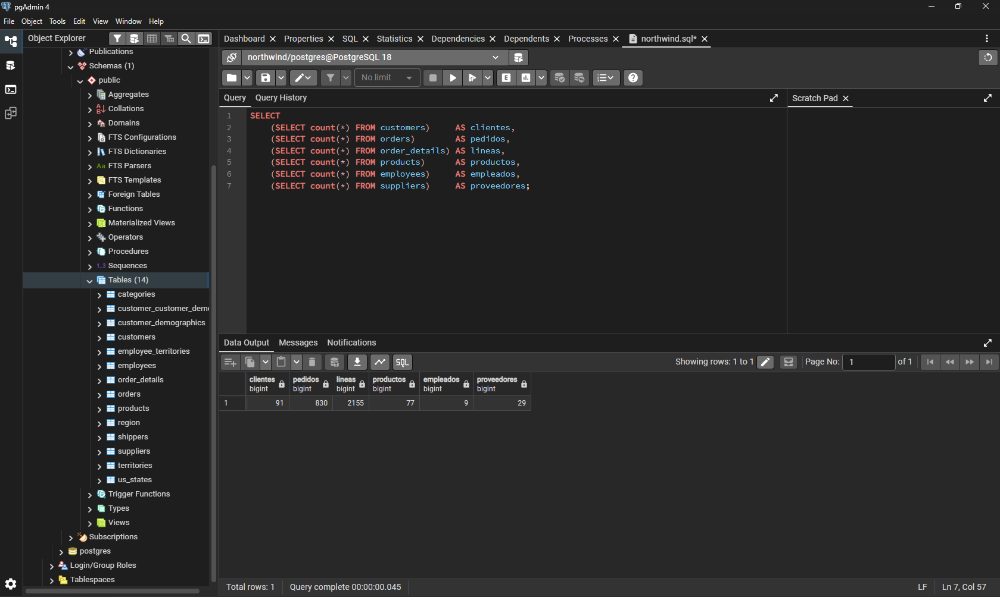
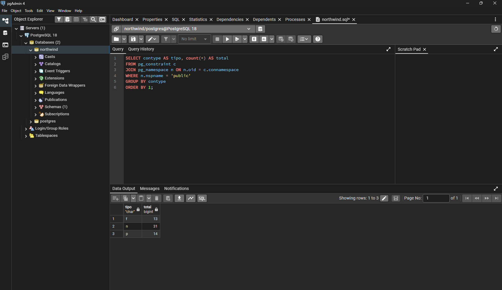
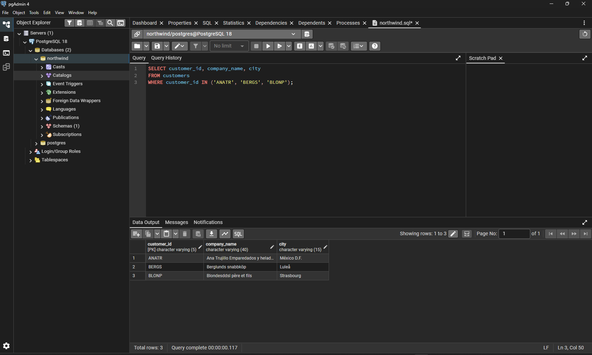

# Práctica — Desinstalación y reinstalación limpia de PostgreSQL 18

Contexto: Instalación de la base de datos para empezar las prácticas en PostgreSQL

## Sección 1 — Primer arranque de pgAdmin 4

pgAdmin 4 es una aplicación web servida en local, por lo que el primer
arranque tarda entre 30 segundos y 2 minutos. No se relanzó la aplicación
durante la espera.


### Las dos contraseñas

| Contraseña | Cuándo aparece | Qué protege |
|---|---|---|
| Master password de pgAdmin | Primer arranque | Almacén local de credenciales guardadas |
| Contraseña del usuario `postgres` | Al conectar con el servidor | Acceso real a la base de datos |

Se usó la misma contraseña para ambas, por simplicidad.

### Conexión con el servidor

Servers → PostgreSQL 18 (doble clic) → contraseña de `postgres` → **Save
Password** activado. El árbol se despliega mostrando `Databases`,
`Login/Group Roles` y `Tablespaces`, confirmando la conexión.


> **Nota:** en el árbol apareció también una entrada residual **PostgreSQL
> 16**, de la instalación anterior ya desinstalada (pgAdmin guarda sus
> conexiones registradas de forma independiente al servidor, en el perfil de
> Windows). No provoca errores mientras no se intente abrir; se puede
> eliminar con clic derecho → *Remove Server*.

## Sección 2 — Creación de la base de datos `northwind`

Se optó por la **Opción 1 (creación por consulta)**.

### Selección del objeto correcto antes de abrir Query Tool

`Query Tool` solo se habilita sobre una base de datos concreta, no sobre el
servidor en general. Se seleccionó la base `postgres` (única existente en
ese momento) antes de `Tools → Query Tool`.


### Creación de la base de datos

```sql
CREATE DATABASE northwind
    WITH ENCODING  = 'UTF8'
         TEMPLATE  = template0;
```


### Comprobación

```sql
SELECT datname, pg_encoding_to_char(encoding) AS codificacion
FROM pg_database
WHERE datname = 'northwind';
```

Resultado obtenido:

| datname | codificacion |
|---|---|
| northwind | UTF8 |


## Sección 3 — Ejecución del script `northwind.sql`

Fichero descargado y guardado en `C:\bbdd\northwind.sql` (ruta corta, sin
tildes ni espacios, para evitar errores en herramientas de línea de
comandos).

Antes de ejecutar el script se comprobó que la pestaña de Query Tool
mostrara `northwind/postgres@PostgreSQL 18` (no `postgres/postgres@...`), es
decir, conectado a la base `northwind` y no a `postgres`.

Ejecución del script completo (`F5`): mensaje `Query returned successfully`.

### Verificación de la carga de datos

```sql
SELECT
    (SELECT count(*) FROM customers)      AS clientes,
    (SELECT count(*) FROM orders)         AS pedidos,
    (SELECT count(*) FROM order_details)  AS lineas,
    (SELECT count(*) FROM products)       AS productos,
    (SELECT count(*) FROM employees)      AS empleados,
    (SELECT count(*) FROM suppliers)      AS proveedores;
```

| clientes | pedidos | lineas | productos | empleados | proveedores |
|---|---|---|---|---|---|
| 91 | 830 | 2155 | 77 | 9 | 29 |

Las 14 tablas quedan visibles en el árbol (`Tables (14)`), confirmando que el
script creó y pobló todas las tablas del modelo Northwind.



## Sección 7 — Restricciones (claves primarias y ajenas)

Verificación del número de restricciones creadas por el script sobre el
esquema `public`:

```sql
SELECT contype AS tipo, count(*) AS total
FROM pg_constraint c
JOIN pg_namespace n ON n.oid = c.connamespace
WHERE n.nspname = 'public'
GROUP BY contype
ORDER BY 1;
```

| tipo | total | significado |
|---|---|---|
| f | 13 | Foreign keys |
| n | 31 | Not-null (no forma parte del checklist, pero es esperable) |
| p | 14 | Primary keys |

Coincide exactamente con lo esperado: 14 claves primarias y 13 claves ajenas.



## Sección 8 — Diagrama entidad-relación (ERD)

Generado con clic derecho sobre la base `northwind` → **ERD For Database**,
reorganizado con **Auto align** y exportado con **Download image**.

> *(pendiente: adjuntar aquí la imagen exportada del ERD,
> `images/erd-northwind.png`, cuando esté disponible)*

Lectura del modelo:
- `orders` y `order_details` forman el núcleo transaccional.
- `order_details` tiene clave primaria compuesta (`order_id`, `product_id`).
- `employees` se autorreferencia mediante `reports_to` (jerarquía de mandos).
- `us_states` aparece aislada, sin claves ajenas declaradas hacia ella.
- `customer_demographics` y `customer_customer_demo` están conectadas pero
  vacías (previstas por el modelo, nunca usadas por el negocio real).

### Verificación de acentos (UTF-8 end-to-end)

Como comprobación adicional de que la codificación UTF-8 forzada en la
Sección 5 funciona correctamente de extremo a extremo (no solo a nivel de
base de datos, sino también al mostrar los datos):

```sql
SELECT customer_id, company_name, city
FROM customers
WHERE customer_id IN ('ANATR', 'BERGS', 'BLONP');
```

| customer_id | company_name | city |
|---|---|---|
| ANATR | Ana Trujillo Emparedados y helados | México D.F. |
| BERGS | Berglunds snabbköp | Luleå |
| BLONP | Blondesddsl père et fils | Strasbourg |

Los caracteres especiales (`é`, `ö`, `å`, `è`) se muestran correctamente.



## Sección 9 — Checklist final antes de la Parte 2

| Punto | Estado |
|---|---|
| Servicio `postgresql-x64-18` en ejecución | ✅ |
| `psql -U postgres -c "SELECT version();"` → PostgreSQL 18 | ✅ (18.6) |
| Base `northwind` existe, encoding `UTF8` | ✅ |
| Conteo de filas: 91 / 830 / 2155 / 77 / 9 / 29 | ✅ |
| 14 claves primarias y 13 claves ajenas | ✅ |
| Nombres con acentos se muestran correctamente | ✅ |
| Imagen del diagrama ER exportada | ⏳ pendiente |

No se presentó ninguno de los problemas descritos en la sección de
"Problemas frecuentes" del enunciado (cluster fallido, puerto ocupado,
pgAdmin en blanco, `relation does not exist`, `permission denied for schema
public`) — la instalación y carga se completaron sin incidencias de ese
tipo. Los únicos obstáculos reales encontrados durante la práctica fueron los
ya documentados en las Secciones 1-3 (alias `sc` de PowerShell, PATH de
usuario vs sistema).

## Resultado final

| Componente | Versión / Valor |
|---|---|
| PostgreSQL | 18.6 |
| Base de datos | `northwind`, encoding UTF8 |
| Tablas | 14 |
| Filas totales cargadas | 91 + 830 + 2155 + 77 + 9 + 29 (+ tablas vacías) |
| Claves primarias | 14 |
| Claves ajenas | 13 |
