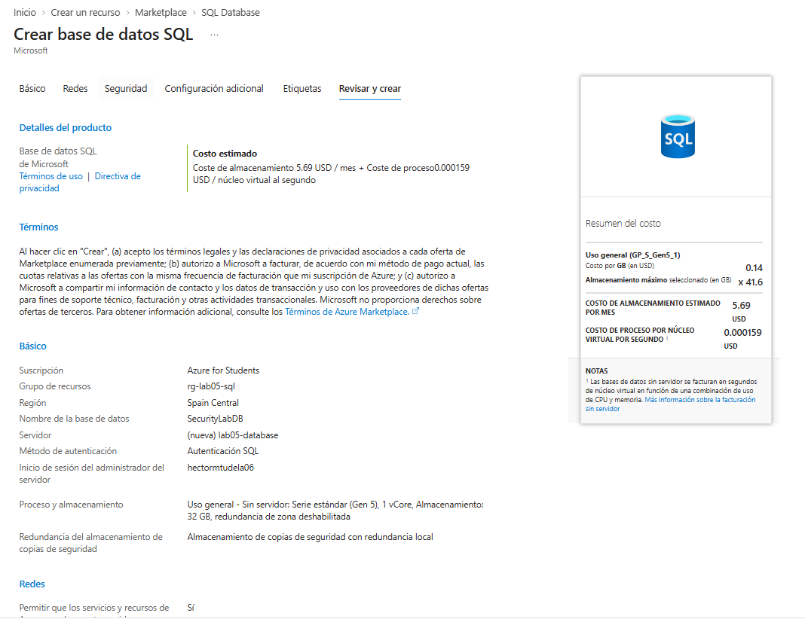
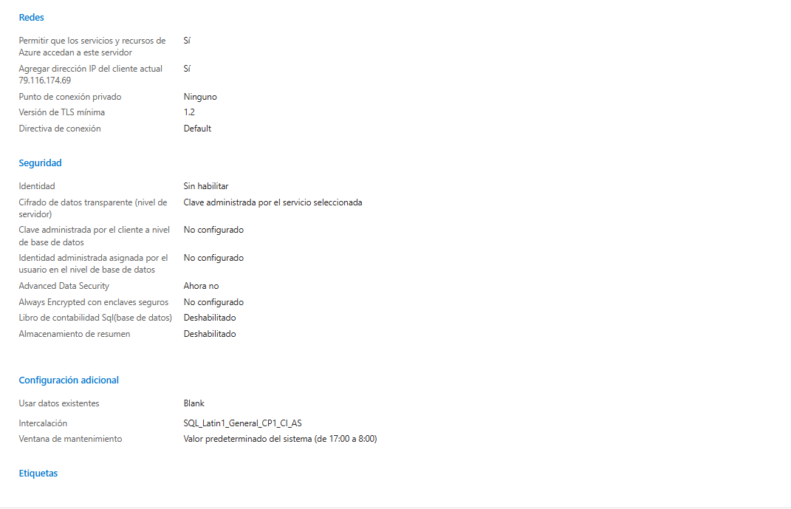
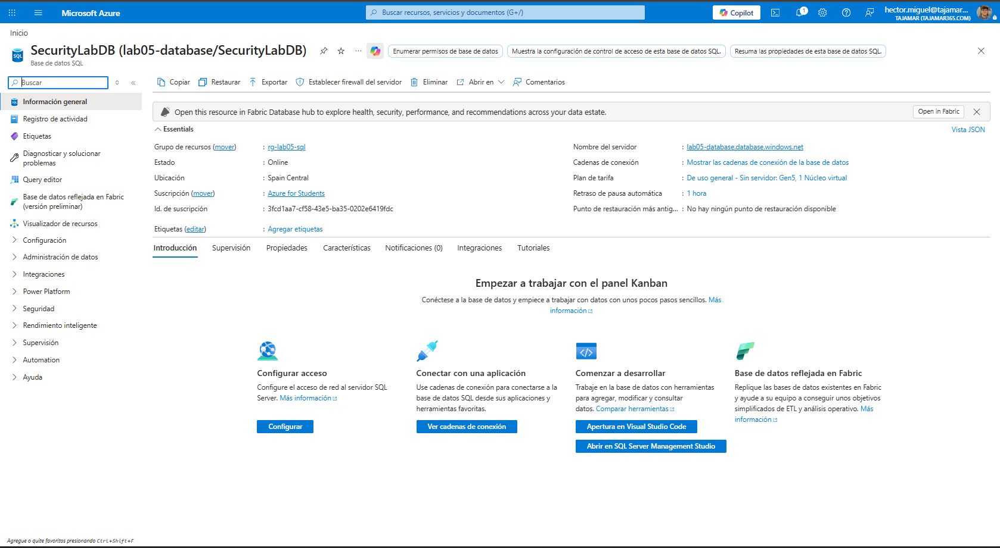
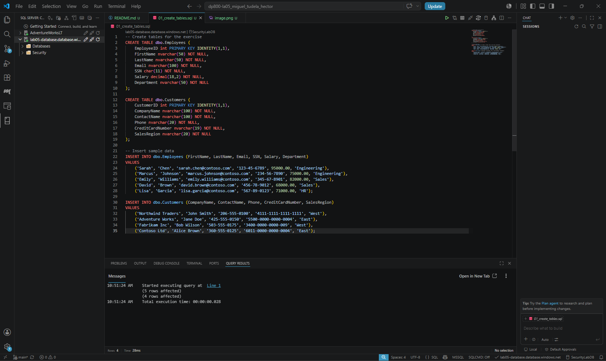
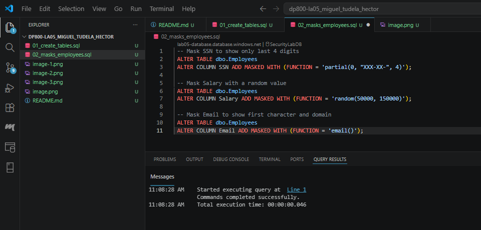
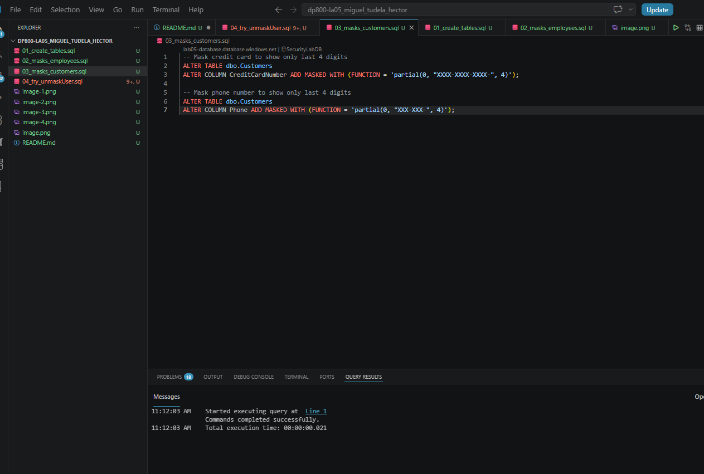
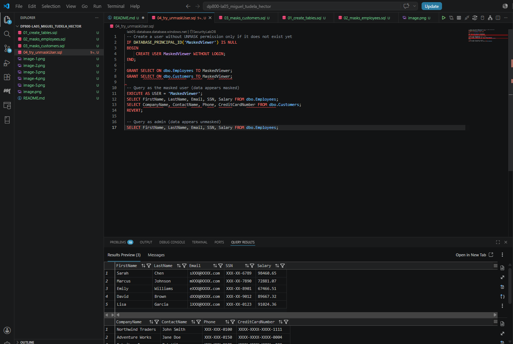
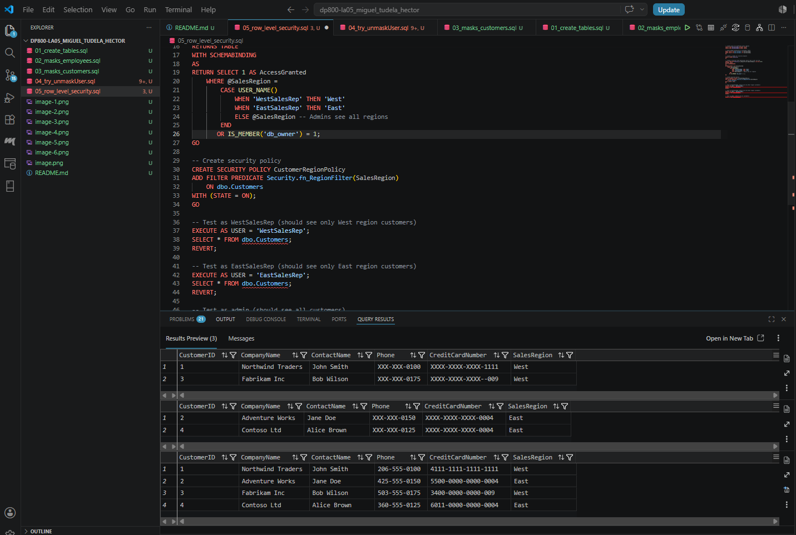

# Laboratorio 05: Implement Data Security and Compliance With SQL

Este repositorio contiene la documentación y los scripts utilizados para completar el **Laboratorio 05: Implementar características de seguridad y cumplimiento normativo en SQL**, parte del entrenamiento de Microsoft Learn.

## Objetivos del Laboratorio
- Aprovisionar una base de datos en Azure SQL.
- Configurar usuarios y roles de base de datos.
- Implementar Enmascaramiento Dinámico de Datos (Dynamic Data Masking).
- Implementar Seguridad a Nivel de Fila (Row-Level Security).

## Requisitos Previos
- Suscripción activa a Microsoft Azure.
- Azure Data Studio, SQL Server Management Studio (SSMS) o la extensión de SQL Server en VS Code.

---

## Pasos Seguidos

### Paso 1: Aprovisionar una base de datos de Azure SQL
Se creó una nueva base de datos en Azure SQL con la configuración básica de desarrollo y se configuró el firewall para permitir conexiones desde la dirección IP local.

- **Nombre de la BBDD:** `SecurityLabDB`
- **Autenticación:** SQL Authentication

> **Evidencia Paso 1:**  
> 
> 
> 

### Paso 2: Crear el esquema de prueba y usuarios
Nos conectamos a la base de datos a través de nuestra herramienta cliente y ejecutamos el script inicial para crear la tabla de pacientes (`Patients`) y los usuarios de prueba (`Doctor` y `Receptionist`).

```sql
-- Creación de tabla y datos de prueba
CREATE TABLE Patients (
    PatientID INT IDENTITY(1,1) PRIMARY KEY,
    FirstName NVARCHAR(50),
    LastName NVARCHAR(50),
    SSN NVARCHAR(15),
    Email NVARCHAR(100),
    Condition NVARCHAR(100)
);

INSERT INTO Patients (FirstName, LastName, SSN, Email, Condition)
VALUES 
('John', 'Doe', '123-456-7890', 'john.doe@email.com', 'Diabetes'),
('Jane', 'Smith', '987-654-3210', 'jane.smith@email.com', 'Hypertension');

-- Creación de usuarios
CREATE USER Doctor WITHOUT LOGIN;
CREATE USER Receptionist WITHOUT LOGIN;

-- Asignación de permisos de lectura
GRANT SELECT ON Patients TO Doctor;
GRANT SELECT ON Patients TO Receptionist;
```

> **Evidencia Paso 2:**  
> 

### Paso 3: Enmascaramiento Dinámico de Datos (DDM)
Para cumplir con la normativa de privacidad, configuramos el enmascaramiento de datos para que el recepcionista no pueda ver el número de seguro social (SSN) completo ni el email real de los pacientes.

```sql
-- Aplicar máscaras a las columnas
ALTER TABLE Patients
ALTER COLUMN SSN ADD MASKED WITH (FUNCTION = 'partial(2, "XXX-XXX", 4)');

ALTER TABLE Patients
ALTER COLUMN Email ADD MASKED WITH (FUNCTION = 'email()');

-- Verificar cómo lo ve el recepcionista
EXECUTE AS USER = 'Receptionist';
SELECT * FROM Patients;
REVERT;
```

> **Evidencia Paso 3:**  
> 
> 
> 


### Paso 4: Seguridad a Nivel de Fila (RLS)
Se implementó RLS para garantizar que ciertos roles solo puedan ver las filas que les corresponden. En este caso, simulamos un escenario donde el `Receptionist` solo debe ver información básica, pero aquí configuramos una función de predicado y una política de seguridad.

```sql
-- Crear un esquema para la seguridad
CREATE SCHEMA Security;
GO

-- Crear la función de predicado
CREATE FUNCTION Security.fn_SecurityPredicate(@UserName AS sysname)
    RETURNS TABLE
WITH SCHEMABINDING
AS
    RETURN SELECT 1 AS fn_SecurityPredicate_Result
    WHERE @UserName = USER_NAME() OR USER_NAME() = 'Doctor';
GO

-- Crear la política de seguridad
CREATE SECURITY POLICY Security.PatientSecurityPolicy
    ADD FILTER PREDICATE Security.fn_SecurityPredicate(USER_NAME())
    ON dbo.Patients
    WITH (STATE = ON);
GO
```

> **Evidencia Paso 4:**  
> 

---

## Conclusión
A lo largo de este laboratorio, se han implementado con éxito características avanzadas de seguridad en Azure SQL Database, demostrando cómo proteger información confidencial en tránsito y en reposo, limitando el acceso tanto a nivel de columna (DDM) como a nivel de fila (RLS).