# Laboratorio 04 — Configure AI-assisted tools for database development

**Autor:** Héctor Miguel Tudela
**Máster Big Data & IA — Tajamar**
**Fecha:** septiembre de 2026

Documentación del laboratorio *"Implement SQL solutions by using AI-assisted tools"* de Microsoft Learn: configuración de GitHub Copilot en VS Code para el desarrollo de soluciones T-SQL sobre una base de datos Azure SQL (AdventureWorksLT).

- Guía teórica: [Implement SQL Solutions by Using AI-assisted Tools](https://learn.microsoft.com/en-us/training/modules/design-implement-sql-solutions-ai-assisted-tools/)
- Enunciado del laboratorio: [04 - Configure AI-assisted tools for database development](https://microsoftlearning.github.io/mslearn-sql-developer/Instructions/Labs/04-design-implement-sql-solutions-ai-assisted-tools.html)
- Repositorio: [hectormtudela/BigData — Laboratorios/dp800-lab04_miguel_tudela_hector](https://github.com/hectormtudela/BigData/tree/main/Laboratorios/dp800-lab04_miguel_tudela_hector)

---

## Índice

1. [Aprovisionar la base de datos Azure SQL](#1-aprovisionar-la-base-de-datos-azure-sql)
2. [Configurar VS Code con GitHub Copilot](#2-configurar-vs-code-con-github-copilot)
3. [Conectar VS Code a la base de datos](#3-conectar-vs-code-a-la-base-de-datos)
4. [Archivo de instrucciones para Copilot](#4-archivo-de-instrucciones-para-copilot)
5. [Generar objetos con Copilot: procedimiento y vista](#5-generar-objetos-con-copilot-procedimiento-y-vista)
6. [Explicar código existente con Copilot](#6-explicar-código-existente-con-copilot)
7. [Sugerencias de optimización de consultas](#7-sugerencias-de-optimización-de-consultas)
8. [Limpieza de recursos](#8-limpieza-de-recursos)
9. [Hallazgos y aprendizajes](#9-hallazgos-y-aprendizajes)

---

## 1. Aprovisionar la base de datos Azure SQL

Se creó una base de datos Azure SQL con los datos de ejemplo **AdventureWorksLT**, en el grupo de recursos `rg-lab04-sql` (región *Spain Central*, suscripción *Azure for Students*).

| | |
|---|---|
| 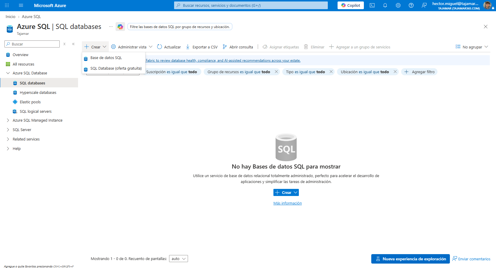 | 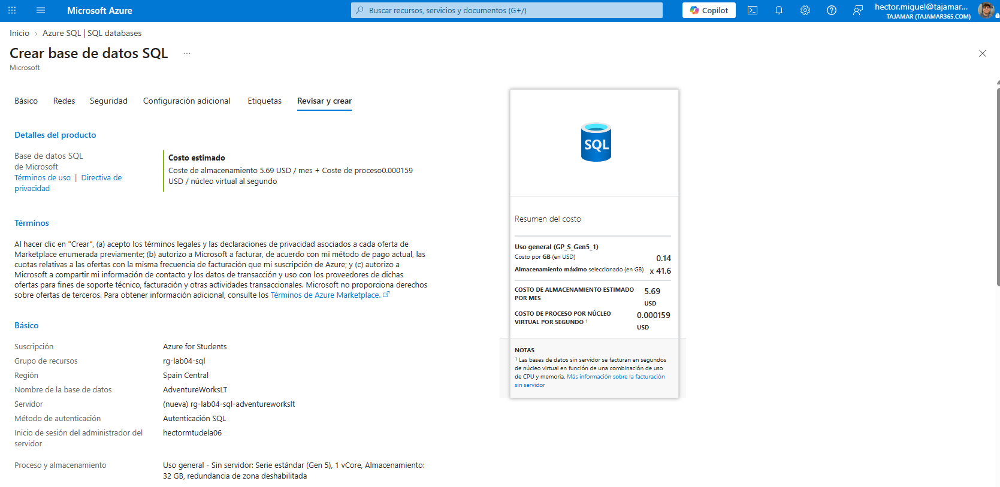 |
| 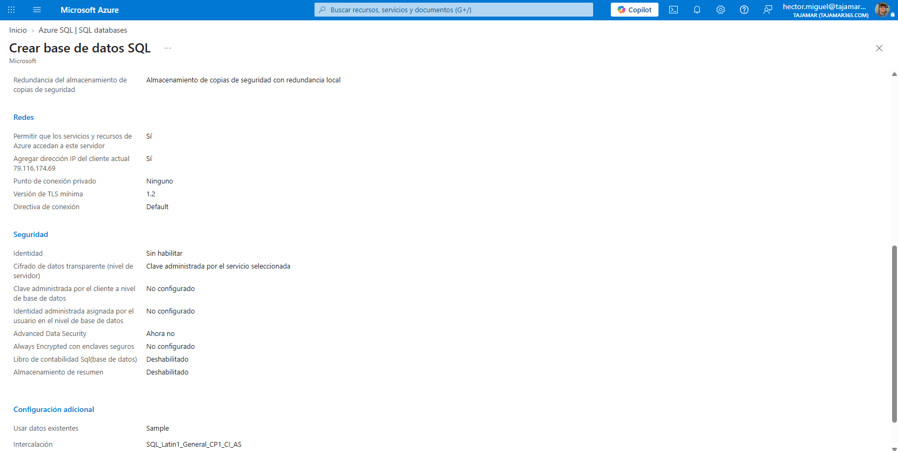 | 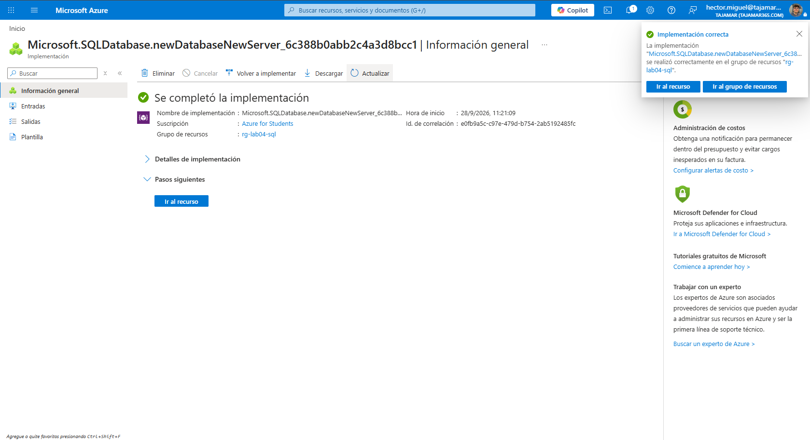 |

## 2. Configurar VS Code con GitHub Copilot

Se instalaron las extensiones **GitHub Copilot Chat** y **SQL Server (mssql)**, y se inició sesión con la cuenta de GitHub con acceso a Copilot.

| | |
|---|---|
| 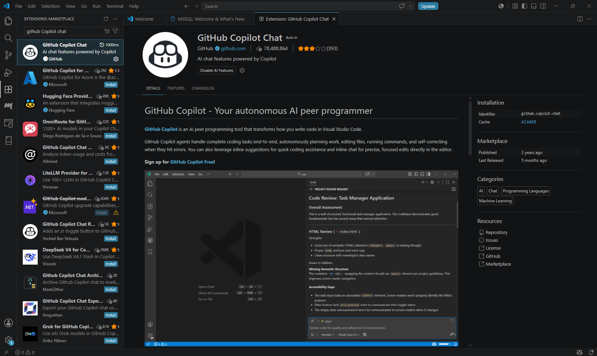 | 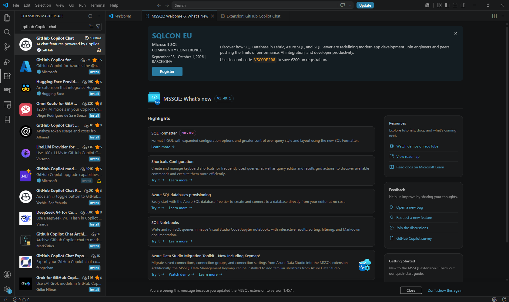 |
| 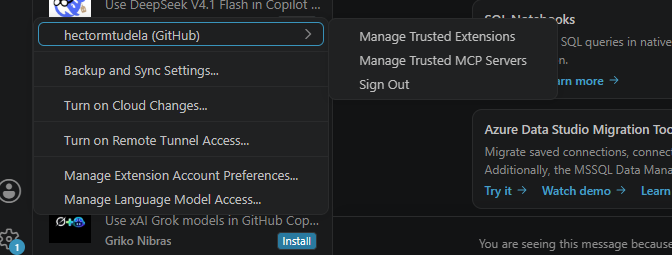 |  |

## 3. Conectar VS Code a la base de datos

Al configurar la conexión con la extensión MSSQL apareció un error de red por una errata en el nombre del servidor (`winadows.net` en vez de `windows.net`). Tras corregirlo, la conexión se estableció correctamente y se pudo explorar el árbol de tablas y vistas de `SalesLT`.

| | |
|---|---|
| 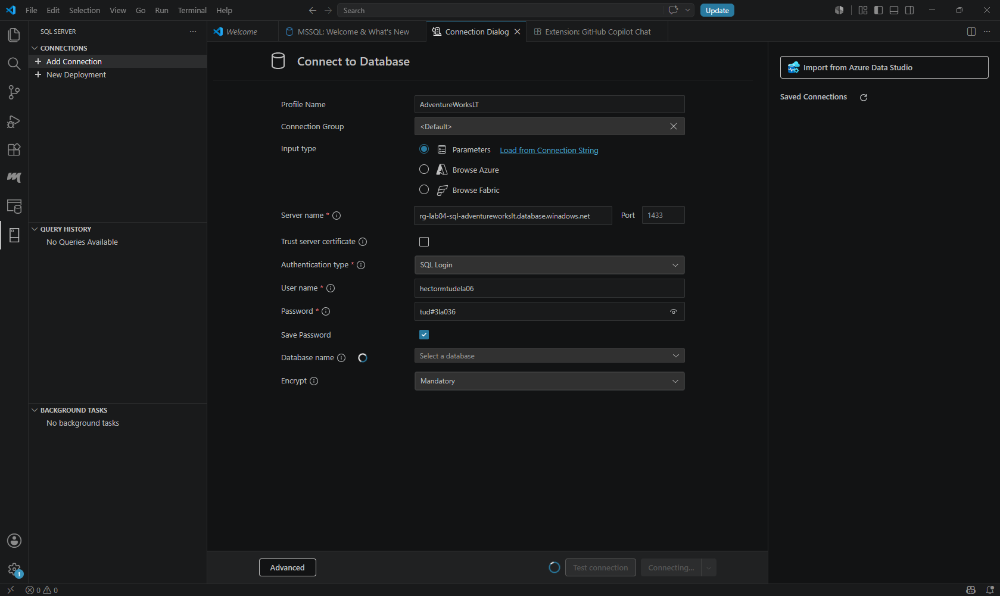 | 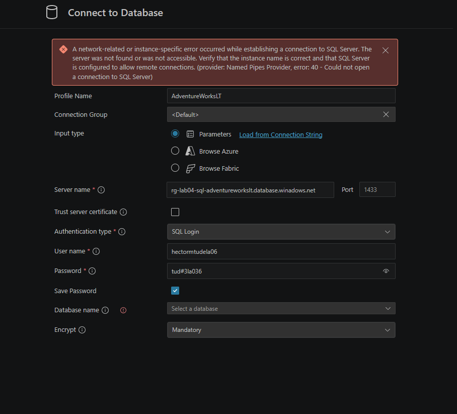 |
| 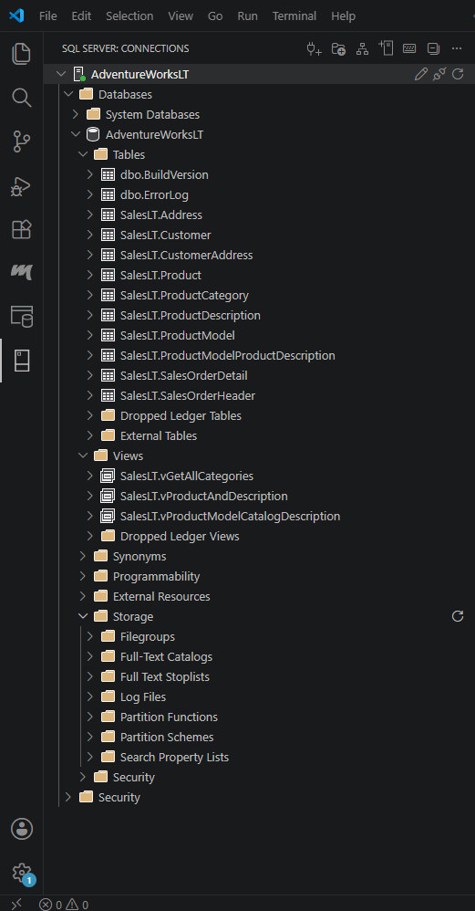 | |

## 4. Archivo de instrucciones para Copilot

Se creó `.github/copilot-instructions.md` en la raíz de la carpeta del laboratorio (dentro de `Laboratorios/dp800-lab04_miguel_tudela_hector` del repositorio `BigData`), con las convenciones de nomenclatura, estilo T-SQL, seguridad y comentarios que Copilot debía seguir al generar código.

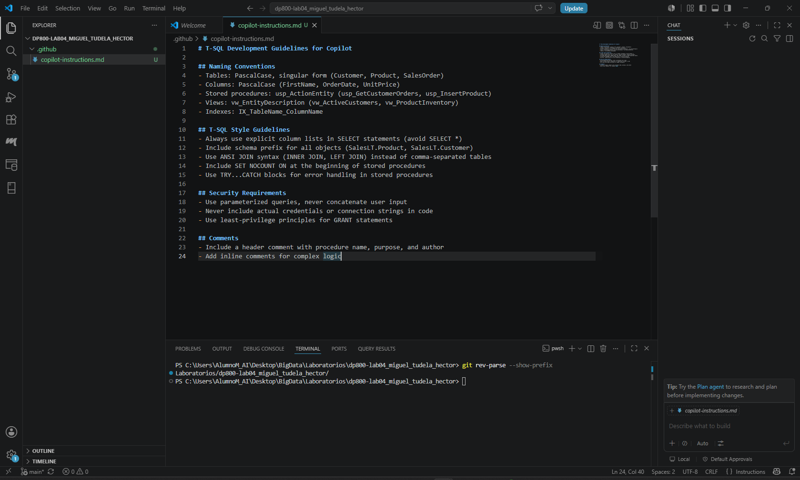

```markdown
# T-SQL Development Guidelines for Copilot

## Naming Conventions
- Tables: PascalCase, singular form (Customer, Product, SalesOrder)
- Columns: PascalCase (FirstName, OrderDate, UnitPrice)
- Stored procedures: usp_ActionEntity (usp_GetCustomerOrders, usp_InsertProduct)
- Views: vw_EntityDescription (vw_ActiveCustomers, vw_ProductInventory)
- Indexes: IX_TableName_ColumnName

## T-SQL Style Guidelines
- Always use explicit column lists in SELECT statements (avoid SELECT *)
- Include schema prefix for all objects (SalesLT.Product, SalesLT.Customer)
- Use ANSI JOIN syntax (INNER JOIN, LEFT JOIN) instead of comma-separated tables
- Include SET NOCOUNT ON at the beginning of stored procedures
- Use TRY...CATCH blocks for error handling in stored procedures

## Security Requirements
- Use parameterized queries, never concatenate user input
- Never include actual credentials or connection strings in code
- Use least-privilege principles for GRANT statements

## Comments
- Include a header comment with procedure name, purpose, and author
- Add inline comments for complex logic
```

> **Incidencia:** al hacer el primer `push` del repositorio, GitHub denegó el permiso porque el cliente Git de este equipo tenía en caché la sesión de otra persona. Se solucionó limpiando las credenciales guardadas (Administrador de credenciales de Windows) y volviendo a iniciar sesión con la cuenta correcta.
>
> 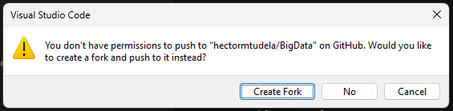

## 5. Generar objetos con Copilot: procedimiento y vista

### 5a. Procedimiento almacenado `usp_GetCustomerOrderSummary`

Prompt utilizado en Copilot Chat (modo *Ask*):

```text
Create a stored procedure named usp_GetCustomerOrderSummary that retrieves customer order information from the AdventureWorksLT database. The procedure should:
- Accept a @CustomerID parameter (optional, if NULL return all customers)
- Return customer name, total number of orders, total order amount, and last order date
- Join SalesLT.Customer, SalesLT.SalesOrderHeader, and SalesLT.SalesOrderDetail tables
- Include error handling with TRY...CATCH
- Follow the T-SQL guidelines in the instruction file
```

Código final generado (siguiendo `copilot-instructions.md`: prefijo `usp_`, esquema `SalesLT.`, `JOIN` ANSI, `SET NOCOUNT ON`, `TRY...CATCH`):

```sql
/*
  Procedure: dbo.usp_GetCustomerOrderSummary
  Purpose: Returns customer order summary data from AdventureWorksLT
  Author: Héctor Miguel Tudela
*/
CREATE OR ALTER PROCEDURE dbo.usp_GetCustomerOrderSummary
    @CustomerID INT = NULL
AS
BEGIN
    SET NOCOUNT ON;

    BEGIN TRY
        SELECT
            c.CustomerID,
            c.FirstName + ' ' + c.LastName AS CustomerName,
            COUNT(DISTINCT h.SalesOrderID) AS TotalOrders,
            COALESCE(SUM(d.LineTotal), 0) AS TotalOrderAmount,
            MAX(h.OrderDate) AS LastOrderDate
        FROM SalesLT.Customer AS c
        LEFT JOIN SalesLT.SalesOrderHeader AS h
            ON c.CustomerID = h.CustomerID
        LEFT JOIN SalesLT.SalesOrderDetail AS d
            ON h.SalesOrderID = d.SalesOrderID
        WHERE @CustomerID IS NULL
            OR c.CustomerID = @CustomerID
        GROUP BY
            c.CustomerID,
            c.FirstName,
            c.LastName
        ORDER BY
            c.CustomerID;
    END TRY
    BEGIN CATCH
        THROW;
    END CATCH
END;
GO
```

> **Incidencia:** la primera ejecución creó el procedimiento en la base `master` en lugar de `AdventureWorksLT`, porque la conexión activa no era la correcta. SQL Server no valida los objetos referenciados hasta la ejecución (*deferred name resolution*), así que el `CREATE` no dio error aunque `SalesLT` no existe en `master`. Se corrigió seleccionando la base de datos correcta y volviendo a ejecutar.

| | | |
|---|---|---|
| 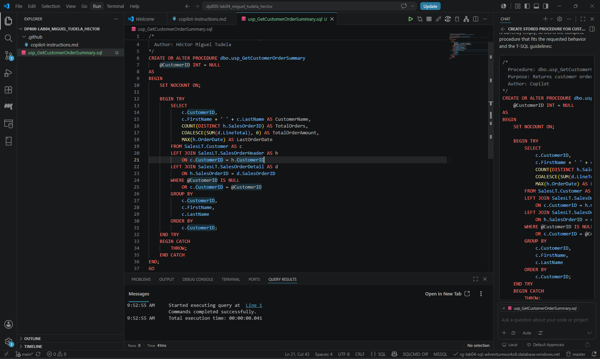 | 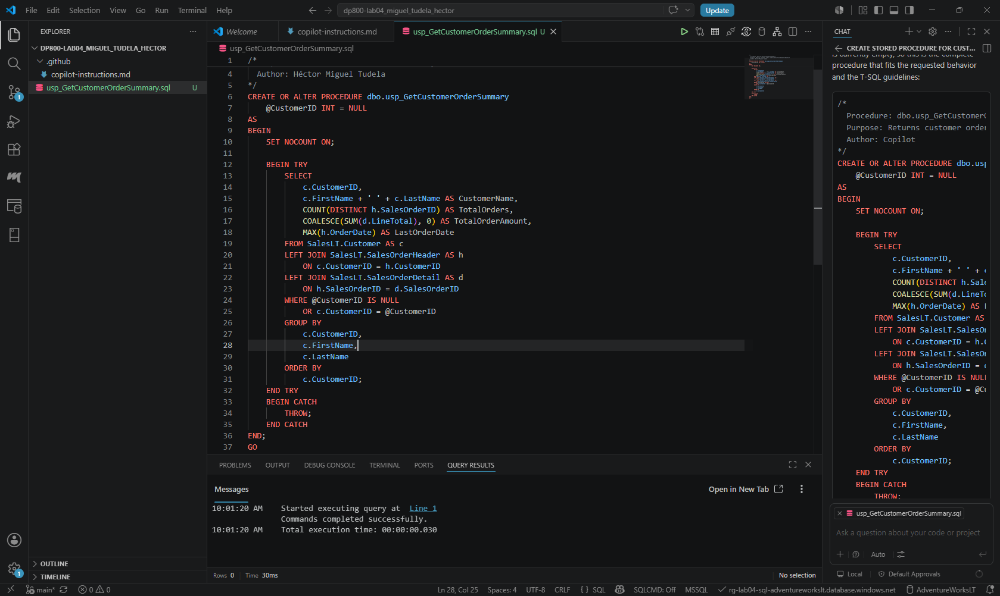 | 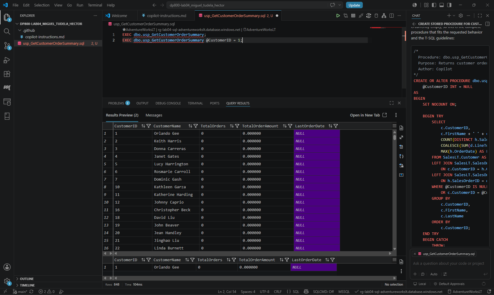 |

### 5b. Vista `vw_ProductSalesAnalysis`

Prompt utilizado en Copilot Chat:

```text
Create a view named vw_ProductSalesAnalysis that shows:
- Product name and category
- Total quantity sold
- Total revenue
- Average sale price
- Number of orders containing this product

Use the SalesLT schema tables and follow the T-SQL guidelines.
```

```sql
/*
  View: SalesLT.vw_ProductSalesAnalysis
  Purpose: Summarizes product sales activity for AdventureWorksLT
  Author: Hector Miguel Tudela
*/
CREATE OR ALTER VIEW SalesLT.vw_ProductSalesAnalysis
AS
SELECT
    p.ProductID,
    p.Name AS ProductName,
    pc.Name AS CategoryName,
    SUM(d.OrderQty) AS TotalQuantitySold,
    SUM(d.LineTotal) AS TotalRevenue,
    AVG(d.UnitPrice) AS AverageSalePrice,
    COUNT(DISTINCT d.SalesOrderID) AS NumberOfOrders
FROM SalesLT.Product AS p
INNER JOIN SalesLT.ProductCategory AS pc
    ON p.ProductCategoryID = pc.ProductCategoryID
INNER JOIN SalesLT.SalesOrderDetail AS d
    ON p.ProductID = d.ProductID
GROUP BY
    p.ProductID,
    p.Name,
    pc.Name;
GO
```

| | | |
|---|---|---|
| 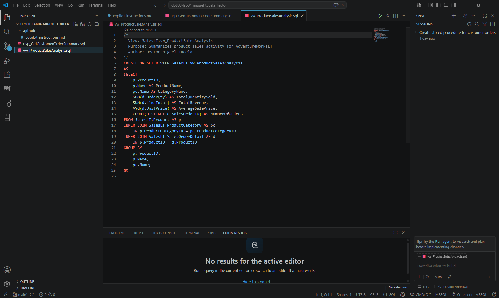 | 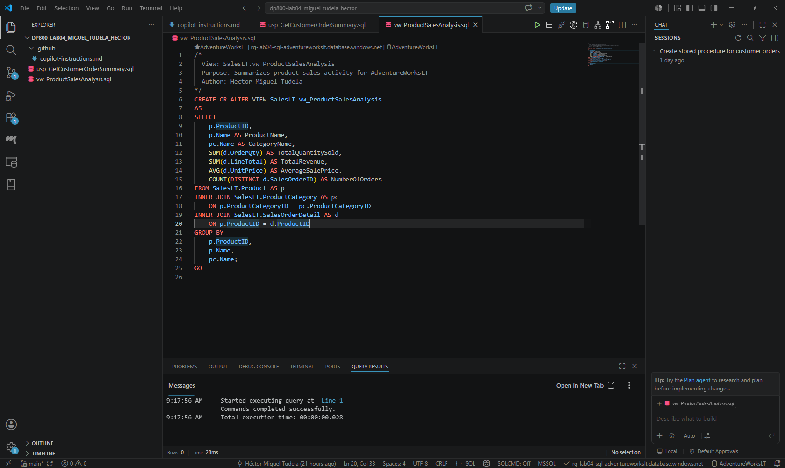 | 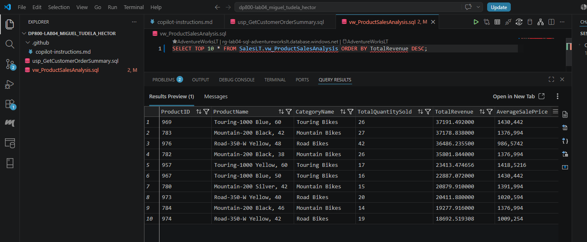 |

## 6. Explicar código existente con Copilot

Se pidió a Copilot que explicara la vista `SalesLT.vGetAllCategories` (un CTE recursivo que construye la jerarquía de categorías de producto).

Prompt:

```text
Explain what this view does and how the recursive CTE works
```

Copilot identificó correctamente el miembro ancla (categorías raíz), el miembro recursivo (`INNER JOIN` contra el propio CTE) y explicó por qué se usa `UNION ALL`. Además señaló que **el comentario de cabecera del archivo original es erróneo**: dice que la vista devuelve información de clientes, cuando en realidad trata sobre categorías de producto.

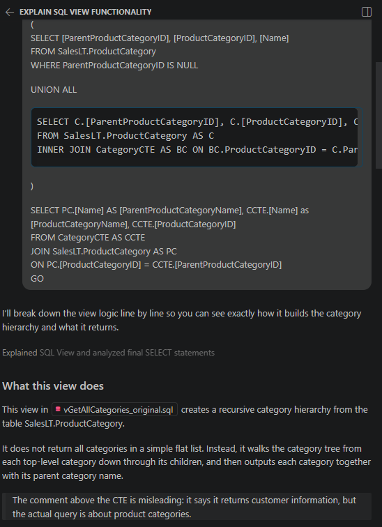

Este hallazgo se verificó de dos formas:

1. **Revisando el propio archivo fuente**, donde se confirmó que el comentario erróneo existe de verdad (probablemente un resto de otra plantilla, nunca actualizado):

   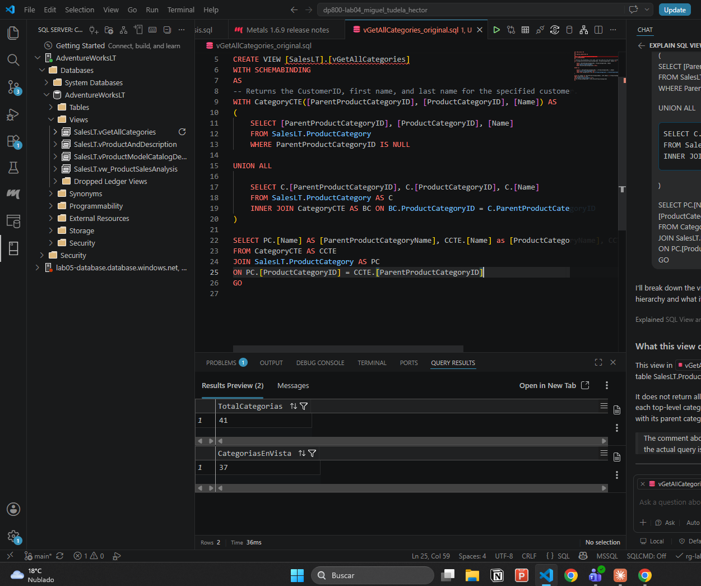

2. **Comparando el número de filas** entre la tabla base y la vista:

   ```sql
   SELECT COUNT(*) AS TotalCategorias FROM SalesLT.ProductCategory;      -- 41
   SELECT COUNT(*) AS CategoriasEnVista FROM SalesLT.vGetAllCategories;  -- 37
   ```

   La diferencia (4) coincide con las 4 categorías raíz de AdventureWorksLT (Bikes, Components, Clothing, Accessories), que quedan fuera del resultado porque el `JOIN` final exige que exista una categoría padre.

> Nota de proceso: al escribir las consultas de verificación se sobrescribió por error el archivo `vGetAllCategories-original.sql` (imagen siguiente). Se recuperó con `Ctrl+Z` antes de guardar, y las consultas de verificación se movieron a un archivo aparte para no perder la definición original.
>
> 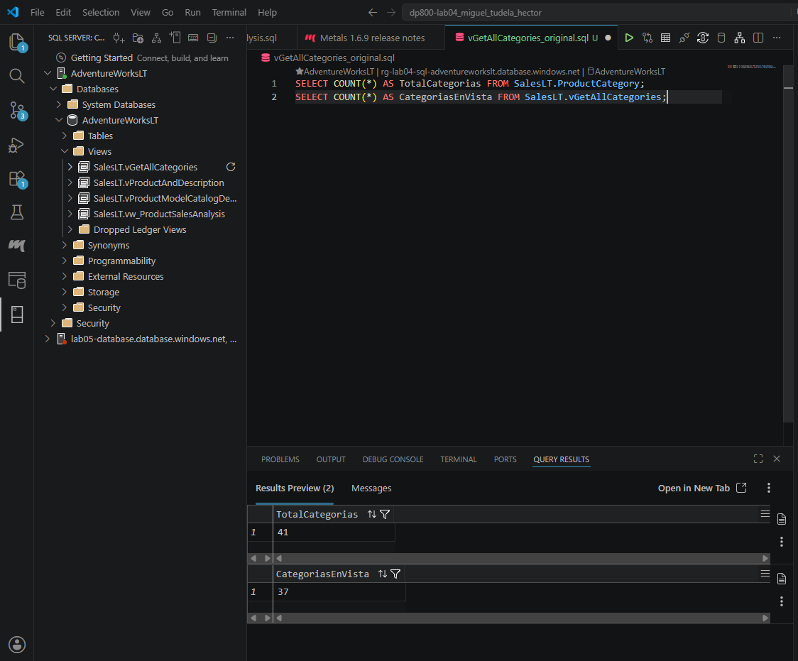

## 7. Sugerencias de optimización de consultas

Se le dio a Copilot una consulta escrita con malas prácticas a propósito:

```sql
SELECT *
FROM SalesLT.SalesOrderHeader h, SalesLT.SalesOrderDetail d, SalesLT.Product p
WHERE h.SalesOrderID = d.SalesOrderID
AND d.ProductID = p.ProductID
AND h.OrderDate > '2008-01-01'
```

Prompt:

```text
Review this query and suggest optimizations following best practices. Explain each improvement.
```

Copilot sugirió correctamente: pasar a `INNER JOIN` con sintaxis ANSI, evitar `SELECT *`, listar columnas explícitas y añadir índices de apoyo. **Pero también cambió, sin advertirlo, la semántica del filtro de fecha**: propuso `WHERE OrderDate >= '2008-01-01' AND OrderDate < '2009-01-01'`, que solo devuelve pedidos de 2008, mientras que el original (`> '2008-01-01'`) devuelve todos los pedidos desde esa fecha en adelante, sin límite superior.

La versión final aplica las mejoras de estilo de Copilot manteniendo la lógica de fecha original:

```sql
SELECT
    h.SalesOrderID,
    h.OrderDate,
    d.SalesOrderDetailID,
    d.ProductID,
    d.OrderQty,
    d.UnitPrice,
    p.Name AS ProductName,
    p.Color,
    p.StandardCost
FROM SalesLT.SalesOrderHeader AS h
INNER JOIN SalesLT.SalesOrderDetail AS d
    ON h.SalesOrderID = d.SalesOrderID
INNER JOIN SalesLT.Product AS p
    ON d.ProductID = p.ProductID
WHERE h.OrderDate > '2008-01-01';
```

Se verificó que la consulta original y la corregida devuelven el mismo número de filas (**542**), confirmando que la reescritura preserva el resultado:

| | |
|---|---|
| 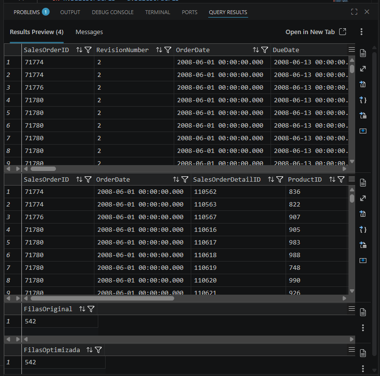 | 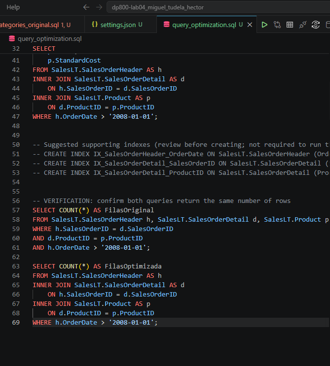 |

## 8. Limpieza de recursos

Se eliminó el grupo de recursos `rg-lab04-sql` en Azure (servidor SQL, base `AdventureWorksLT` y `master`) para no incurrir en costes adicionales.

| | |
|---|---|
| 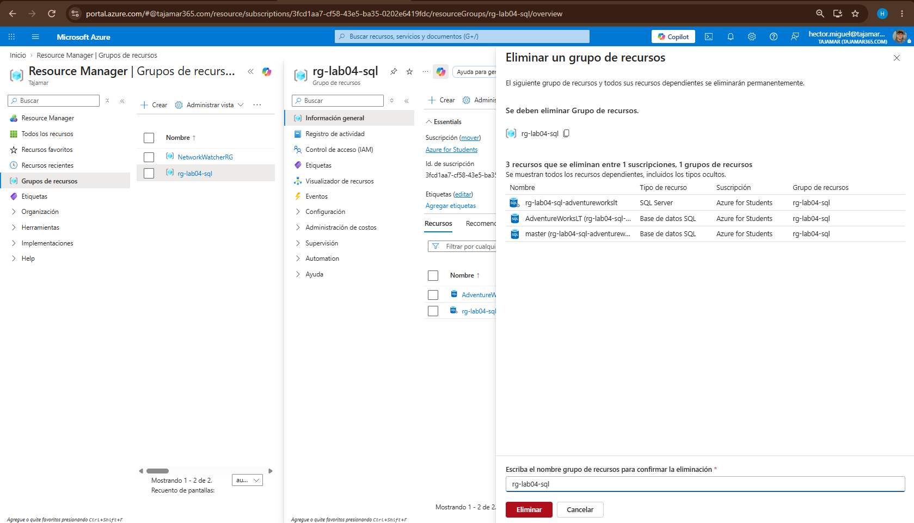 | 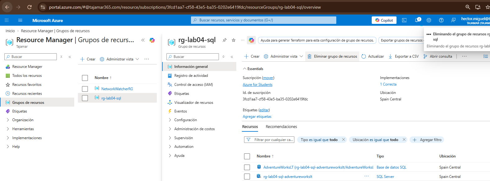 |

## 9. Hallazgos y aprendizajes

Más allá de completar los pasos del laboratorio, dos incidencias concretas ilustran por qué el código generado o revisado por IA necesita verificación humana, no solo copiarse:

- **Paso 6:** Copilot detectó correctamente que un comentario de la base de datos de ejemplo estaba desactualizado (decía "customer information" en una vista sobre categorías de producto). Se confirmó revisando el archivo fuente y contrastando cifras reales.
- **Paso 7:** una sugerencia de "optimización" de Copilot cambiaba el resultado de la consulta (limitaba el rango de fechas a un solo año) sin advertirlo como un cambio de comportamiento, solo como mejora de estilo. Se detectó comparando el número de filas entre la versión original y la sugerida.

En ambos casos, Copilot fue útil para acelerar el desarrollo y explicar código, pero sus resultados necesitaron revisión y verificación antes de darse por buenos.
