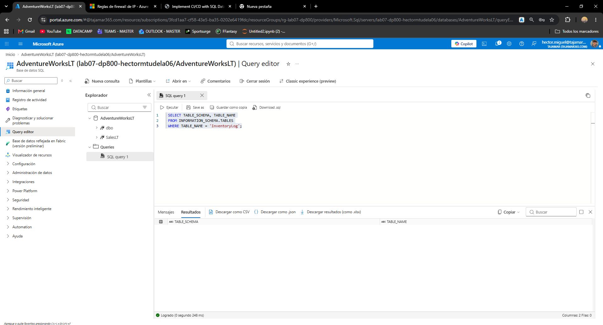
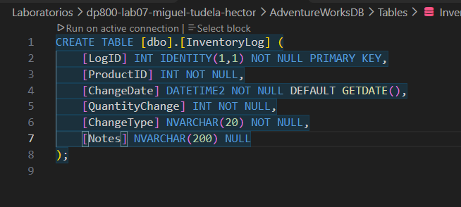
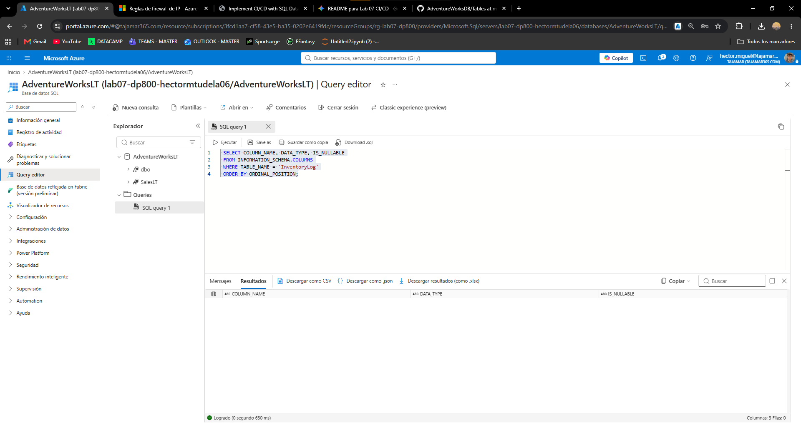

# Laboratorio 07 DP-800: Implementación de CI/CD para Proyectos de Base de Datos SQL

**Autor:** Héctor Miguel Tudela

## 📝 Descripción del Proyecto
Este repositorio documenta el desarrollo práctico del Laboratorio 07 correspondiente a la certificación **DP-800 de Microsoft**. 

El objetivo principal de esta práctica es diseñar e implementar un flujo completo de **Integración Continua y Entrega Continua (CI/CD)** para un proyecto de base de datos SQL (`AdventureWorksDB`). A través de este laboratorio, automatizamos el proceso de compilación y despliegue de los cambios de esquema (como nuevas tablas o procedimientos almacenados) directamente hacia una instancia de Azure SQL Database utilizando GitHub Actions.

## 🛠️ Tecnologías y Herramientas Utilizadas
* **Azure SQL Database:** Entorno de destino para el despliegue de la base de datos.
* **GitHub Actions:** Motor de automatización para la canalización CI/CD.
* **.NET 8.x SDK:** Entorno para compilar el proyecto SQL.
* **microsoft.sqlpackage:** Herramienta de línea de comandos para extraer, compilar y desplegar aplicaciones de capa de datos (`.dacpac`).
* **Git:** Control de versiones.

---

## 🚀 Desarrollo del Laboratorio Paso a Paso

### 1. Configuración de Seguridad y Secretos (Secciones 5 y 6)
Para cumplir con las mejores prácticas de seguridad y evitar exponer credenciales en el código fuente, se configuró la cadena de conexión de Azure SQL como un secreto encriptado dentro del repositorio de GitHub.

* **Nombre del secreto:** `SQL_CONNECTION_STRING`
* **Verificación:** Se comprobó la correcta creación del secreto utilizando la CLI de GitHub mediante el comando `gh secret list`. La salida confirmó la existencia del secreto sin revelar su contenido.

### 2. Creación del Pipeline de GitHub Actions (Sección 7)
Se definió el flujo de trabajo automatizado creando el archivo `.github/workflows/build-deploy.yml`. 

> **Nota de desarrollo:** El código YAML original de la documentación de Microsoft presentaba errores de formato e indentación que rompían el pipeline. Se corrigió manualmente la estructura (especialmente en los bloques `steps` y `with`) para asegurar su correcto funcionamiento.

El pipeline consta de un único *Job* (`build-and-deploy`) que se ejecuta en `ubuntu-latest` y automatiza los siguientes pasos cada vez que se hace un `push` a la rama `main`:
1. **Checkout repository:** Clona el código del repositorio en el runner de GitHub.
2. **Setup .NET SDK:** Prepara el entorno con la versión 8.x de .NET.
3. **Build SQL project:** Compila el proyecto `AdventureWorksDB.sqlproj` generando un artefacto `.dacpac`.
4. **Install SqlPackage:** Instala la herramienta global necesaria para interactuar con el paquete DACPAC.
5. **Deploy to Azure SQL Database:** Utiliza la acción oficial `azure/sql-action@v2.3` y el secreto de conexión para publicar los cambios en Azure.

### 3. Integración y Despliegue (Sección 8)
Una vez configurado el proyecto SQL con la tabla `InventoryLog` y el workflow de GitHub Actions, se procedió a subir los cambios al repositorio remoto. Se verificó mediante `git status` que no se incluyeran carpetas innecesarias (`bin/`, `obj/`) y se ejecutaron los comandos:

```bash
git add -A
git commit -m "Initial SQL project with InventoryLog table and CI/CD pipeline"
git push
```
Este evento `push` desencadenó automáticamente la ejecución del workflow en la pestaña *Actions*.

---

## ⚠️ Troubleshooting y Resolución de Errores

Durante la primera ejecución del pipeline de CI/CD, el proceso falló a los 44 segundos, específicamente en el último paso: **Deploy to Azure SQL Database**.

### Análisis del Log de Error
Al inspeccionar los logs mediante el comando `gh run view --log-failed`, se obtuvo la siguiente salida:

```text
##[error]Failed to add firewall rule. Unable to detect client IP Address. 
mssql: login error: Database 'AdventureWorksLT' on server 'lab07-dp800-***.database.windows.net' is not currently available.  
Please retry the connection later.  If the problem persists, contact customer support, and provide them the session tracing ID...
```

### Diagnóstico
El fallo no se debió a un error en el código SQL ni en la sintaxis del workflow, sino a la infraestructura y seguridad de Azure. El error revela dos problemas:

1. **Bloqueo del Firewall de Azure SQL:** Por defecto, los servidores de Azure SQL bloquean todas las conexiones externas. El runner (servidor de GitHub) intentó desplegar el archivo `.dacpac`, pero su dirección IP dinámica fue rechazada por el firewall del servidor lógico en Azure.
2. **Disponibilidad de la Base de Datos:** El mensaje indica que `AdventureWorksLT` "is not currently available", lo que suele ocurrir si la base de datos Serverless se ha pausado por inactividad o si hay un problema temporal de aprovisionamiento en el laboratorio.

### Solución a Implementar
Para que el pipeline termine con éxito, es necesario realizar los siguientes ajustes en el portal de Azure:
1. Acceder al recurso del **Servidor SQL** (`lab07-dp800-...`).
2. Ir a la sección de **Redes (Networking)**.
3. Marcar la casilla **"Permitir que los servicios y recursos de Azure accedan a este servidor"** (o añadir una regla de firewall que permita el acceso de las IPs de GitHub Actions).
4. Asegurarse de que la base de datos `AdventureWorksLT` esté activa (reiniciándola o realizando una consulta rápida desde el portal para "despertarla" si está en tier Serverless).
5. Volver a ejecutar el *Job* fallido desde la interfaz de GitHub Actions.


## ✅ Verificación del Despliegue Final

Tras aplicar la solución del firewall, el pipeline completó su ejecución de forma exitosa (marcado con un check verde en GitHub Actions), confirmando que el archivo .dacpac se desplegó correctamente.

Para validar la integridad estructural de la base de datos de destino, se accedió al Query editor de AdventureWorksLT en el portal de Azure y se ejecutaron las siguientes consultas de comprobación:

1. **Verificación de la tabla generada:**

```sql
SELECT TABLE_SCHEMA, TABLE_NAME
FROM INFORMATION_SCHEMA.TABLES
WHERE TABLE_NAME = 'InventoryLog';
```



## Modificación de Esquema y Verificación del Ciclo Completo

Para comprobar la fiabilidad del entorno CI/CD, se realizó una modificación de esquema sobre la base de datos existente.

Enfoque Declarativo
Los proyectos de bases de datos SQL funcionan de forma declarativa. En lugar de redactar un script ALTER TABLE, se modifica directamente el script original de creación (CREATE TABLE) indicando cómo debe quedar la tabla finalmente. Al desplegar el nuevo .dacpac, el sistema (azure/sql-action) compara el código con el esquema real de la base de datos y genera la instrucción ALTER TABLE por debajo de forma automática.

Modificación Realizada
Se añadió la columna Notes a la tabla InventoryLog editando el archivo Tables/InventoryLog.sql:



Después de que ha terminado el workflow he ejecutado la consulta pedida en Azure SQL:



Finalmente he limpiado tanto el repositorio como la SQL Database en Azure