## Pregunta 1 — Catálogo comercial activo

**Enunciado:** Obtén los productos que no están descatalogados y cuyo precio unitario esté entre 10 y 50 euros, ambos incluidos. Muestra el nombre del producto y su precio redondeado a dos decimales, ordenado de mayor a menor precio.

```sql
-- Productos activos con precio entre 10 y 50, de mayor a menor precio
SELECT product_name AS producto, ROUND(unit_price::numeric, 2) AS precio
FROM products
WHERE discontinued = 0 AND unit_price BETWEEN 10 AND 50
ORDER BY precio DESC;
```
**Resultado:**
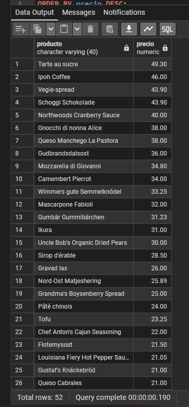

**Comentario:** He usado ``::numeric`` porque unit_price no es un tipo de valor que pueda usarse en ROUND() y porque se pide en las especificaciones del proyecto. 


---

## Pregunta 2 — Concentración geográfica de la cartera


**Enunciado:** Dirección quiere saber en qué mercados está realmente concentrada la base de clientes antes de decidir dónde abrir delegación. Cuenta cuántos clientes hay en cada país y muestra únicamente aquellos países con **5 o más clientes**, ordenados de mayor a menor. Indica también cuántas ciudades distintas hay en cada uno de esos países.

```sql
-- Países con 5 o más clientes, con su número de ciudades distintas
SELECT country AS pais, COUNT(*) AS num_clientes, COUNT(DISTINCT city) AS num_ciudades
FROM customers
GROUP BY country
HAVING COUNT(*) >= 5
ORDER BY num_clientes DESC, pais;
```

**Resultado:**
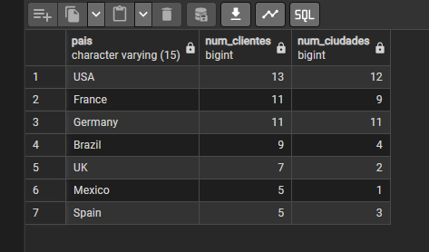

**Comentario:** Uso ``Having`` porque estoy filtrando filas después de haber agrupado los datos con ``GROUP BY``.

---

## Pregunta 3 — Alerta de reposición

**Enunciado:** Productos activos con stock inferior o igual a su nivel de reposición, con una columna que diga 'CRÍTICO' si el stock es 0 y 'AVISO' en el resto.

```sql
-- Productos activos con stock igual o inferior al nivel de reposición
SELECT product_name AS producto, units_in_stock AS stock, reorder_level AS nivel_reposicion,
       units_on_order AS pedido,
       CASE
           WHEN units_in_stock = 0 THEN 'CRÍTICO'
           ELSE 'AVISO'
       END AS situacion
FROM products
WHERE discontinued = 0
  AND units_in_stock <= reorder_level
ORDER BY units_in_stock, product_name;
```

**Resultado:**


**Comentario:** Usé CASE WHEN para decidir el texto entre "Crítico" y "Aviso" 


---

## Pregunta 4  — Ficha completa de producto


**Enunciado:** Para los productos suministrados por empresas de Italia, Francia o España, muestra producto, categoría, proveedor, país y ciudad, ordenados por país y producto.


```sql
-- Productos de proveedores de Italia, Francia o España con categoría y proveedor
SELECT products.product_name AS producto,
       categories.category_name AS categoria,
       suppliers.company_name AS proveedor,
       suppliers.country AS pais,
       suppliers.city AS ciudad
FROM products 
INNER JOIN categories ON categories.category_id = products.category_id
INNER JOIN suppliers ON suppliers.supplier_id = products.supplier_id
WHERE suppliers.country IN ('Italy', 'France', 'Spain')
ORDER BY suppliers.country, products.product_name;
```
**Resultado:**
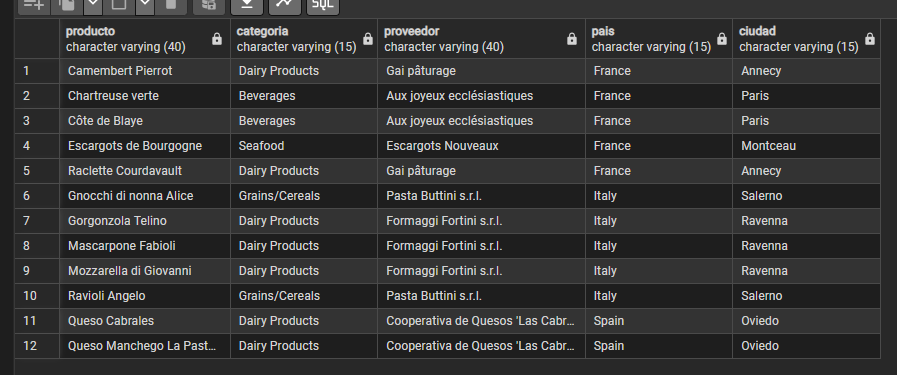

**Comentario:** Unión de tablas mediante ``INNER JOIN`` para poder hacer ``IN`` sobre los países necesarios en la tabla ``suppliers``

---

## Pregunta 5 — Detalle valorizado de un pedido

**Enunciado:** Reconstruye la factura del pedido 10248 línea a línea: producto, precio, cantidad, descuento e importe, con el nombre del cliente y la fecha.

```sql
-- Detalles del pedido 10248
SELECT customers.company_name AS cliente, orders.order_date AS fecha_pedido,products.product_name AS producto,
       ROUND(order_details.unit_price::numeric, 2) AS precio_unitario, order_details.quantity AS cantidad,
       ROUND(order_details.discount::numeric, 2) AS descuento, ROUND((order_details.unit_price::numeric) * order_details.quantity * (1 - order_details.discount::numeric), 2) AS importe_linea
FROM orders
INNER JOIN order_details USING (order_id)
INNER JOIN products USING (product_id)
INNER JOIN customers USING (customer_id)
WHERE orders.order_id = 10248
ORDER BY products.product_name;
```
**Resultado:**
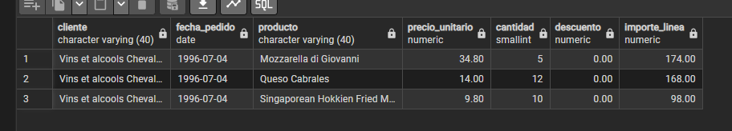

**Comentario:** Uso de ``USING`` porque las tablas comparten el nombre de columna de sus ids y si no se usase aparecerían duplicadas.

---

## Pregunta 6 — Ranking de categorías por facturación

**Enunciado:** Facturacion totl por categoría, con número de líneas y de productos distintos vendidos. Solo las categorías con más de 100000 euros.


```sql
-- Facturación por categoría, solo las que superan 100.000 euros
SELECT categories.category_name AS categoria,
       COUNT(*) AS num_lineas,
       COUNT(DISTINCT products.product_id) AS num_productos,
       ROUND(SUM((order_details.unit_price::numeric) * order_details.quantity * (1 - order_details.discount::numeric)), 2) AS facturacion
FROM order_details
INNER JOIN products ON products.product_id = order_details.product_id
INNER JOIN categories ON categories.category_id = products.category_id
GROUP BY categories.category_name
HAVING SUM((order_details.unit_price::numeric) * order_details.quantity * (1 - order_details.discount::numeric)) > 100000
ORDER BY facturacion DESC;
```
**Resultado:**
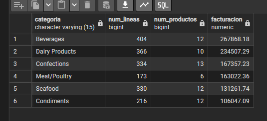

**Comentario:** En el ``HAVING`` repito la expresión completa del ``SUM()`` porque no le puedo hacer llamada por su nombre


---

## Pregunta 7 — Clientes sin actividad comercial

**Enunciado:** Todos los clientes con su número de pedidos y la fecha del último. Los que no han pedido salen con 0 y ``'SIN PEDIDOS'``, y los inactivos van primero.

```sql
-- Todos los clientes con su número de pedidos y fecha del último; los inactivos primero
SELECT customers.company_name AS cliente,
       customers.country AS pais,
       COUNT(orders.order_id) AS num_pedidos,
       COALESCE(MAX(orders.order_date)::text, 'SIN PEDIDOS') AS ultimo_pedido
FROM customers
LEFT JOIN orders ON orders.customer_id = customers.customer_id
GROUP BY customers.customer_id, customers.company_name, customers.country
ORDER BY num_pedidos, customers.company_name;
```
**Resultado:**


**Comentario:** Usé ``LEFT JOIN`` para que los clientes sin pedidos no desaparezcan. También, como ``MAX(order_date)`` es una fecha y ``'SIN PEDIDOS'`` es texto, convierto la fecha a texto para poder usar ``COALESCE``.


---

## Pregunta 8 — Organigrama de la fuerza de ventas

**Enunciado:** Cada empleado con su cargo, el nombre completo de su responsable y el cargo de este. Quien no reporta a nadie aparece con ``'DIRECCIÓN GENERAL'``.

```sql
-- Organigrama: cada empleado con su responsable directo
SELECT employees.first_name || ' ' || employees.last_name AS empleado,
       employees.title AS cargo,
       COALESCE(jefe.first_name || ' ' || jefe.last_name, 'DIRECCIÓN GENERAL') AS responsable,
       COALESCE(jefe.title, '-') AS cargo_responsable
FROM employees
LEFT JOIN employees jefe ON jefe.employee_id = employees.reports_to
ORDER BY employees.employee_id;
```
**Resultado:** 


**Comentario:** Uso de ``SELF JOIN``. La tabla employees aparece dos veces, como empleado y su jefe. En este caso, el alias de uno de ellos es imprescindible, en mi caso uso el del jefe porque lo veo muy necesario.

---

## Pregunta 9 — Rejilla de cobertura categoría × año 

**Enunciado:** Todas las combinaciones de las 8 categorías con los 3 años (24 filas) con su facturación, con 0 cuando no haya ventas.

```sql
-- Rejilla completa categoría x año con la facturación (0 si no hubo ventas)
WITH ventas AS (
    SELECT products.category_id,
           EXTRACT(YEAR FROM orders.order_date)::int AS anio,
           (order_details.unit_price::numeric) * order_details.quantity * (1 - order_details.discount::numeric) AS importe
    FROM orders
    INNER JOIN order_details ON order_details.order_id = orders.order_id
    INNER JOIN products ON products.product_id = order_details.product_id
),
anios AS (
    SELECT DISTINCT EXTRACT(YEAR FROM order_date)::int AS anio
    FROM orders
)
SELECT categories.category_name AS categoria,
       anios.anio AS anio,
       COALESCE(ROUND(SUM(ventas.importe), 2), 0) AS facturacion
FROM categories
CROSS JOIN anios
LEFT JOIN ventas ON ventas.category_id = categories.category_id AND ventas.anio = anios.anio
GROUP BY categories.category_name, anios.anio
ORDER BY categories.category_name, anios.anio;
```
**Resultado:**


**Comentario:** He tenido que usar un ``CROSS JOIN`` por que necesitaba 8 categorías x 3 años y después un ``LEFT JOIN``.


---

## Pregunta 10 — Mapa de países: clientes frente a proveedores

**Enunciado:** Para cada país, cuántos clientes y cuántos proveedores hay, y si tiene solo clientes, solo proveedores o ambos.

```sql
-- Clientes y proveedores por país, con el tipo de presencia
SELECT COALESCE(client.pais, provider.pais) AS pais,
       COALESCE(client.num, 0) AS num_clientes,
       COALESCE(provider.num, 0) AS num_proveedores,
       CASE
           WHEN provider.pais IS NULL THEN 'SOLO CLIENTES'
           WHEN client.pais IS NULL THEN 'SOLO PROVEEDORES'
           ELSE 'AMBOS'
       END AS tipo_presencia
FROM (SELECT country AS pais, COUNT(*) AS num FROM customers GROUP BY country) client
FULL JOIN (SELECT country AS pais, COUNT(*) AS num FROM suppliers GROUP BY country) provider
       ON client.pais = provider.pais
ORDER BY pais;
```
**Resultado:**


**Comentario:** He agregado por separsdo clientes y proveedores en dos subconsultas y las he unido con ``FULL JOIN`` para que así aparezcan los países que están solo en un lado

---

## Pregunta 11 — Directorio unificado de contactos

**Enunciado:** Una sola tabla con los contactos de clientes, proveedores y empleados, con origen, nombre en mayúsculas, organización, ciudad y país.

```sql
-- Directorio unificado de contactos de clientes, proveedores y empleados
SELECT 'CLIENTE' AS origen,
       UPPER(customers.contact_name) AS contacto,
       customers.company_name AS organizacion,
       customers.city AS ciudad,
       customers.country AS pais
FROM customers
UNION ALL
SELECT 'PROVEEDOR',
       UPPER(suppliers.contact_name),
       suppliers.company_name,
       suppliers.city,
       suppliers.country
FROM suppliers
UNION ALL
SELECT 'EMPLEADO',
       UPPER(employees.first_name || ' ' || employees.last_name),
       'NORTHWIND TRADERS',
       employees.city,
       employees.country
FROM employees
ORDER BY origen, pais, contacto;
```
**Resultado:**
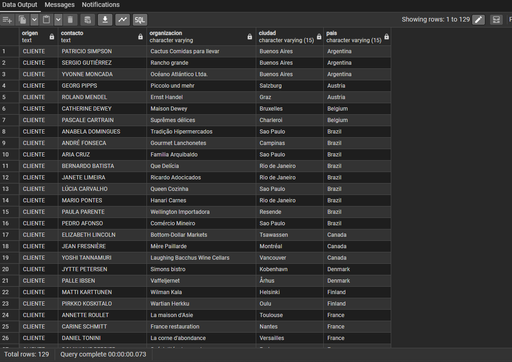

**Comentario:** Uso ``UNION ALL`` porque quiero todas las filas tal cual: con ``UNION`` se eliminarían los duplicados y se borrarían los que coincidiesen en en nombre y ciudad. 


---

## Pregunta 12 — Mercados con desequilibrio 

**Enunciado:** a) Países con clientes pero sin ningún proveedor. b) Países con clientes y proveedores a la vez.

```sql
-- Países con clientes pero sin ningún proveedor
SELECT country AS pais 
FROM customers
EXCEPT
SELECT country FROM suppliers
ORDER BY pais;

-- Países con clientes y proveedores a la vez
SELECT country AS pais 
FROM customers
INTERSECT
SELECT country FROM suppliers
ORDER BY pais;
```

**Resultados:**
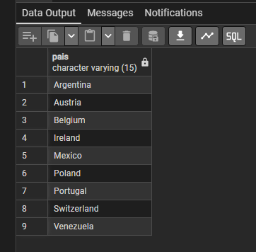
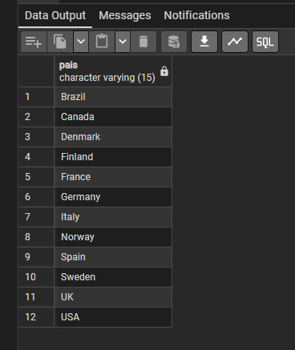
**Comentario:** El apartado a) usa ``EXCEPT`` (clientes menos proveedores) y el b) usa ``INTERSECT`` (los que están en los dos).

---

## Pregunta 13 — Clientes que nunca han comprado pescado 

**Enunciado:** Clientes que nunca han incluido un producto de la categoría Seafood en ningún pedido, con su país y su número de pedidos.

```sql
-- Clientes que nunca han comprado productos de la categoría Seafood
SELECT customers.company_name AS cliente,
       customers.country AS pais,
       COUNT(orders.order_id) AS pedidos_realizados
FROM customers
LEFT JOIN orders ON orders.customer_id = customers.customer_id
WHERE NOT EXISTS (
    SELECT 1
    FROM orders o2
    INNER JOIN order_details ON order_details.order_id = o2.order_id
    INNER JOIN products ON products.product_id = order_details.product_id
    INNER JOIN categories ON categories.category_id = products.category_id
    WHERE o2.customer_id = customers.customer_id
      AND categories.category_name = 'Seafood'
)
GROUP BY customers.customer_id, customers.company_name, customers.country
ORDER BY pedidos_realizados DESC, customers.company_name;
```
**Resultado:**
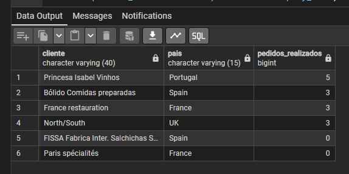

**Comentario:** Subconsulta correlacionada que busca si el cliente tiene alguna línea de la categoría Seafood. Uso ``NOT EXISTS`` en vez de ``NOT IN`` porque si la subconsulta devolviera algún ``NULL`` el resultado sería una tabla vacía sin avisar. 

---

## Pregunta 14 — Productos por encima de la media

**Enunciado:** Productos activos con precio superior al precio medio de todo el catálogo, con el precio, la media y la diferencia.

```sql
-- Productos activos con precio superior a la media del catálogo
SELECT product_name,
       ROUND(unit_price::numeric, 2),
       ROUND((SELECT AVG(unit_price::numeric) FROM products), 2),
       ROUND(unit_price::numeric - (SELECT AVG(unit_price::numeric) FROM products), 2)
FROM products
WHERE discontinued = 0
  AND unit_price::numeric > (SELECT AVG(unit_price::numeric) FROM products)
ORDER BY unit_price DESC;
```
**Resultado:**
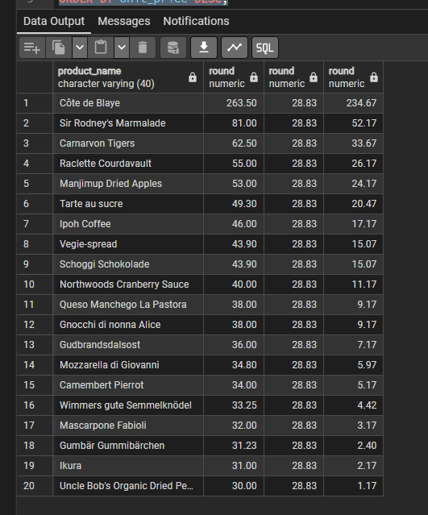

**Comentario:** Uso una subconsulta escalar (una fila y una columna) en el WHERE para comparar con la media y la repito en el SELECT para mostrarla y calcular la diferencia. 

---

## Pregunta 15 — Ticket medio por cliente

**Enunciado:** Para cada cliente que haya comprado, número de pedidos, importe total y ticket medio. Los 15 con mayor ticket medio.

```sql
-- Los 15 clientes con mayor ticket medio por pedido
SELECT customers.company_name,
       customers.country,
       COUNT(*),
       ROUND(SUM(importe_pedido), 2),
       ROUND(AVG(importe_pedido), 2)
FROM (
    SELECT orders.order_id,
           orders.customer_id,
           SUM((order_details.unit_price::numeric) * order_details.quantity * (1 - order_details.discount::numeric)) AS importe_pedido
    FROM orders
    INNER JOIN order_details
        ON order_details.order_id = orders.order_id
    GROUP BY orders.order_id, orders.customer_id
) AS pedidos
INNER JOIN customers
    ON customers.customer_id = pedidos.customer_id
GROUP BY customers.customer_id, customers.company_name, customers.country
ORDER BY AVG(pedidos.importe_pedido) DESC
LIMIT 15;
```
**Resultado:** :
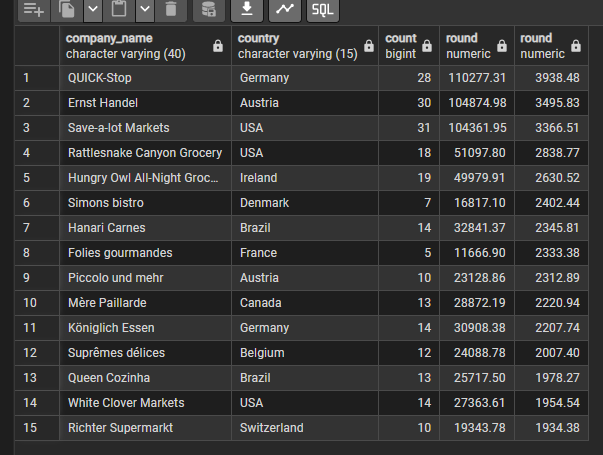

**Comentario:** El cálculo tiene dos niveles. Primero, en una subconsulta en el ``FROM``, sumo las líneas para obtener el importe de cada pedido. Después promedio esos importes por cliente.


---

## Pregunta 16 — El producto más caro de cada categoría

**Enunciado:** Para cada categoría, el producto con el precio más alto, con el precio medio de su categoría. Con subconsulta correlacionada.

```sql
-- Producto más caro de cada categoría, con el precio medio de su categoría
SELECT categories.category_name,
       products.product_name,
       ROUND(products.unit_price::numeric, 2),
       (SELECT ROUND(AVG(productos_categoria.unit_price::numeric), 2)
        FROM products AS productos_categoria
        WHERE productos_categoria.category_id = products.category_id)
FROM products
INNER JOIN categories
    ON categories.category_id = products.category_id
WHERE products.unit_price = (SELECT MAX(productos_categoria.unit_price)
                             FROM products AS productos_categoria
                             WHERE productos_categoria.category_id = products.category_id)
ORDER BY categories.category_name;
```
**Resultado:** 
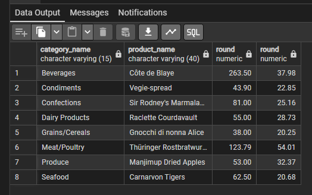

**Comentario:**  En el ``WHERE``, la subconsulta correlacionada calcula el precio máximo de la categoría del producto que se está evaluando (p2.category_id = p.category_id). En el ``SELECT``, otra subconsulta correlacionada calcula la media de esa categoría.

---

## Pregunta 17 — Segmentación ABC de la cartera de clientes

**Enunciado:** Con CTE, calcula la facturación de cada cliente, divídelos en cuartiles, etiqueta cada segmento y devuelve por segmento el número de clientes, la facturación y su porcentaje sobre el total.

```sql
-- Segmentación ABC de clientes por cuartiles de facturación
WITH facturacion_cliente AS (
    SELECT orders.customer_id,
           SUM((order_details.unit_price::numeric) * order_details.quantity * (1 - order_details.discount::numeric)) AS facturacion
    FROM orders
    INNER JOIN order_details
        ON order_details.order_id = orders.order_id
    GROUP BY orders.customer_id
),
cuartiles AS (
    SELECT facturacion_cliente.customer_id,
           facturacion_cliente.facturacion,
           NTILE(4) OVER (ORDER BY facturacion_cliente.facturacion DESC) AS cuartil
    FROM facturacion_cliente
),
segmentos AS (
    SELECT cuartiles.customer_id,
           cuartiles.facturacion,
           CASE cuartiles.cuartil
               WHEN 1 THEN 'A - Estratégico'
               WHEN 2 THEN 'B - Consolidado'
               WHEN 3 THEN 'C - Ocasional'
               ELSE 'D - Marginal'
           END AS segmento
    FROM cuartiles
)
SELECT segmentos.segmento,
       COUNT(*) AS num_clientes,
       ROUND(SUM(segmentos.facturacion), 2) AS facturacion_segmento,
       ROUND(100 * SUM(segmentos.facturacion) / SUM(SUM(segmentos.facturacion)) OVER (), 2) AS porcentaje_sobre_total
FROM segmentos
GROUP BY segmentos.segmento
ORDER BY segmentos.segmento;
```
**Resultado:**
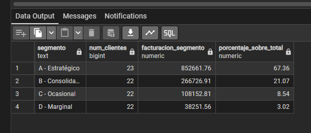

**Comentario:** Encadeno tres CTE: facturacion_cliente, cuartiles y segmentos. Para el porcentaje uso ``SUM(SUM(...)) OVER ()``, que suma el total de todos los segmentos.

---

## Pregunta 18 — Los tres productos más vendidos de cada categoría

**Enunciado:** Para cada categoría, los 3 productos con mayor facturación, con posición en la categoría, unidades, facturación y posición global.

```sql
-- Top 3 de productos por facturación en cada categoría, con su posición global
WITH ventas AS (
    SELECT categories.category_name,
           products.product_name,
           SUM(order_details.quantity) AS unidades,
           SUM((order_details.unit_price::numeric) * order_details.quantity * (1 - order_details.discount::numeric)) AS facturacion
    FROM order_details
    INNER JOIN products
        ON products.product_id = order_details.product_id
    INNER JOIN categories
        ON categories.category_id = products.category_id
    GROUP BY categories.category_name, products.product_id, products.product_name
),
ranking AS (
    SELECT ventas.category_name,
           ventas.product_name,
           ventas.unidades,
           ventas.facturacion,
           RANK() OVER (PARTITION BY ventas.category_name ORDER BY ventas.facturacion DESC) AS posicion_en_categoria,
           RANK() OVER (ORDER BY ventas.facturacion DESC) AS posicion_global
    FROM ventas
)
SELECT ranking.category_name,
       ranking.posicion_en_categoria,
       ranking.product_name,
       ranking.unidades,
       ROUND(ranking.facturacion, 2) AS facturacion,
       ranking.posicion_global
FROM ranking
WHERE ranking.posicion_en_categoria <= 3
ORDER BY ranking.category_name, ranking.posicion_en_categoria;
```
**Resultado:**
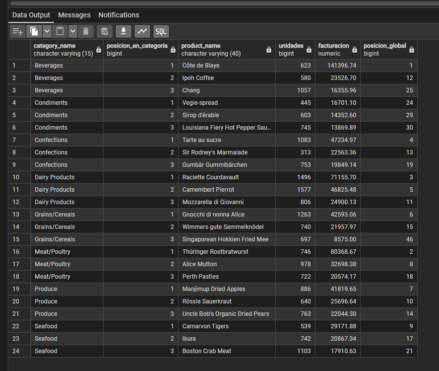

**Comentario:** Calculo las dos posiciones con ``RANK()``, una con ``PARTITION BY`` categoria y otra sin partición para el ranking global, y filtro fuera, porque no se puede filtrar por una función de ventana en el ``WHERE``.


---

## Pregunta 19 — Evolución mensual con acumulado y media móvil

**Enunciado:** Para cada mes de 1997: facturación, acumulado, media móvil de 3 meses, facturación del mes anterior y variación porcentual.

```sql
-- Evolución mensual de 1997: acumulado, media móvil de 3 meses y variación mensual
WITH mensual AS (
    SELECT DATE_TRUNC('month', orders.order_date)::date AS mes,
           SUM((order_details.unit_price::numeric) * order_details.quantity * (1 - order_details.discount::numeric)) AS facturacion
    FROM orders
    INNER JOIN order_details
        ON order_details.order_id = orders.order_id
    WHERE orders.order_date >= DATE '1997-01-01'
      AND orders.order_date < DATE '1998-01-01'
    GROUP BY DATE_TRUNC('month', orders.order_date)
)
SELECT mensual.mes,
       ROUND(mensual.facturacion, 2) AS facturacion,
       ROUND(SUM(mensual.facturacion) OVER (ORDER BY mensual.mes), 2) AS acumulado,
       ROUND(AVG(mensual.facturacion) OVER (
           ORDER BY mensual.mes
           ROWS BETWEEN 2 PRECEDING AND CURRENT ROW
       ), 2) AS media_movil_3m,
       ROUND(LAG(mensual.facturacion) OVER (ORDER BY mensual.mes), 2) AS mes_anterior,
       ROUND(
           100 * (mensual.facturacion - LAG(mensual.facturacion) OVER (ORDER BY mensual.mes))
           / LAG(mensual.facturacion) OVER (ORDER BY mensual.mes),
           2
       ) AS variacion_pct
FROM mensual
ORDER BY mensual.mes;
```
**Resultado:**
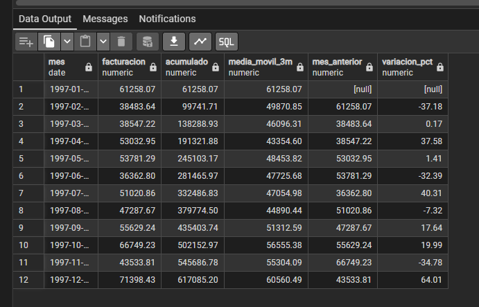

**Comentario:** ``SUM() OVER (ORDER BY mes)`` da el acumulado y para la media móvil declaro el marco a mano con ``ROWS BETWEEN 2 PRECEDING AND CURRENT ROW``.


---

## Pregunta 20 — Cuadro de mando anual por categoría 

**Enunciado:** Una fila por categoría con la facturación de 1996, 1997 y 1998 en columnas, el total, el peso sobre el total de la compañía, la tendencia 1997-1998 y una fila de totales generales.

```sql
-- Cuadro de mando anual por categoría con pivotado, totales y tendencia 1997-1998
-- OJO: 1996 solo tiene datos desde julio y 1998 solo hasta el 6 de mayo, así que
-- comparar los importes anuales en bruto no es válido. La tendencia se calcula
-- con el ritmo diario de facturación (importe / días con datos de cada año).
WITH ventas AS (
    SELECT categories.category_name,
           EXTRACT(YEAR FROM orders.order_date)::int AS anio,
           (order_details.unit_price::numeric) * order_details.quantity * (1 - order_details.discount::numeric) AS importe
    FROM orders
    INNER JOIN order_details
        ON order_details.order_id = orders.order_id
    INNER JOIN products
        ON products.product_id = order_details.product_id
    INNER JOIN categories
        ON categories.category_id = products.category_id
),
dias AS (
    SELECT 365 AS dias_1997,
           (SELECT MAX(orders.order_date) FROM orders) - DATE '1998-01-01' + 1 AS dias_1998
),
pivotado AS (
    SELECT ventas.category_name,
           SUM(ventas.importe) FILTER (WHERE ventas.anio = 1996) AS f_1996,
           SUM(ventas.importe) FILTER (WHERE ventas.anio = 1997) AS f_1997,
           SUM(ventas.importe) FILTER (WHERE ventas.anio = 1998) AS f_1998,
           SUM(ventas.importe) AS total
    FROM ventas
    GROUP BY ROLLUP (ventas.category_name)
)
SELECT COALESCE(pivotado.category_name, 'TOTAL GENERAL') AS categoria,
       ROUND(COALESCE(pivotado.f_1996, 0), 2) AS f_1996,
       ROUND(COALESCE(pivotado.f_1997, 0), 2) AS f_1997,
       ROUND(COALESCE(pivotado.f_1998, 0), 2) AS f_1998,
       ROUND(pivotado.total, 2) AS total,
       ROUND(
           100 * pivotado.total /
           SUM(pivotado.total) FILTER (WHERE pivotado.category_name IS NOT NULL) OVER (),
           2
       ) AS peso_pct,
       CASE
           WHEN COALESCE(pivotado.f_1998, 0) / dias.dias_1998
                > COALESCE(pivotado.f_1997, 0) / dias.dias_1997
           THEN 'CRECE'
           ELSE 'DECRECE'
       END AS tendencia
FROM pivotado
CROSS JOIN dias
ORDER BY (pivotado.category_name IS NULL), pivotado.category_name;
```
**Resultado:**
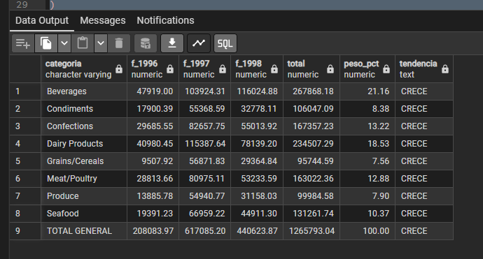

**Comentario:** Pivoto con ``SUM(...) FILTER (WHERE anio = ...)``, que es más legible que el ``CASE`` dentro del ``SUM``. ``ROLLUP (categoria)`` añade la fila de totales, que rellena con ``COALESCE`` como total general. 


