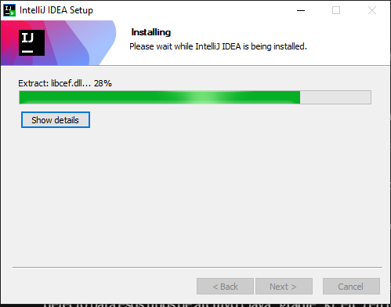
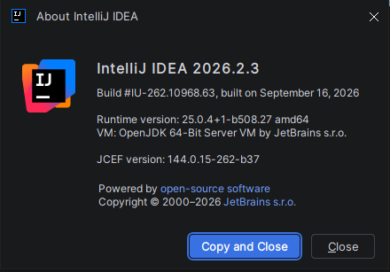
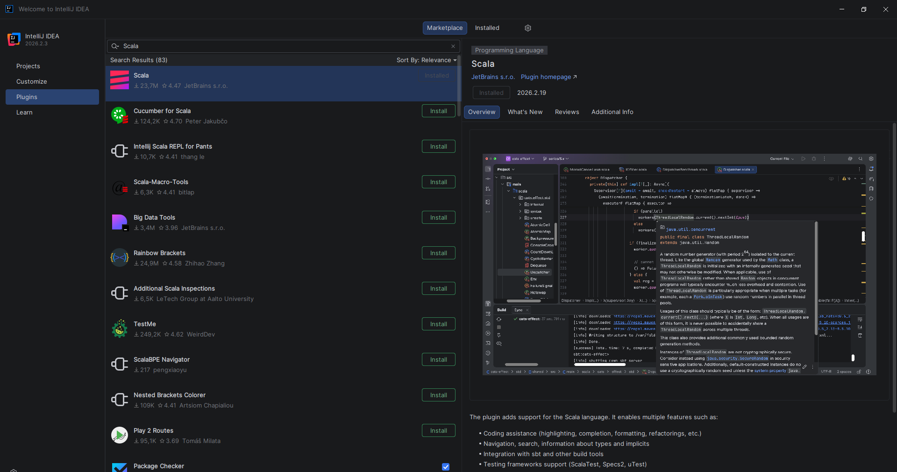
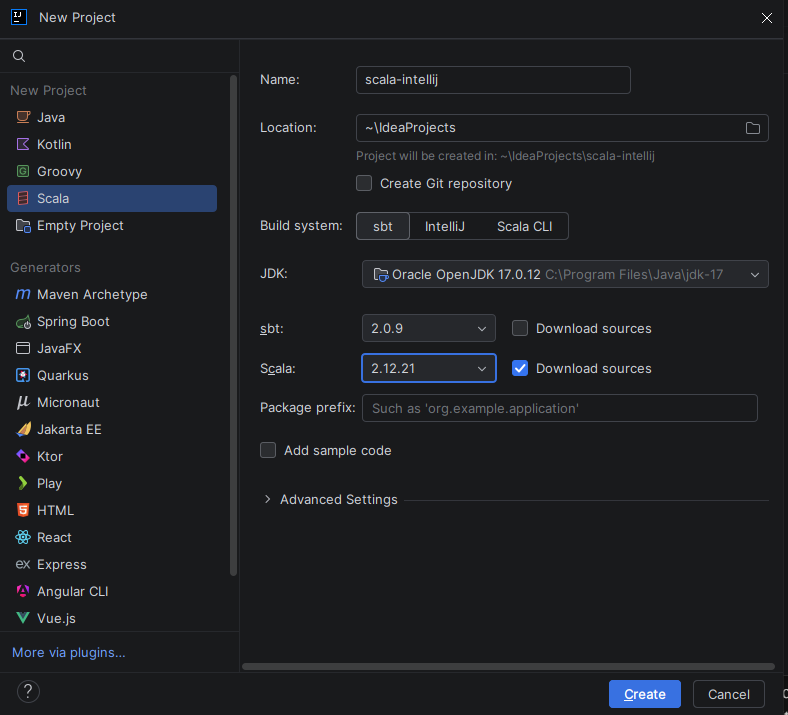
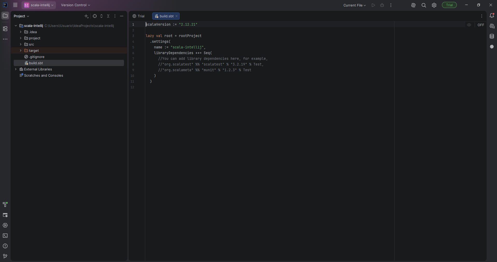
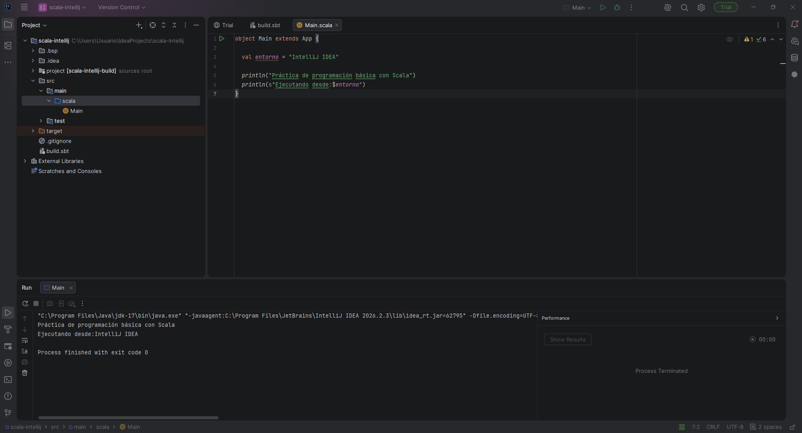
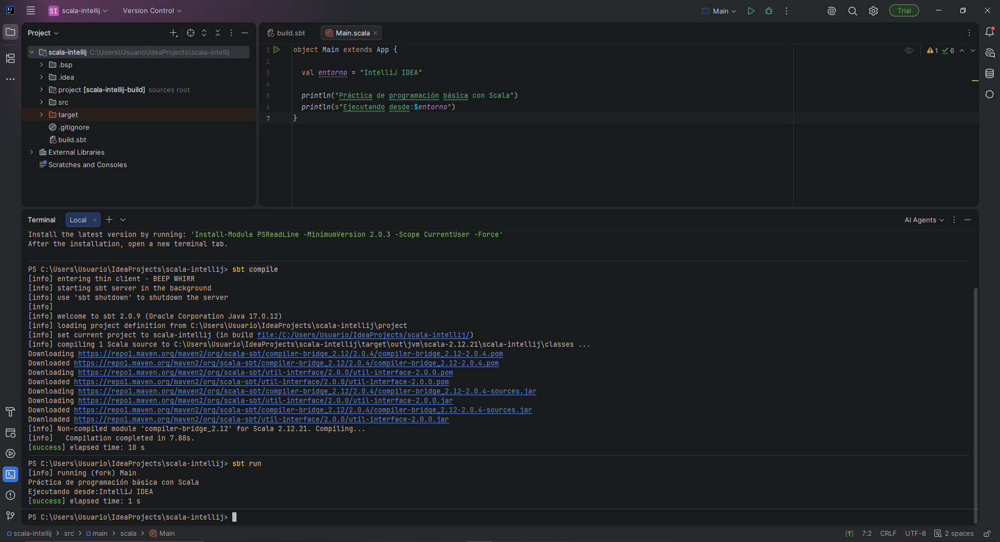

# 1.3 Entorno 3 — IntelliJ IDEA Community + Scala 2.12.21 + sbt

## Objetivo

El objetivo de este entorno es preparar un segundo entorno de desarrollo, esta vez basado en un **IDE completo**, utilizando **IntelliJ IDEA Community Edition**, el plugin de **Scala**, **JDK 17**, **Scala 2.12.21** y **sbt**.

El material del curso (Datacamp) presenta los IDE como especialmente útiles para proyectos con múltiples archivos, e identifica **IntelliJ IDEA** como uno de los entornos utilizados habitualmente para desarrollar en Scala.

---

## 1. Instalar IntelliJ IDEA Community Edition

Se descargó e instaló **IntelliJ IDEA Community Edition** siguiendo el asistente de instalación estándar de Windows.



Una vez instalado, se inició el programa y se comprobó la versión desde **Help → About**:

```text
IntelliJ IDEA 2026.2.3
Build #IU-262.10968.63, built on September 16, 2026
Runtime version: 25.0.4+1-b508.27 amd64
VM: OpenJDK 64-Bit Server VM by JetBrains s.r.o.
```



De esta forma se confirma que IntelliJ IDEA Community Edition quedó correctamente instalado en Windows 11.

En el primer arranque, en la pantalla de **Import Settings**, se eligió la opción **Skip Import**, con el fin de partir de una configuración limpia y por defecto del IDE.

---

## 2. Instalar el soporte para Scala

Desde el sistema de plugins de IntelliJ IDEA (**File → Settings → Plugins**) se instaló el plugin oficial de JetBrains:

```text
Scala
```

Este plugin añade soporte completo para el lenguaje Scala dentro de IntelliJ: resaltado de sintaxis, autocompletado, integración con sbt y ejecución de programas Scala directamente desde el IDE.



Tras la instalación, IntelliJ solicitó reiniciarse, reinicio que se realizó antes de continuar con el resto de pasos.

---

## 3. Configurar JDK 17

Se comprobó que el proyecto utilizara **JDK 17** como SDK, en lugar del JDK propuesto por defecto por el asistente (Oracle OpenJDK 21).

La configuración del JDK se realizó desde el propio asistente de creación del proyecto, seleccionando en el desplegable **JDK** la instalación correspondiente a **JDK 17**, la misma utilizada en el Entorno 2.



De esta forma se garantiza que el proyecto compila y se ejecuta utilizando Java 17.

---

## 4. Crear un proyecto sbt

Desde **File → New → Project**, se seleccionó **Scala** como tipo de proyecto y **sbt** como sistema de construcción (*build system*).

Se configuró el proyecto con los siguientes datos:

* **Name:** `scala-intellij`
* **Build system:** `sbt`
* **Scala version:** `2.12.21`
* **JDK:** 17


Una vez creado, IntelliJ generó automáticamente la estructura estándar de un proyecto sbt, incluyendo las carpetas `src/main/scala`, `project` y el archivo `build.sbt` en la raíz.

---

## 5. Revisar `build.sbt`

Se comprobó el contenido del archivo `build.sbt` generado por el asistente de IntelliJ:

```scala
scalaVersion := "2.12.21"

lazy val root = rootProject
  .settings(
    name := "scala-intellij",
    libraryDependencies ++= Seq(
      //You can add library dependencies here, for example,
      //"org.scalatest" %% "scalatest" % "3.2.19" % Test,
      //"org.scalameta" %% "munit" % "1.2.3" % Test
    )
  )
```



Aunque la sintaxis es distinta a la utilizada en el Entorno 2 (aquí se emplea `rootProject` con `.settings(...)`, una forma más moderna de definir la configuración), el resultado es equivalente: se fija `scalaVersion := "2.12.21"` y `name := "scala-intellij"`.

---

## 6. Crear un programa Scala

Dentro de `src/main/scala/Main.scala` se escribió el siguiente programa:

```scala
object Main extends App {

  val entorno = "IntelliJ IDEA"

  println("Práctica de programación básica con Scala")
  println(s"Ejecutando desde:$entorno")
}
```

El programa es equivalente al utilizado en el Entorno 2, cambiando únicamente el valor de la variable `entorno` para reflejar que en este caso se ejecuta desde IntelliJ IDEA.

---

## 7. Ejecutar desde IntelliJ IDEA

Se ejecutó el programa directamente desde el propio IDE, utilizando el icono de ejecución (▶) que IntelliJ muestra junto a la declaración `object Main extends App`.



La consola integrada de IntelliJ mostró correctamente la salida del programa, confirmando que el entorno de ejecución del propio IDE funciona sin necesidad de utilizar una terminal externa.

---

## 8. Ejecutar utilizando sbt

Finalmente, se abrió una terminal dentro del proyecto para comprobar también la compilación y ejecución mediante `sbt`.

En el primer intento, el comando `sbt compile` no fue reconocido por la terminal integrada de IntelliJ (`sbt : El término 'sbt' no se reconoce como nombre de un cmdlet...`), ya que la sesión del IDE se había iniciado antes de que la variable **PATH** del sistema incluyera la ruta de `sbt`. El problema se resolvió cerrando y volviendo a abrir IntelliJ IDEA, de forma que la terminal integrada heredara el PATH actualizado.

Una vez solucionado, se ejecutaron correctamente:

```bash
sbt compile
```

y a continuación:

```bash
sbt run
```



El resultado confirmó que el proyecto compila correctamente con Scala 2.12.21 y que, al ejecutarlo, se muestra la salida esperada del programa `Main.scala`.

---

## 9. Comprobación final del entorno

Una vez completados todos los pasos, se comprobó que el entorno funcionaba correctamente tanto desde el propio IDE como desde la terminal.

El entorno final está compuesto por:

```text
IntelliJ IDEA Community Edition
    │
    ▼
Plugin de Scala
    │
    ▼
sbt
    │
    ▼
Scala 2.12.21 (JDK 17)
```

Por tanto, el **Entorno 3 — IntelliJ IDEA Community + Scala 2.12.21 + sbt** queda correctamente configurado, permitiendo desarrollar, compilar y ejecutar proyectos Scala tanto mediante las herramientas propias del IDE como mediante `sbt` desde la terminal.

---

## Evidencias

Las evidencias incluidas en esta documentación permiten comprobar:

* IntelliJ IDEA Community instalado, con su versión comprobada desde **Help → About**.
* Plugin de **Scala** instalado.
* JDK 17 configurado para el proyecto.
* Proyecto sbt `scala-intellij` creado, con Scala 2.12.21 configurado.
* Estructura del proyecto generada automáticamente por el asistente.
* Contenido del archivo `build.sbt`.
* Archivo `Main.scala` con el programa de prueba.
* Ejecución correcta del programa desde IntelliJ IDEA.
* Ejecución correcta mediante `sbt compile` y `sbt run` desde la terminal integrada.
