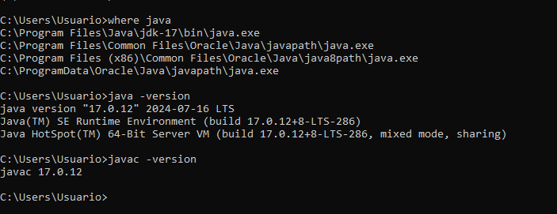
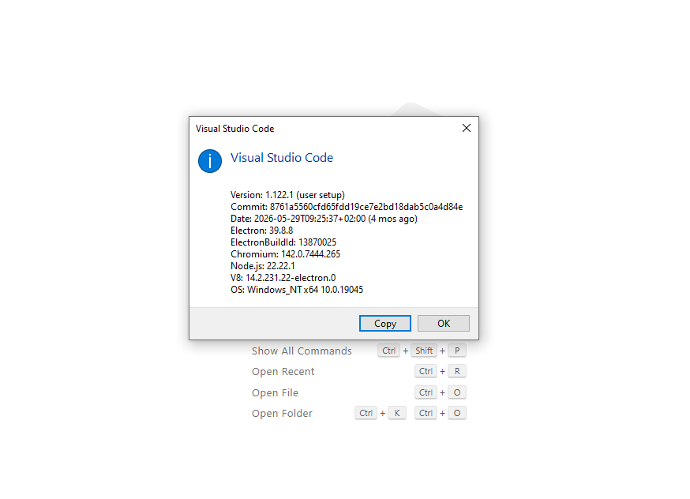
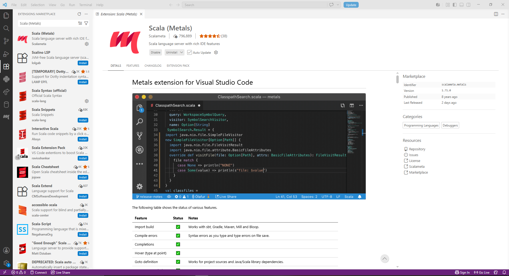
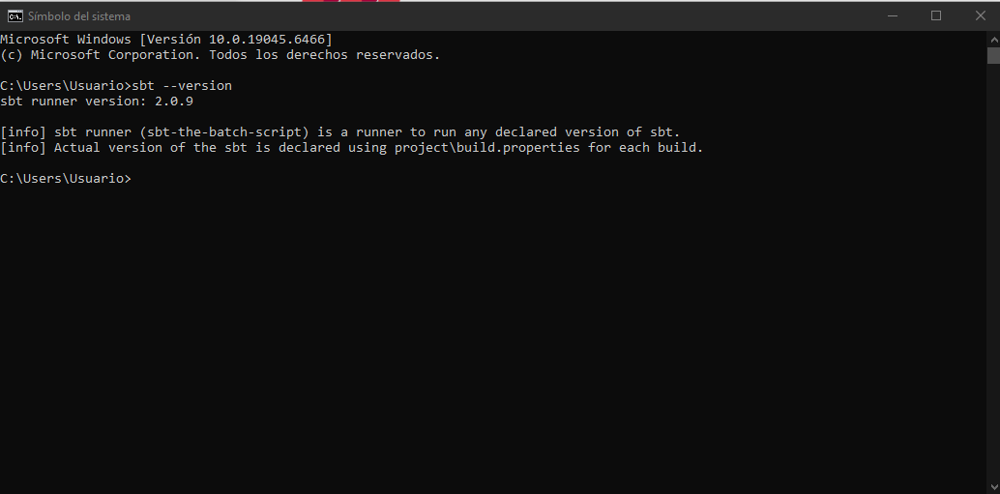
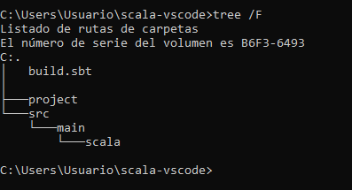
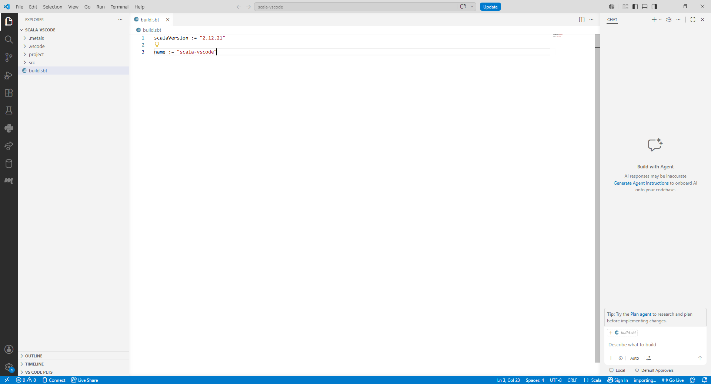
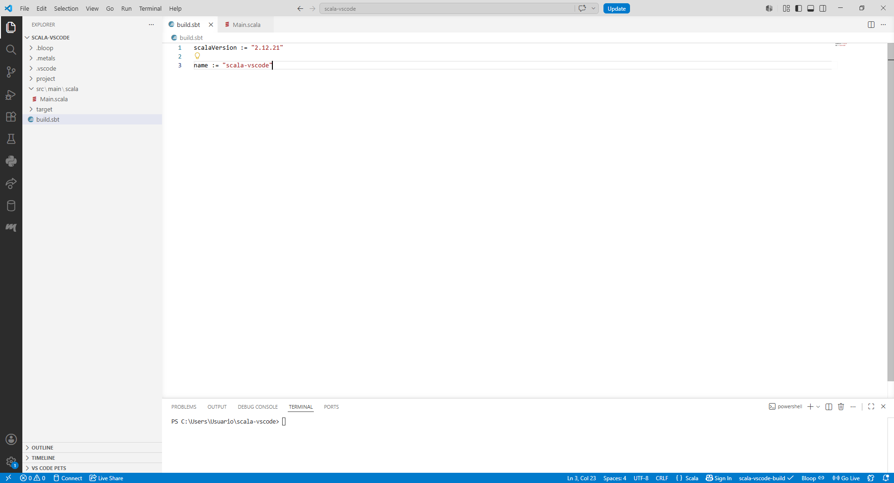
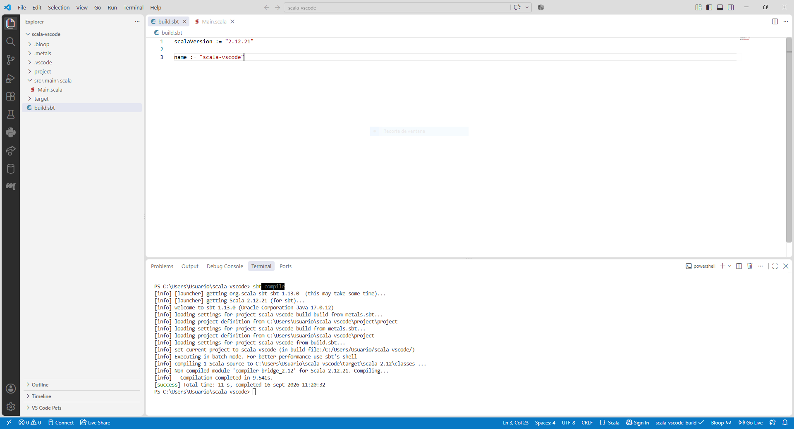
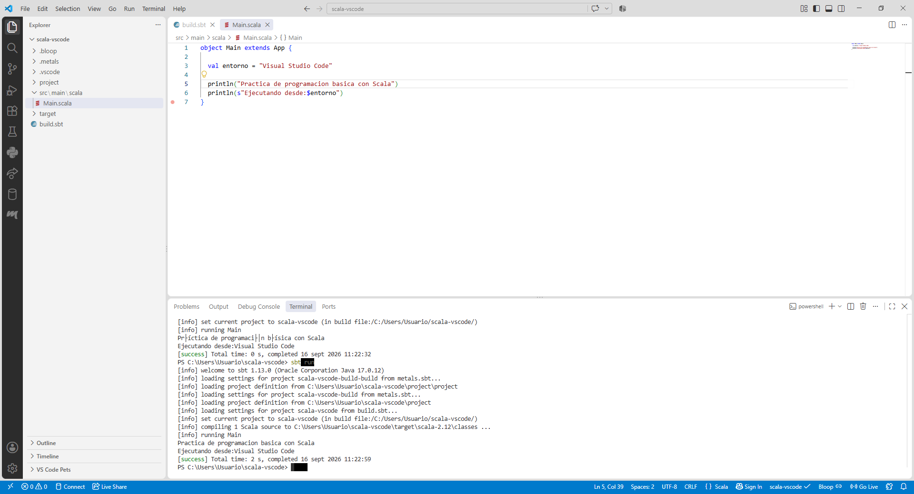

# 1.2 Entorno 2 — Visual Studio Code + Metals + Scala 2.12.21 + JDK 17 + sbt
 
## Objetivo
 
El objetivo de este entorno es preparar un entorno de desarrollo para proyectos **Scala** utilizando **Visual Studio Code**, **Metals**, **JDK 17**, **Scala 2.12.21** y **sbt**.
 
El material del curso (Datacamp) distingue entre pequeños scripts y aplicaciones Scala estructuradas. Las aplicaciones pueden estar compuestas por varios archivos y ser compiladas antes de ejecutarse.
 
En esta parte se comienza a trabajar con ese segundo enfoque, dejando atrás el uso de notebooks interactivos y pasando a un flujo de trabajo basado en proyectos compilados con `sbt`.
 
---
 
## 1. Instalar JDK 17
 
Se instaló un **JDK 17** compatible con las herramientas utilizadas en el resto del entorno (Visual Studio Code, Metals y sbt).
 
Una vez instalado, se comprobó su disponibilidad desde una terminal ejecutando:
 
```bash
java -version
```
 
y:
 
```bash
javac -version
```
 
El resultado obtenido confirma que el JDK 17 está correctamente instalado y disponible en el `PATH` del sistema:
 
```text
java version "17.0.12" 2024-07-16 LTS
Java(TM) SE Runtime Environment (build 17.0.12+8-LTS-286)
Java HotSpot(TM) 64-Bit Server VM (build 17.0.12+8-LTS-286, mixed mode, sharing)
 
javac 17.0.12
```
 

 
De esta forma se verifica que el JDK 17 está correctamente configurado para el resto del entorno.
 
---
 
## 2. Instalar Visual Studio Code
 
A continuación se instaló **Visual Studio Code**, el editor utilizado como base del entorno de desarrollo.
 
Una vez instalado, se inició el programa y se comprobó la versión instalada desde el menú **Help → About**:
 
```text
Version: 1.122.1 (user setup)
Electron: 39.8.8
Chromium: 142.0.7444.265
Node.js: 22.22.1
OS: Windows_NT x64 10.0.19045
```
 

 
De esta forma se confirma que Visual Studio Code está correctamente instalado en Windows 11.
 
---
 
## 3. Instalar Metals
 
Desde el sistema de extensiones de Visual Studio Code se instaló la extensión:
 
```text
Scala (Metals)
```
 
Metals actúa como **servidor de lenguaje (Language Server)** para Scala, aportando funcionalidades de IDE como autocompletado, comprobación de errores, navegación a definiciones e importación de proyectos `sbt`.
 

 
La captura muestra el nombre de la extensión (**Scala (Metals)**, publicada por *Scalameta*) y su estado, con las opciones **Disable** y **Uninstall** visibles, lo que confirma que la extensión quedó correctamente instalada.
 
---
 
## 4. Instalar y comprobar sbt
 
Se instaló **sbt**, la herramienta de construcción (*build tool*) utilizada para compilar y ejecutar proyectos Scala.
 
Se comprobó su disponibilidad desde una terminal ejecutando:
 
```bash
sbt --version
```
 
El resultado obtenido fue:
 
```text
sbt runner version: 2.0.9
 
[info] sbt runner (sbt-the-batch-script) is a runner to run any declared version of sbt.
[info] Actual version of the sbt is declared using project\build.properties for each build.
```
 

 
De esta forma se confirma que sbt está correctamente instalado y disponible desde la terminal.
 
---
 
## 5. Crear un proyecto Scala con sbt
 
Se creó una carpeta para el proyecto llamada:
 
```text
scala-vscode
```
 
Dentro de ella se generó la estructura mínima necesaria para un proyecto `sbt`:
 
```text
scala-vscode/
├── build.sbt
├── project/
└── src/
    └── main/
        └── scala/
            └── Main.scala
```
 
La estructura de carpetas se comprobó desde la terminal mediante el comando `tree /F`:
 

 
Como se observa en la captura, el proyecto cuenta con el archivo `build.sbt` en la raíz y con las carpetas `project` y `src\main\scala`, tal y como exige la estructura mínima de un proyecto `sbt`.
 
---
 
## 6. Configurar Scala 2.12.21
 
En el archivo `build.sbt` se configuró explícitamente la versión de Scala a utilizar:
 
```scala
scalaVersion := "2.12.21"
```
 
Y se añadió también un nombre para el proyecto:
 
```scala
name := "scala-vscode"
```
 

 
De esta forma, el proyecto queda configurado para compilarse y ejecutarse utilizando **Scala 2.12.21**.
 
---
 
## 7. Crear el programa
 
Dentro de `src/main/scala/Main.scala` se creó un pequeño programa de prueba:
 
```scala
object Main extends App {
 
  val entorno = "Visual Studio Code"
 
  println("Práctica de programación básica con Scala")
  println(s"Ejecutando desde:$entorno")
}
```
 
El programa define un objeto `Main` que extiende `App`, declara una variable `entorno` y muestra dos mensajes por consola, uno de ellos utilizando interpolación de cadenas.
 
---
 
## 8. Importar el proyecto con Metals
 
Al abrir la carpeta `scala-vscode` desde Visual Studio Code, **Metals** detectó automáticamente el proyecto `sbt` y comenzó el proceso de importación, generando las carpetas auxiliares `.bloop` y `.metals` necesarias para ofrecer las funcionalidades de IDE (autocompletado, comprobación de errores, navegación, etc.).
 

 
En el explorador de archivos se puede comprobar cómo, junto a `build.sbt` y `src\main\scala\Main.scala`, aparecen ahora las carpetas `.bloop` y `.metals`, generadas por Metals tras importar correctamente el proyecto.
 
---
 
## 9. Compilar el proyecto
 
Desde una terminal situada dentro del proyecto se ejecutó:
 
```bash
sbt compile
```
 
El resultado obtenido fue:
 
```text
[info] loading settings for project scala-vscode-build-build from metals.sbt...
[info] loading project definition from C:\Users\Usuario\scala-vscode\project\project
[info] loading settings for project scala-vscode-build from metals.sbt...
[info] loading project definition from C:\Users\Usuario\scala-vscode\project
[info] loading settings for project scala-vscode from build.sbt...
[info] set current project to scala-vscode (in build file:/C:/Users/Usuario/scala-vscode/)
[info] compiling 1 Scala source to C:\Users\Usuario\scala-vscode\target\scala-2.12\classes ...
[info] Non-compiled module 'compiler-bridge_2.12' for Scala 2.12.21. Compiling...
[info]   Compilation completed in 9.541s.
[success] Total time: 11 s, completed 16 sept 2026 11:20:32
```
 

 
El mensaje `[success]` confirma que el proyecto compila correctamente con la versión de Scala configurada.
 
---
 
## 10. Ejecutar el proyecto
 
Finalmente, desde la misma terminal se ejecutó:
 
```bash
sbt run
```
 
El resultado obtenido fue:
 
```text
[info] running Main
Practica de programacion basica con Scala
Ejecutando desde:Visual Studio Code
[success] Total time: 0 s, completed 16 sept 2026 11:22:32
```
 

 
La salida por consola confirma que el programa `Main.scala` se ejecuta correctamente, mostrando el mensaje fijo y el mensaje generado mediante interpolación de cadenas con la variable `entorno`.
 
---
 
## 11. Comprobación final del entorno
 
Una vez completados todos los pasos, se comprobó que el entorno funcionaba correctamente de principio a fin.
 
El entorno final está compuesto por:
 
```text
Visual Studio Code
    │
    ▼
Metals (Scala Language Server)
    │
    ▼
sbt
    │
    ▼
Scala 2.12.21 (JDK 17)
```
 
Por tanto, el **Entorno 2 — Visual Studio Code + Metals + Scala 2.12.21 + JDK 17 + sbt** queda correctamente configurado y preparado para trabajar con proyectos Scala estructurados y compilados.
 
---
 
## Evidencias
 
Las evidencias incluidas en esta documentación permiten comprobar:
 
* Resultado de `java -version` y `javac -version` (JDK 17 instalado).
* Visual Studio Code instalado, con su versión comprobada.
* Extensión **Scala (Metals)** instalada.
* Resultado de `sbt --version`.
* Estructura del proyecto `scala-vscode` generada mediante `tree /F`.
* Contenido del archivo `build.sbt`.
* Scala **2.12.21** configurado explícitamente.
* Archivo `Main.scala` con el programa de prueba.
* Proyecto reconocido e importado correctamente por Metals.
* Ejecución correcta de `sbt compile`.
* Ejecución correcta de `sbt run`.
