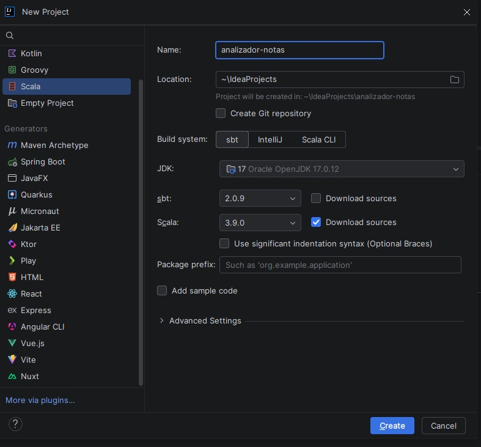
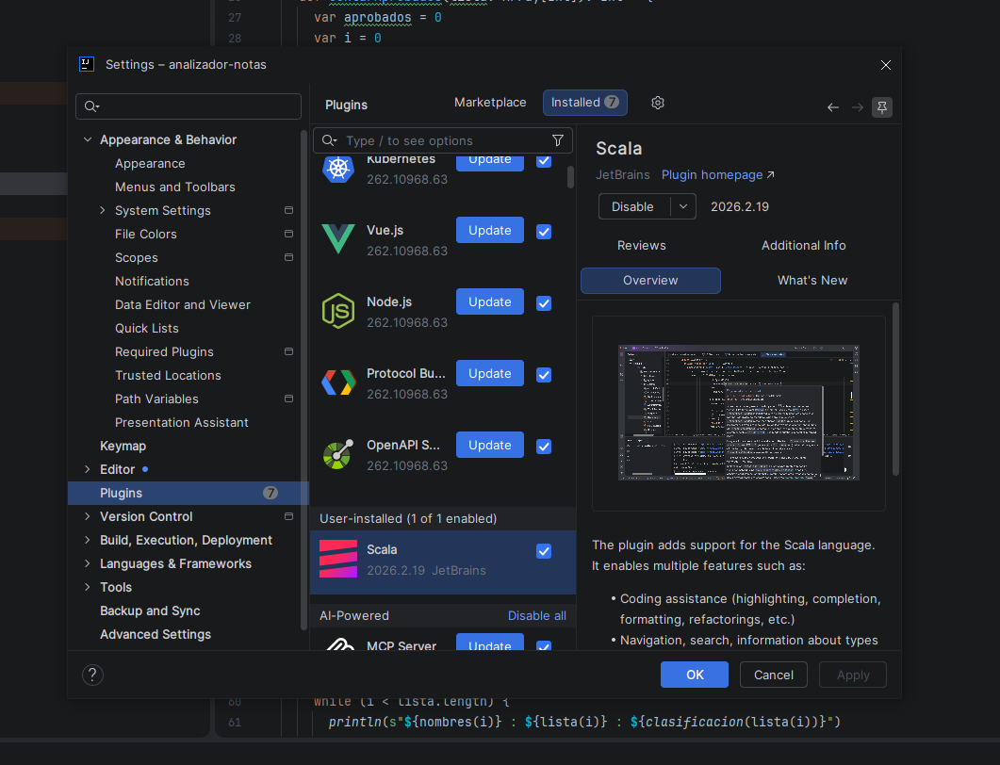
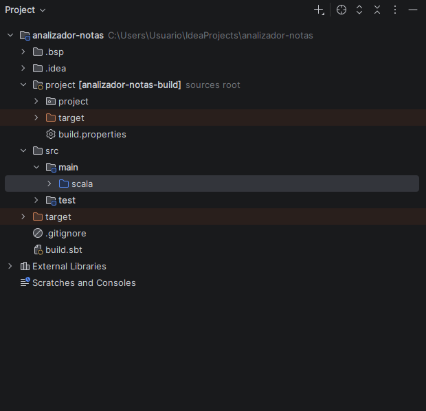
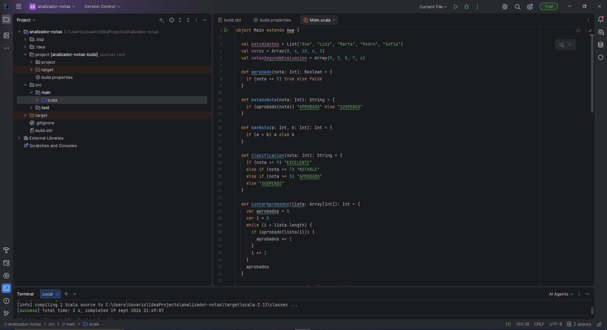
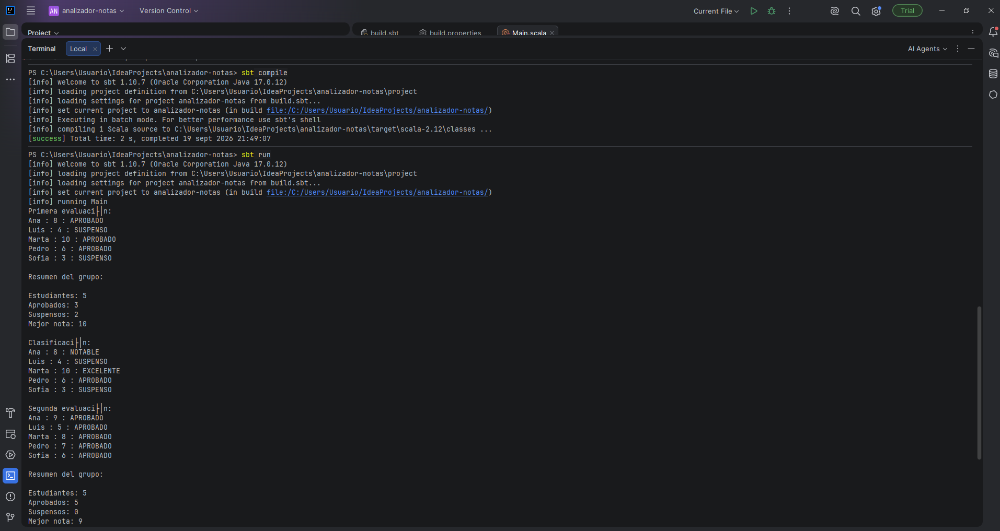

# Mini proyecto 3.2: Analizador de calificaciones

## Entorno

- IntelliJ IDEA Community
- Plugin de Scala (versión 2026.2.19)
- Scala 2.12.21
- JDK 17 (Oracle OpenJDK 17.0.12)
- sbt 1.10.7

## Qué hace el programa

Analiza las notas de 5 estudiantes en dos evaluaciones. Para cada evaluación muestra si cada alumno aprueba o suspende, hace un resumen del grupo (estudiantes, aprobados, suspensos y mejor nota) y clasifica cada nota en EXCELENTE, NOTABLE, APROBADO o SUSPENSO. Al final compara las dos evaluaciones y dice si el grupo ha mejorado, empeorado o se ha mantenido igual. También crea una lista nueva con un estudiante añadido para ver cómo funciona `::`.

## Estructura

```
analizador-notas/
├── build.sbt
├── project/
│   └── build.properties
├── README.md
├── capturas/
└── src/
    └── main/
        └── scala/
            └── Main.scala
```

- `build.sbt`: nombre del proyecto y versión de Scala.
- `project/build.properties`: versión de sbt.
- `Main.scala`: todo el programa, dentro de `object Main extends App`.

## Colecciones

- `estudiantes`: `List` con los nombres (Ana, Luis, Marta, Pedro, Sofia).
- `notas`: `Array[Int]` con las notas de la primera evaluación (8, 4, 10, 6, 3).
- `notasSegundaEvaluacion`: `Array[Int]` con las de la segunda (9, 5, 8, 7, 6).
- `nuevosEstudiantes`: `List` nueva con "Carlos" al principio.

Cada nombre se corresponde con la nota que está en su misma posición.

## Funciones

- `aprobado(nota)`: devuelve `true` si la nota es 5 o más.
- `estadoNota(nota)`: devuelve "APROBADO" o "SUSPENSO".
- `maxNota(a, b)`: devuelve la mayor de dos notas.
- `clasificacion(nota)`: devuelve EXCELENTE (9-10), NOTABLE (7-8), APROBADO (5-6) o SUSPENSO (0-4).
- `contarAprobados(lista)`: recorre el array con un `while` y cuenta los aprobados.
- `mejorNota(lista)`: recorre el array con un `while` y usa `maxNota` para sacar la mejor nota.
- `mostrarListado`, `mostrarResumen` y `mostrarClasificacion`: imprimen los resultados por pantalla.

## Cómo ejecutarlo

Desde la terminal de IntelliJ, dentro de la carpeta del proyecto:

```
sbt compile
sbt run
```

## Resultados

Primera evaluación:

```
Ana : 8 : APROBADO
Luis : 4 : SUSPENSO
Marta : 10 : APROBADO
Pedro : 6 : APROBADO
Sofia : 3 : SUSPENSO

Estudiantes: 5
Aprobados: 3
Suspensos: 2
Mejor nota: 10

Ana : 8 : NOTABLE
Luis : 4 : SUSPENSO
Marta : 10 : EXCELENTE
Pedro : 6 : APROBADO
Sofia : 3 : SUSPENSO
```

En la segunda evaluación aprueban los 5 (0 suspensos) y la mejor nota es un 9. La clasificación queda así: Ana EXCELENTE, Luis APROBADO, Marta NOTABLE, Pedro NOTABLE y Sofia APROBADO.

Comparación de las dos evaluaciones:

- Mejor nota: 10 en la primera y 9 en la segunda.
- Aprobados: 3 en la primera y 5 en la segunda.
- Como el enunciado dice que hay que decidirlo por el número de aprobados, el grupo **ha mejorado**, aunque la mejor nota haya bajado un punto.

## Listas: por qué la original no cambia

```scala
val nuevosEstudiantes = "Carlos" :: estudiantes
```

Después de esto, `estudiantes` sigue teniendo 5 nombres y `nuevosEstudiantes` tiene 6, con Carlos el primero. La lista original no cambia porque `List` es inmutable: una vez creada no se puede modificar. El operador `::` no mete el elemento en la lista que ya existe, sino que crea una lista nueva a partir de ella.

## Problemas que me han salido

1. **Versiones por defecto.** Al crear el proyecto, IntelliJ proponía Scala 3.9.0 y sbt 2.0.9. Como el enunciado pide Scala 2.12.21, puse esa versión en `build.sbt` y dejé sbt 1.10.7 en `build.properties`.
2. **`No main class detected`.** Al hacer `sbt run` daba este error y `sbt compile` no compilaba nada. Había creado `Main.scala` dentro de `src/main` y no dentro de `src/main/scala`, que es donde sbt busca. Lo arrastré a la carpeta `scala` y ya funcionó (ahora sale `compiling 1 Scala source`).
3. **Tildes mal en la terminal.** Palabras como "evaluación" salen como `evaluaci├│n`. Es un tema de codificación de la consola de PowerShell en Windows, el código está bien y el programa funciona igual.

## Capturas

**Creación del proyecto** (sbt, JDK 17 y Scala):



**Plugin de Scala instalado:**



**Estructura del proyecto**, con `Main.scala` dentro de `src/main/scala`:



**`Main.scala` y `sbt compile` correcto:**



**`sbt compile` y `sbt run`:**


