# Práctica 04 — Desplegar un recurso real y medir su coste en Azure

**Alumno:** hectormtudela06
**Resource Group:** `rg-practica04-vm-hectormtudela`
**Fecha de inicio:** 22/09/2026
**Región final de la VM:** Spain Central *(ver Sección 6 — no fue una elección libre, sino el resultado de varias restricciones reales de la suscripción)*

---

## Sección 3 — Estimación de coste (Pricing Calculator)

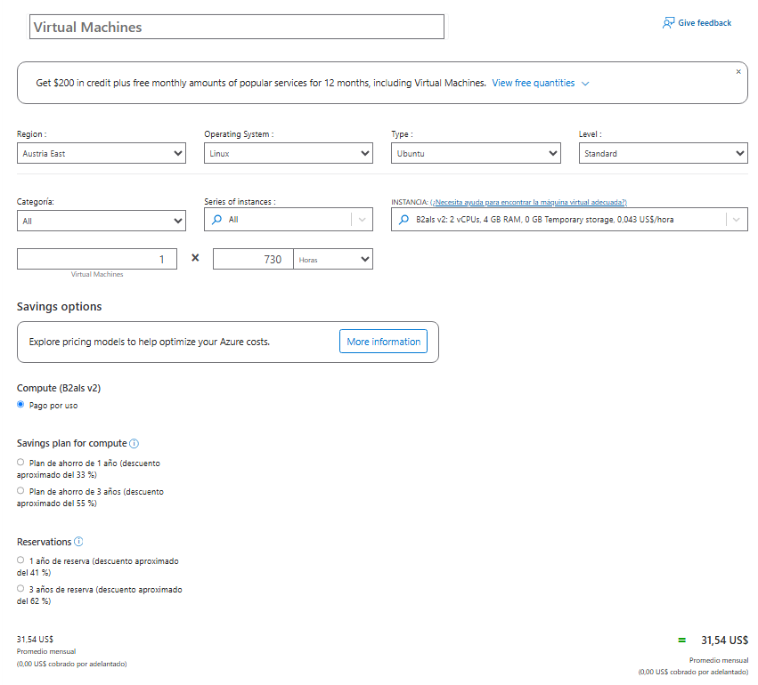
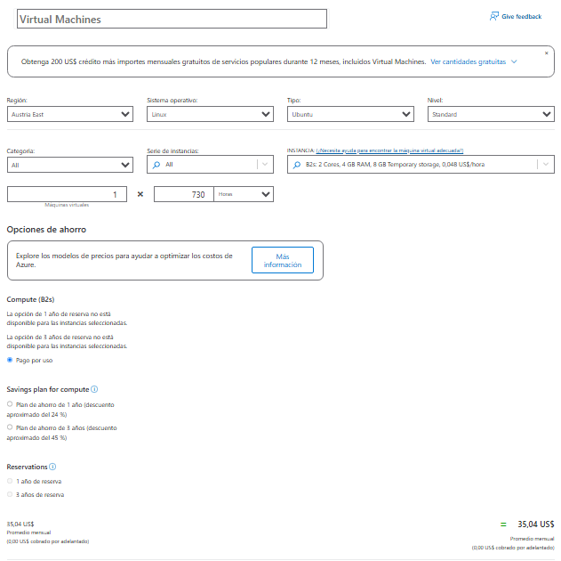
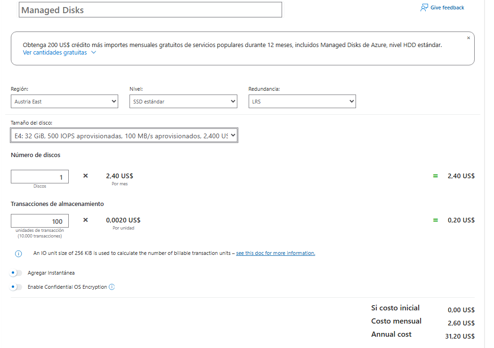
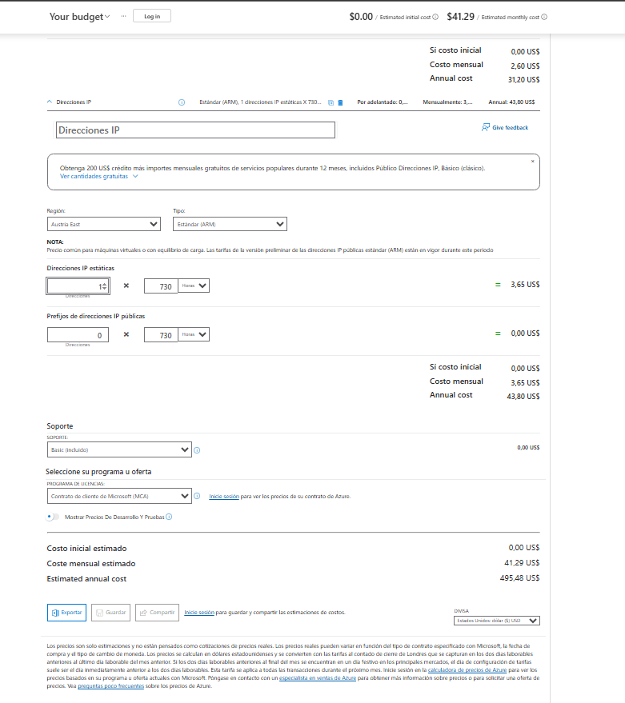
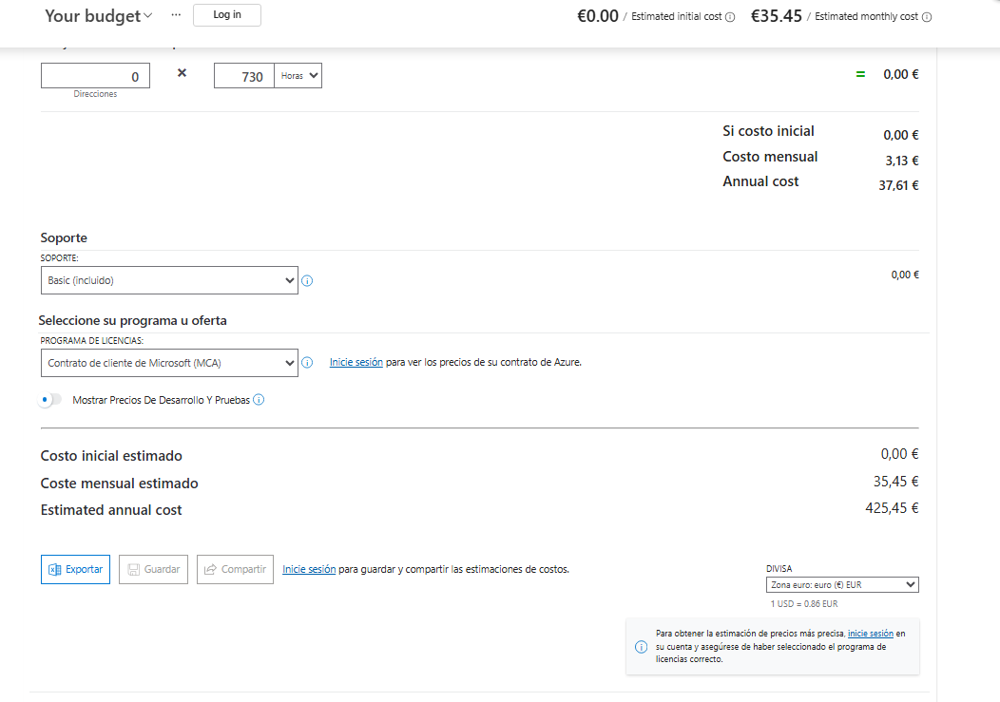
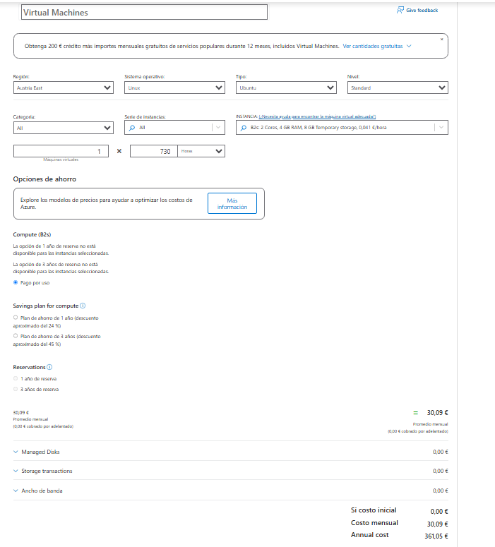

| Escenario | Horas de cómputo | Coste cómputo | Coste disco (72 h) | Coste IP (72 h) | Total estimado |
|---|---|---|---|---|---|
| A. VM encendida todo el laboratorio | 72 | 2,95 € | 0,22 € | 0,31 € | **3,48 €** |
| B. VM con apagado automático nocturno (~12 h/día) | 36 | 1,48 € | 0,22 € | 0,31 € | **2,01 €** |
| C. VM encendida solo 8 h en total | 8 | 0,33 € | 0,22 € | 0,31 € | **0,86 €** |

**Datos base (Austria East, en euros):**
- VM B2s: 0,041 €/hora
- Disco Standard SSD 32GB: 2,23 €/mes → 0,22 € a 72h
- IP pública Standard estática: 3,13 €/mes → 0,31 € a 72h

---

## Sección 4 — Resource Group etiquetado

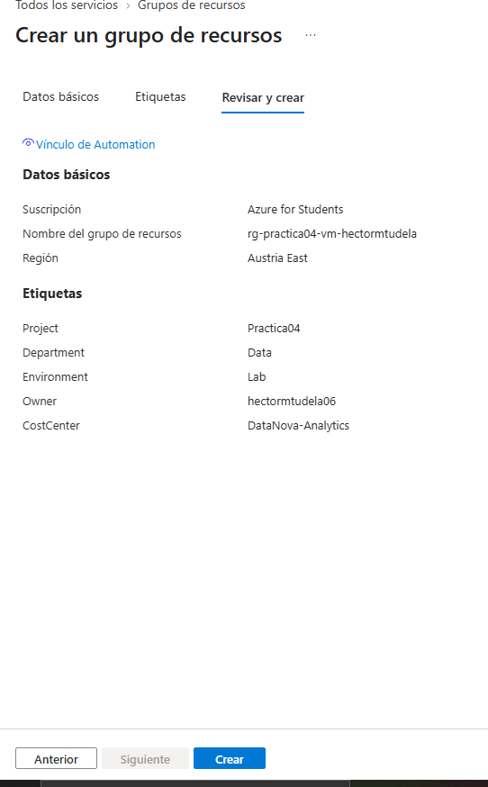

| Tag | Valor |
|---|---|
| Project | Practica04 |
| Department | Data |
| Environment | Lab |
| Owner | hectormtudela06 |
| CostCenter | DataNova-Analytics |

---

## Sección 5 — Budget del laboratorio

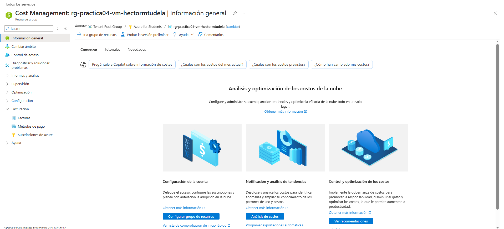
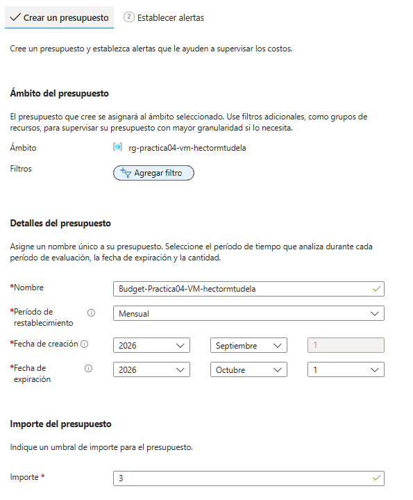
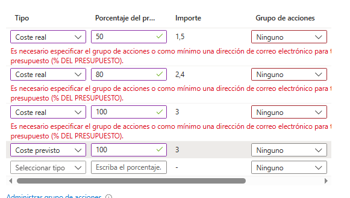

| Campo | Valor |
|---|---|
| Name | `Budget-Practica04-VM-hectormtudela` |
| Amount | 3 € (Escenario B: 2,01 € redondeado) |
| Reset period | Monthly |

| Tipo | Umbral | Importe | Qué significa |
|---|---|---|---|
| Actual | 50 % | 1,5 € | Se ha gastado la mitad de lo previsto |
| Actual | 80 % | 2,4 € | El laboratorio se acerca al límite |
| Actual | 100 % | 3 € | Se ha alcanzado lo estimado |
| Forecasted | 100 % | 3 € | Azure prevé que el mes superará el Budget |

**Predicción (antes del Día 2):** _(escribe aquí si crees que se activará la alerta Forecasted)_

---

## Sección 6 — Despliegue de la máquina virtual

### 6.1 — Configuración final

| Dato | Valor |
|---|---|
| Región final | **Spain Central** |
| Tamaño final | **Standard_B2s_v2** (2 vCPU, 8 GiB RAM) — sustituto de `B2s`, ver 6.2 |
| Precio por hora (estimado, B2s en Austria East) | 0,041 €/hora |
| Precio real (B2s_v2, Pricing Calculator en Spain Central) | *(pendiente — consultar calculador)* |
| Fecha y hora de creación | 22/09/2026, 20:38 UTC |
| Método de despliegue | **Azure CLI (Cloud Shell)**, tras fallos repetidos del asistente gráfico del portal |
| Apagado automático | No configurado — indicación del profesor por fallo conocido de la plataforma en esta práctica |
| Disco del SO | Standard SSD, eliminar con VM ✅ |
| Puertos de entrada | Ninguno |

### 6.2 — Diario de incidencias (importante para el informe)

Esta sección documenta por qué la configuración final difiere de la especificada originalmente por la práctica (`Standard_B2s` en una región europea cualquiera), y sirve como evidencia de resolución de problemas reales de plataforma:

1. **Región `Austria East` no aparece en el selector del asistente** → sustituida por `West Europe`.
2. **`West Europe` bloqueada por política de la suscripción** (error `RequestDisallowedByAzure` en "Revisar y crear", afectando a todos los recursos: VM, disco, IP, NIC, NSG, VNet).
3. **Consulta a Azure Policy → Assignments → "Allowed resource deployment regions"**: la suscripción `Azure for Students` solo permite desplegar en 5 regiones exactas: `germanywestcentral`, `belgiumcentral`, `spaincentral`, `italynorth`, `francecentral`. Estas no coinciden con las que el asistente gráfico ofrece como "Recomendado", lo que causó varios intentos fallidos previos.
4. **`France Central` sí está permitida, pero el tamaño `B2s` (y toda la serie B) aparece como "Tamaño no disponible"** ahí.
5. **Consulta a Suscripción → Uso y cuotas**, filtrando por `Microsoft.Compute` y familia `BS`: se confirma que la familia **`Bsv2`** tiene cuota disponible (10 vCPUs, 0% de uso) en **Spain Central**, mientras que otras combinaciones región/familia devuelven error al consultarlas.
6. **Se despliega la VM con Azure CLI** (`az vm create`) en `spaincentral` con `Standard_B2s`: falla con **`SkuNotAvailable` por restricción de capacidad** (no de política — Azure confirma que la región está permitida, pero no hay capacidad física de ese tamaño en ese momento).
7. **Se repite el comando sustituyendo el tamaño por `Standard_B2s_v2`** (misma familia B, 2 vCPU, más RAM): **despliegue correcto**, confirmado en el Registro de actividad del Resource Group (`Create or Update Virtual Machine — Correcto`).
8. **Apagado automático por CLI (`az vm auto-shutdown`) también falla** con el mismo error de política (`RequestDisallowedByAzure`), porque ese comando usa por defecto la región del *Resource Group* (creado originalmente en Austria East) en vez de la región real de la VM. El profesor indica que esta función tiene un fallo conocido en la práctica y que no es necesario configurarla.

**Conclusión:** la sustitución de `B2s` por `B2s_v2` y el cambio de región de Austria East a Spain Central están justificados por restricciones reales, verificables y documentadas de la suscripción — no por elección arbitraria. Esta diferencia se recoge en la comparación estimado vs. real de la Sección 10.

### 6.3 — Capturas del proceso (en orden cronológico)

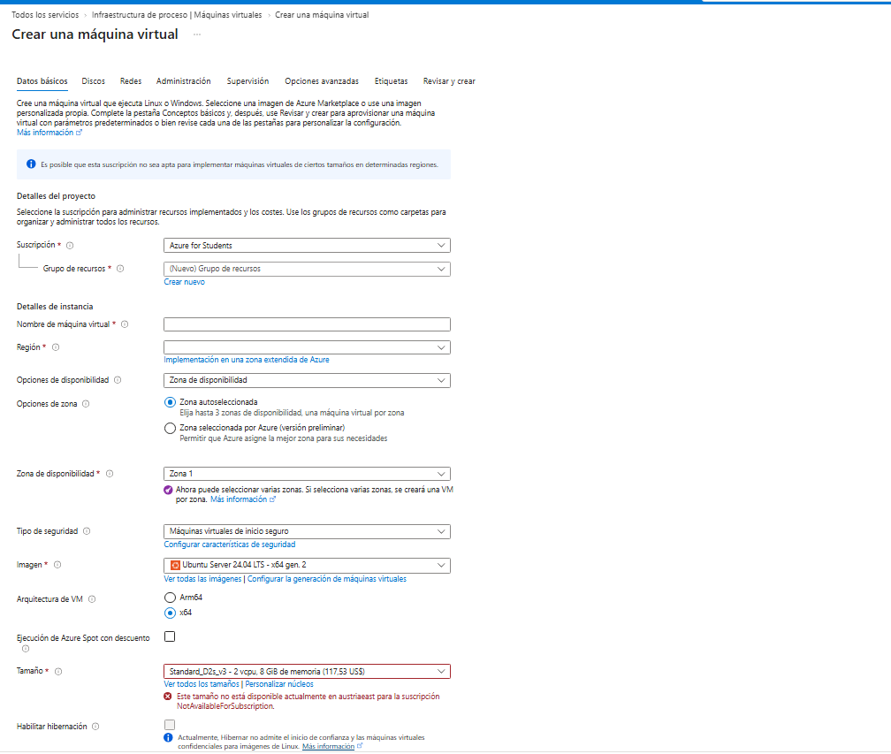
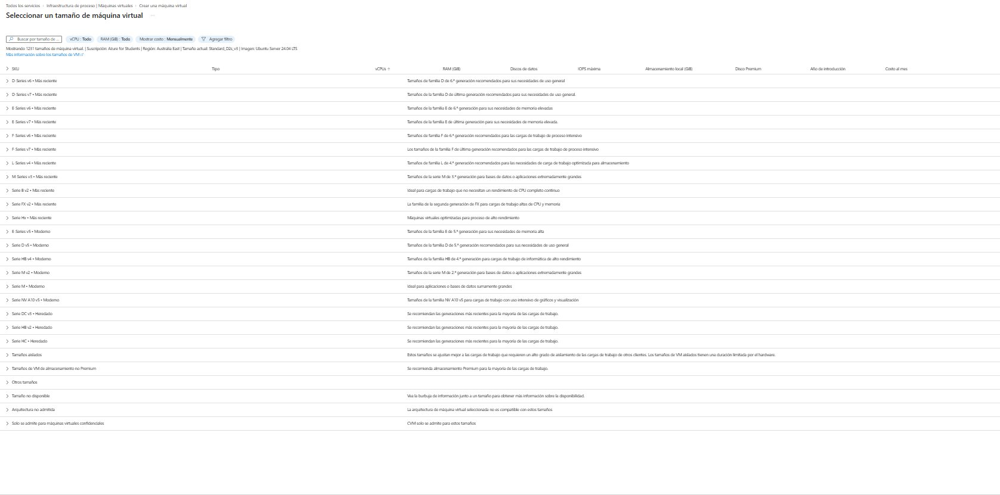
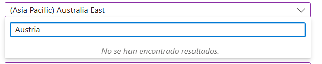
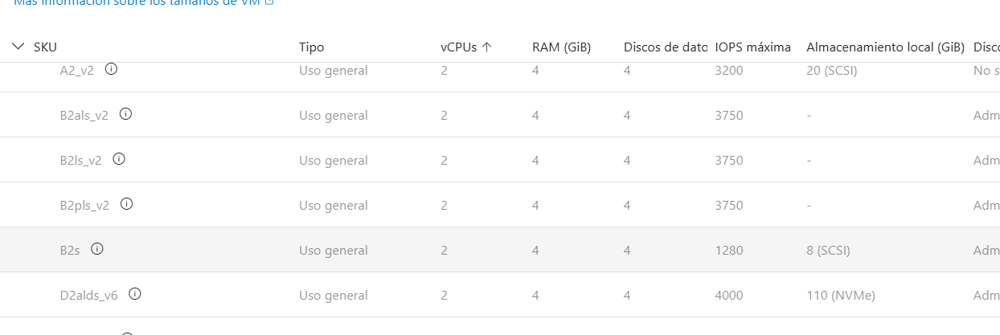
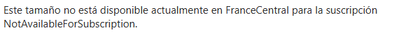
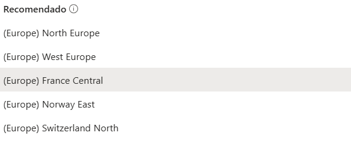
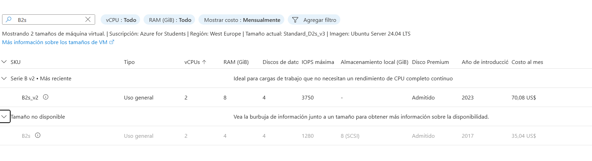
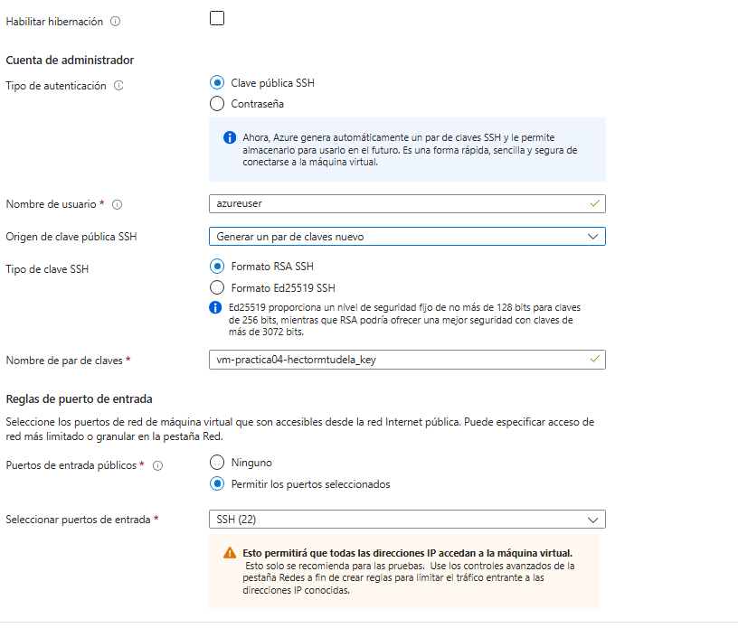
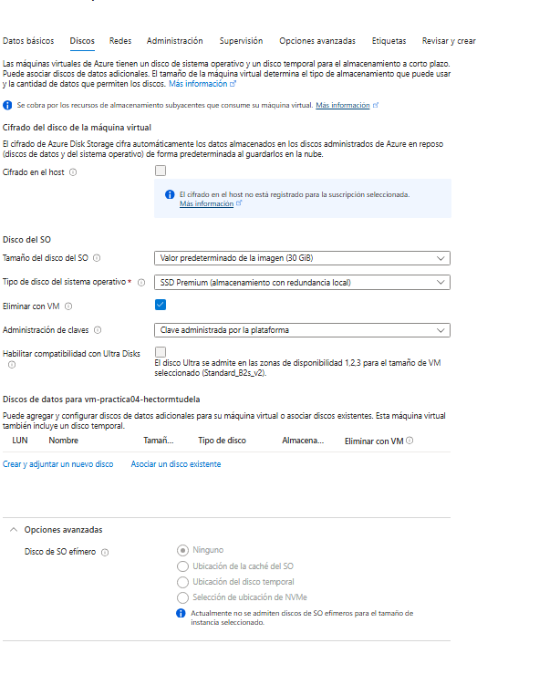
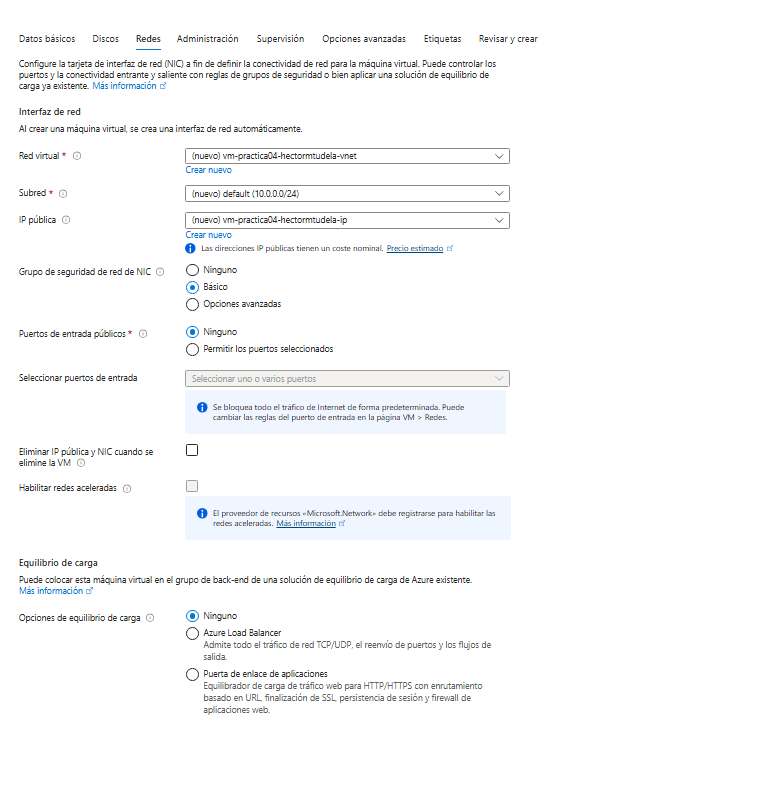
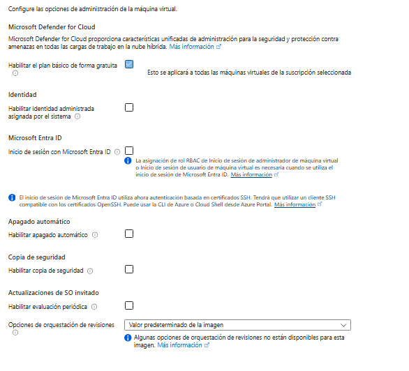
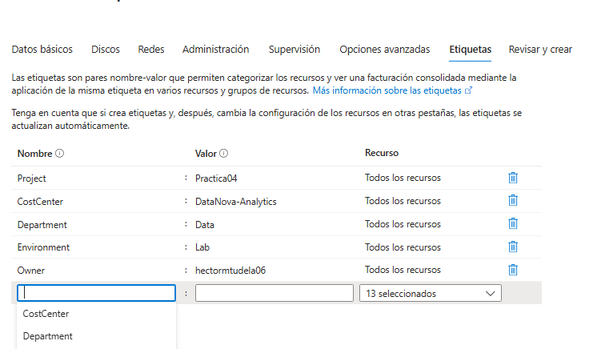
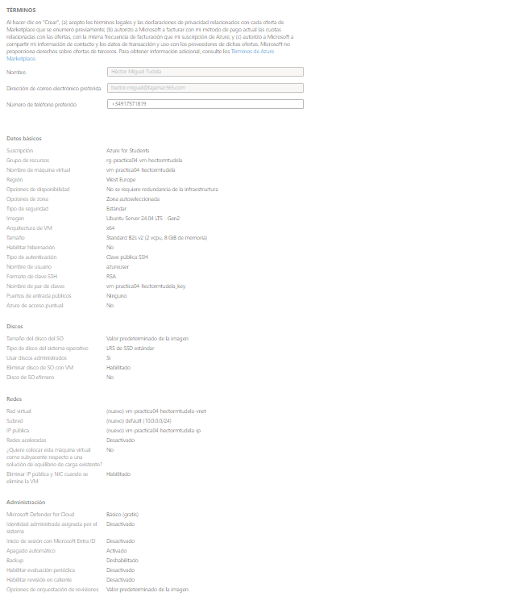
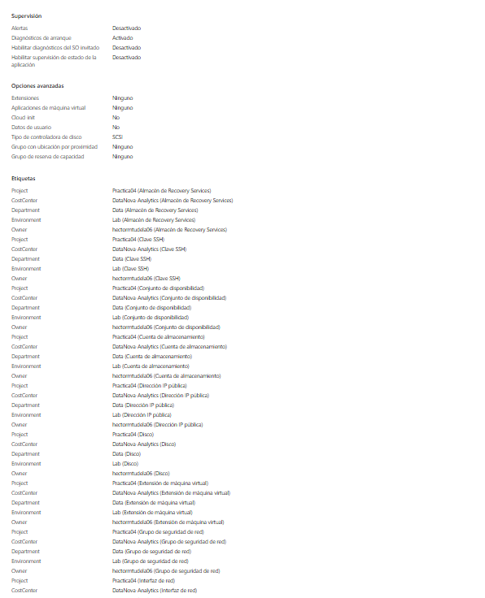
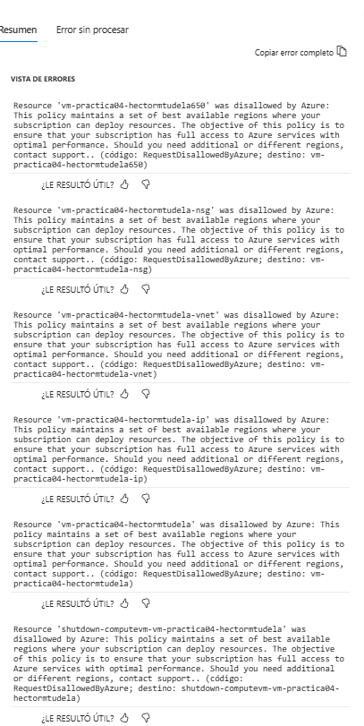
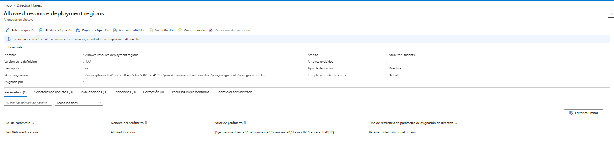
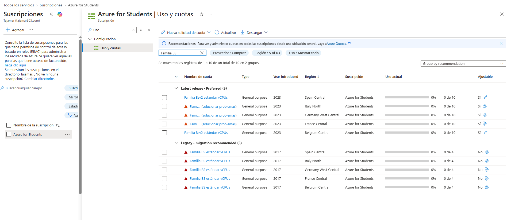
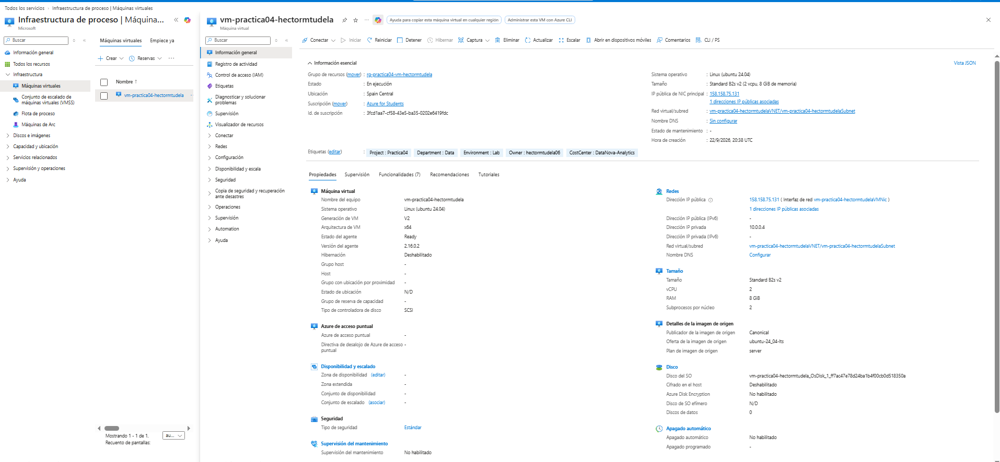
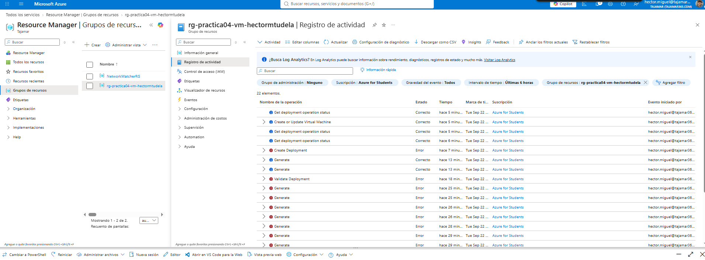

---

## Sección 7 — Verificación del etiquetado

| Recurso | Tipo | ¿Tiene los 5 Tags? | ¿Genera coste? |
|---|---|---|---|
| vm-practica04-hectormtudela | Virtual machine | Sí (confirmado vía Cost Analysis → Group by Tag, Sección 8) | Sí |
| vm-practica04-hectormtudela_OsDisk_1_... | Disk | Sí (confirmado vía Cost Analysis → Group by Tag) | Sí |
| vm-practica04-hectormtudelaPublicIP | Public IP address | Sí (confirmado vía Cost Analysis → Group by Tag) | Sí |
| vm-practica04-hectormtudelaVMNic | Network interface | Heredado del despliegue por CLI (`--tags`), no verificado individualmente | No |
| vm-practica04-hectormtudelaNSG | Network security group | Heredado del despliegue por CLI (`--tags`), no verificado individualmente | No |
| vm-practica04-hectormtudelaVNET | Virtual network | Heredado del despliegue por CLI (`--tags`), no verificado individualmente | No |

Como la VM se desplegó por Azure CLI (`az vm create --tags ...`, Sección 6.2) en vez de por el asistente gráfico, las etiquetas se aplicaron mediante el parámetro `--tags` del propio comando, en vez de marcar "Todos los recursos" en la pestaña Etiquetas del wizard. Se confirmó indirectamente que el etiquetado fue correcto porque, al agrupar el coste por Tag → Project en Cost Analysis (Sección 8), el 100% del gasto apareció bajo "practica04" sin ningún resto "Untagged".

---

## Sección 8 — Primera revisión en Cost Analysis (Día 2)

**Primera comprobación (23/09/2026, mañana):** 0,01 €. **Segunda comprobación (24/09/2026):** 2,27 € — la VM ya lleva un día completo funcionando y el coste ha subido notablemente, como se ve en el pico de la gráfica diaria a partir del 22-23 de septiembre (día de creación).

| Recurso | Coste acumulado |
|---|---|
| Máquina virtual | 2,06 € |
| Disco | 0,09 € |
| IP pública | 0,12 € |
| Otros (ancho de banda) | < 0,01 € |
| **Total (Actual Cost)** | **2,27 €** |

**Verificación por Tags:** al agrupar por Tag → Project, todo el gasto (2,27 €) aparece bajo la etiqueta **"practica04"**, sin ninguna parte como "Untagged" — confirma que el etiquetado de todos los recursos (VM, disco, IP) es correcto.

| Dato | Valor |
|---|---|
| Actual Cost | 2,27 € |
| Forecasted Cost (fin de mes) | No disponible todavía (Azure muestra "Previsión no disponible" y "€0/día (est.)" — necesita más histórico) |
| Budget del laboratorio | 3 € |
| ¿Actual supera el Budget? | No (2,27 € < 3 €), pero ya ha superado el umbral del 50% (1,5 €) |
| ¿Forecast supera el Budget? | No se puede determinar todavía |

| Alerta | ¿Se ha activado? | Fecha y hora |
|---|---|---|
| Actual 50 % | ✅ Sí | 23/09/2026, 23:26 UTC (valor evaluado: 1,58 €) |
| Actual 80 % | *(pendiente — coste actual 2,27 € aún no llega a 2,40 €)* | |
| Actual 100 % | *(pendiente)* | |
| Forecasted 100 % | *(pendiente — Azure aún no calcula previsión)* | |

**¿Se cumplió la predicción de la Sección 5?** Parcialmente: se predijo que la alerta **Forecasted** sería la primera en activarse, pero en la práctica ha sido la **Actual 50%** la primera en dispararse, ya que Azure todavía no ha podido calcular una previsión fiable (falta de histórico suficiente en estos primeros días). Es un buen ejemplo de que el comportamiento real de la plataforma no siempre coincide con lo esperado sobre el papel.

---

## Sección 9 — Experimento: apagar vs. desasignar

| Medidor | Coste acumulado hasta desasignar (~22-24 sept, VM encendida) | Coste tras desasignar (24-25 sept en adelante) |
|---|---|---|
| Cómputo B2s v2 | ≈ 2,73 € (prácticamente todo el coste de cómputo se generó mientras la VM estuvo encendida) | ≈ 0 € — deja de facturarse por completo |
| Disco Standard SSD | 0,17 € (acumulado, sigue subiendo aunque muy poco cada día) | Sigue acumulando a un ritmo bajo y constante |
| IP pública | 0,23 € (acumulado, igual que el disco) | Sigue acumulando a un ritmo bajo y constante |

*(Nota: Cost Analysis en esta suscripción no permite ver el desglose exacto por medidor y por día a la vez con suficiente detalle visual; los valores de disco e IP son acumulados totales, pero la gráfica diaria confirma claramente el patrón: el coste total cae de ~2,2 €/día con la VM encendida a prácticamente 0 €/día tras desasignarla, quedando solo el pequeño coste fijo de disco e IP.)*

1. **¿Qué medidor baja cuando la VM está desasignada?** El de **cómputo (B2s v2)** — pasa de ser el componente dominante del coste diario a no generar nada en absoluto.
2. **¿Qué medidores siguen generando coste?** El **disco Standard SSD** y la **IP pública**, ambos a un ritmo bajo pero constante, independientemente de si la VM está encendida, apagada o desasignada — solo dejan de cobrarse si se eliminan.
3. **Si un compañero deja 20 VMs apagadas desde el sistema operativo (Stopped, no deallocated) durante un fin de semana, ¿qué está pagando DataNova?** Está pagando el **cómputo completo de las 20 VMs** durante todo el fin de semana, exactamente igual que si estuvieran encendidas y trabajando — apagar desde dentro del SO no libera los recursos de cómputo reservados, solo detiene el sistema operativo. Es un gasto totalmente evitable y, multiplicado por 20 VMs y varios días, puede ser una cantidad significativa.
4. **¿Qué acción garantizaría que ningún medidor siga cobrando?** **Eliminar los recursos por completo** (VM, disco e IP pública) — desasignar solo detiene el cómputo, pero el disco y la IP siguen existiendo y facturándose hasta que se borran explícitamente.

---

## Sección 10 — Comparación estimación vs. real (Día 3)

| Concepto | Estimado (Escenario A, B2s en Austria East, 72h) | Real (B2s_v2 en Spain Central, ~72h hasta la limpieza) | Diferencia |
|---|---|---|---|
| Cómputo | 2,95 € | 2,73 € | -0,22 € |
| Disco | 0,22 € | 0,17 € | -0,05 € |
| IP pública | 0,31 € | 0,23 € | -0,08 € |
| **Total** | **3,48 €** | **3,13 €** | **-0,35 €** |

1. **¿Qué escenario de la Sección 3 se parece más a lo que realmente ocurrió?** El **Escenario A** (VM encendida todo el laboratorio, 72h), porque la VM estuvo funcionando de forma prácticamente continua desde su creación hasta que se desasignó pasado más de un día — no hubo apagado automático (Sección 6.2) que la parara por las noches como en el Escenario B.
2. **¿Qué componente se desvió más de lo estimado? ¿Por qué?** En términos absolutos, el **cómputo** (-0,22 €), aunque en realidad el coste real salió **más bajo** de lo estimado en los tres componentes. Esto tiene sentido porque la estimación original se calculó para `Standard_B2s` en Austria East, mientras que la VM real se desplegó como `Standard_B2s_v2` en Spain Central — dos combinaciones de tamaño y región distintas al plan original, por las restricciones documentadas en la Sección 6.2. Que el precio real haya salido más bajo pese a tener el doble de RAM (8 GiB vs 4 GiB) es una diferencia interesante a destacar: la variable región pesa más en el precio final que el tamaño de VM en este caso.
3. **¿Algún coste no estaba en tu estimación?** No se detectó ningún medidor adicional inesperado (el desglose por "Meter" de la Sección 8 solo mostró cómputo, disco, IP, y una cantidad despreciable de transferencia de datos/bandwidth, ya contemplada como coste "mínimo" en la práctica).
4. **Coste estimado para 10 analistas, 8h/día, 22 días, con los datos reales:**

   Partiendo del precio real por hora de cómputo observado (2,73 € / ≈44 h de funcionamiento ≈ **0,062 €/hora**), y asumiendo que el disco y la IP existen el mes completo (usando el coste mensual estimado del calculador: 2,23 € disco + 3,13 € IP):

   - **Si es un único servidor compartido** por los 10 analistas (8h/día × 22 días = 176h de uso): 176h × 0,062 €/h = **10,92 €** de cómputo + 2,23 € disco + 3,13 € IP = **≈16,28 €/mes**.
   - **Si cada analista necesitara su propia VM** (10 servidores idénticos, mismo patrón de uso): 10 × 16,28 € ≈ **≈162,80 €/mes**.

   La diferencia entre ambos escenarios (compartir un único servidor vs. una VM por persona) es enorme, y es precisamente el tipo de decisión de arquitectura que un análisis de costes como este ayuda a tomar con datos reales en vez de suposiciones.

---

## Sección 11 — Limpieza

- [x] Resource group eliminado (`rg-practica04-vm-hectormtudela`, 6 recursos: VM, disco, IP pública, NIC, NSG, VNet)
- [x] Verificado que no queda nada bajo el Tag `Project = Practica04` (filtro por "04" en Grupos de recursos → "No hay grupos de recursos que coincidan con el filtro")
- [x] Budget del laboratorio eliminado (gasto evaluado en el momento del borrado: 3,09 €, sobre un presupuesto de 3,00 € — se superó ligeramente el 100%, lo cual es coherente con no tener apagado automático activo)
- [ ] Coste diario en 0 € 24h después (verificación final) — **pendiente**, hay que revisar Cost Analysis pasadas 24h desde el borrado (aprox. el 25/09/2026)

---

## Sección 12 — Informe final

| Elemento | Resultado |
|---|---|
| Nombre de la práctica | Práctica 04 — VM Linux con control de costes |
| Resource Group | rg-practica04-vm-hectormtudela |
| Servicios utilizados | Virtual Machine (Standard_B2s_v2), Managed Disk (Standard SSD), Public IP (Standard, estática), Virtual Network, NSG, Cost Management (Budgets + Cost Analysis) |
| Coste estimado antes de desplegar | 2,01 € (Escenario B) — 3,48 € (Escenario A, el que más se acercó a la realidad) |
| Budget disponible | 3,00 € |
| Alertas configuradas | Actual 50%, Actual 80%, Actual 100%, Forecasted 100% |
| Alertas activadas | Actual 50% (confirmada por email, 23/09 23:26 UTC, valor evaluado 1,58 €); el resto probablemente se activaron después, ya que el gasto final (3,09 €) superó el 100% del Budget |
| Coste observado | 3,13-3,09 € en total (VM 2,73 €, IP 0,23 €, disco 0,17 €) |
| Recurso con mayor coste | La máquina virtual (cómputo) — aprox. 87% del gasto total |
| Recursos eliminados | Los 6 del Resource Group (VM, disco, IP pública, NIC, NSG, VNet) + Budget del laboratorio |
| Observaciones | El tamaño y la región especificados por la práctica (`Standard_B2s` en una región europea libre) no fueron viables por restricciones reales de la suscripción Azure for Students (política de regiones permitidas + falta de capacidad/cuota); se sustituyó por `Standard_B2s_v2` en Spain Central, documentado con evidencia en la Sección 6.2. El coste real final quedó por debajo de lo estimado en el Escenario A, pese al tamaño de VM más grande, lo que sugiere que la región pesa más que el tamaño concreto en el precio final. No se configuró apagado automático por indicación del profesor (fallo conocido de la plataforma en esta práctica). |

---

## Sección 13 — Ejercicio final (caso DataNova Engineering)

**Datos:**
- Budget del proyecto = 50 €
- Actual Cost (día 10) = 22 €
- Forecasted Cost = 68 €
- Apagado automático = No configurado
- Estado de 3 VMs = Stopped (no deallocated)

1. **¿Qué alertas se habrán activado?** Con un Budget de 50 € y un Actual Cost de 22 € (44%), **ninguna alerta de tipo "Actual" se ha activado todavía** (ni siquiera la del 50%, ya que 22 € < 25 €). Sin embargo, la alerta **Forecasted 100%** sí se habrá activado, porque la previsión (68 €) supera ampliamente el 100% del presupuesto (50 €).
2. **¿Por qué el Forecasted Cost es tan superior al Actual Cost?** Azure proyecta linealmente el ritmo de gasto de los primeros 10 días hasta fin de mes: 22 € en 10 días = 2,2 €/día; multiplicado por ~30-31 días del mes, da una previsión de unos 66-68 €. La causa raíz de que ese ritmo sea tan alto es que las VMs no tienen apagado automático, y 3 de ellas llevan tiempo en estado "Stopped" (no deallocated) — generan coste de cómputo constante las 24 horas sin que nadie las esté usando activamente.
3. **¿Qué parte del gasto de las 3 VMs detenidas se podría eliminar sin borrarlas?** El **coste de cómputo**. Al estar en "Stopped" pero no "deallocated", Azure sigue reservando y facturando los recursos de cómputo como si estuvieran encendidas. Si se desasignan, ese coste desaparece por completo, quedando solo el coste (mucho menor) del disco y la IP de cada una.
4. **Ordena de mayor a menor impacto en ahorro inmediato:**
   1. **Desasignar las 3 VMs detenidas** — elimina de inmediato un coste de cómputo que se paga sin ningún uso real; la acción de mayor impacto y más urgente.
   2. **Configurar apagado automático en las 5 VMs** — previene que se repita el mismo problema cada noche/fin de semana; ahorro recurrente e importante, aunque no tan inmediato como la anterior.
   3. **Cambiar los discos de Premium SSD a Standard SSD** — ahorro real pero mucho menor, ya que el disco es solo una fracción del coste total.
   4. **Eliminar las IP públicas que no se usan** — impacto todavía menor (la IP es el componente más barato), pero suma.
   5. **Añadir Tags a todos los recursos** — no genera ningún ahorro económico directo.
5. **¿Qué acción no ahorra dinero pero es imprescindible para analizarlo?** **Añadir Tags a todos los recursos.** Sin etiquetado correcto no es posible desglosar el gasto por proyecto, equipo o entorno en Cost Analysis, lo que impide identificar con precisión qué recursos o equipos concretos son responsables del sobrecoste — es la base necesaria para poder tomar decisiones informadas sobre las otras 4 acciones.