# Práctica 06 - Servicios de Azure para DB SQL y NoSQL

## Ejercicio 1: Exploración de servicios de base de datos relacionales de Azure

**Referencia:** [DP-900 Lab - Explore Azure SQL Database](https://microsoftlearning.github.io/DP-900T00A-Azure-Data-Fundamentals/Instructions/Labs/dp900-01-sql-lab.html)

**Objetivo:** Crear una base de datos en la nube con Azure SQL Database, cargar datos de ejemplo (fabricantes y vehículos de un concesionario) y consultarlos con SQL.


---

## 1. Aprovisionar el recurso Azure SQL Database

*(Pendiente de completar)*

Pasos:
1. Acceder al [Azure portal](https://portal.azure.com) e iniciar sesión.
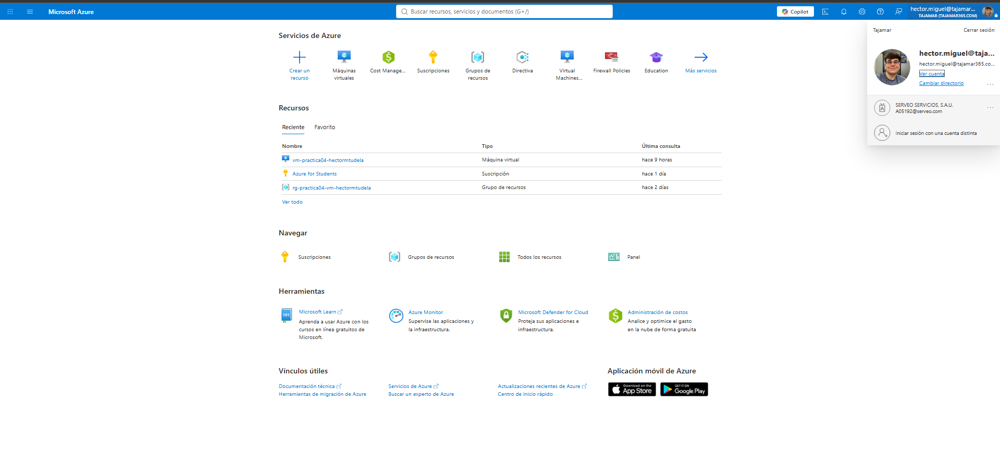
2. Crear un recurso → buscar `Azure SQL` → seleccionar **Azure SQL** (Microsoft) → **Create SQL Database**.
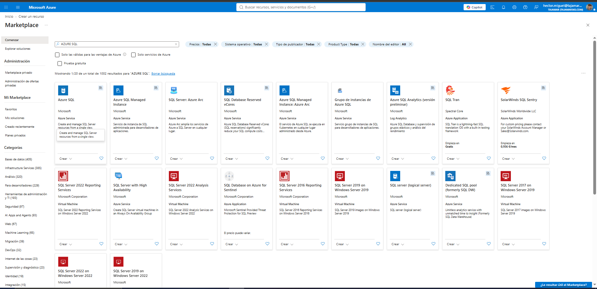
3. Configurar:
   - **Subscription**: mi suscripción de Azure
   - **Resource group**: nuevo grupo de recursos
   - **Database name**: `Dealership`
   - **Server**: nuevo servidor, autenticación SQL, usuario y contraseña de administrador
   - **Elastic pool**: No
   - **Workload environment**: Development
   - **Backup storage redundancy**: Locally-redundant
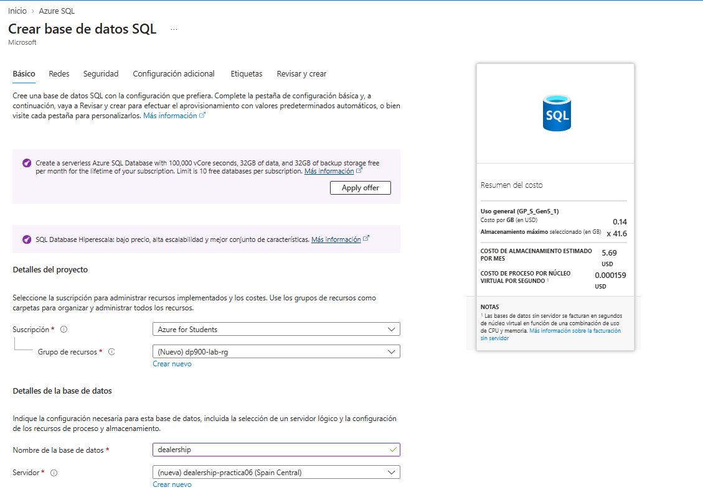
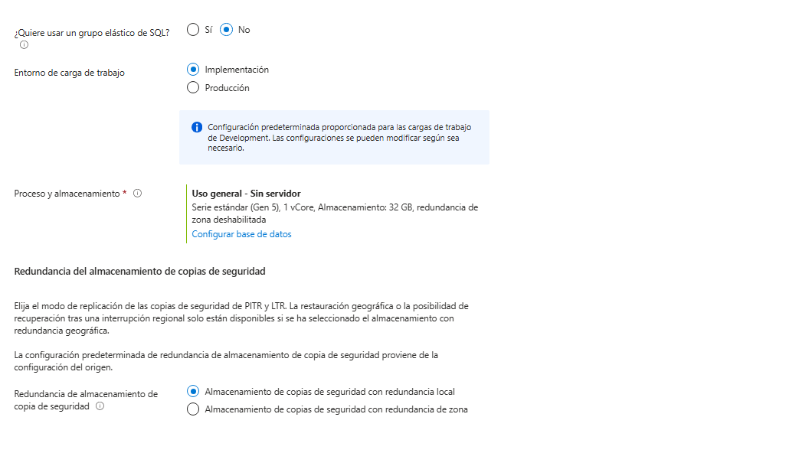
4. Pestaña **Networking**: Public endpoint, ambas reglas de firewall en Yes.
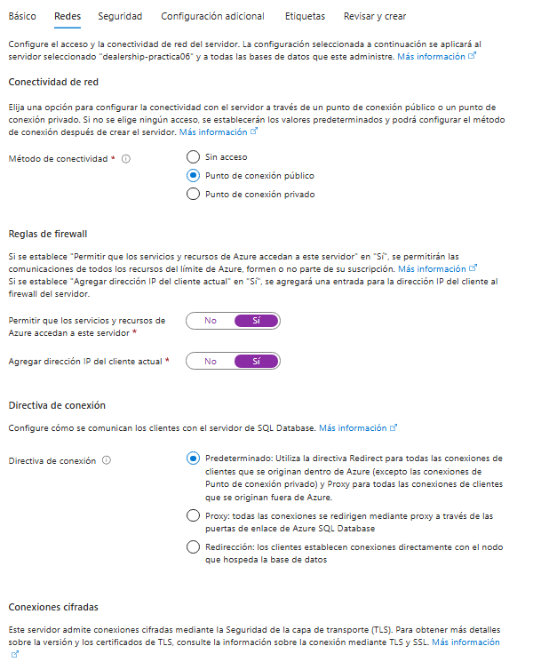
5. Pestaña **Security**: Defender for SQL → Not now.
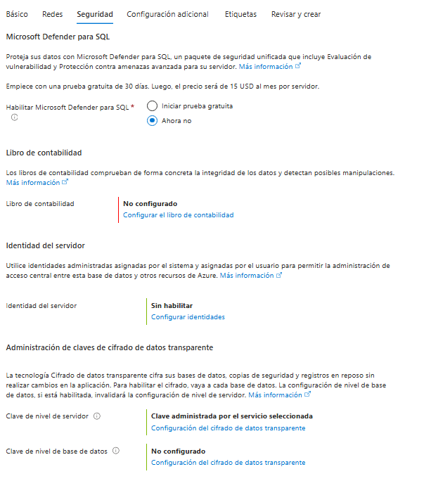
6. Pestaña **Additional settings**: Use existing data → None.
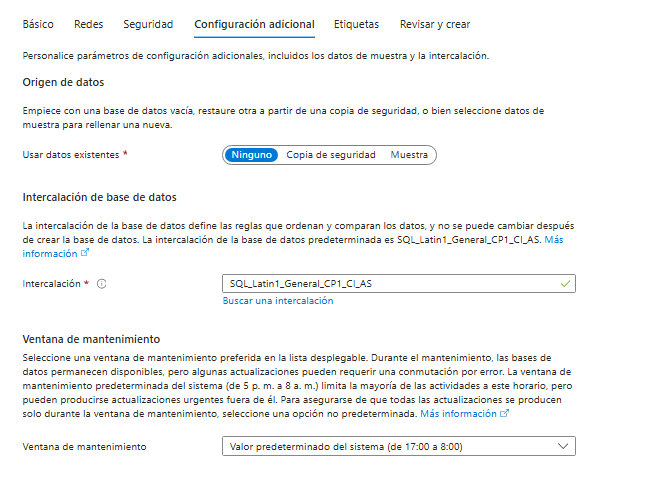
7. **Review + create** → **Create**. 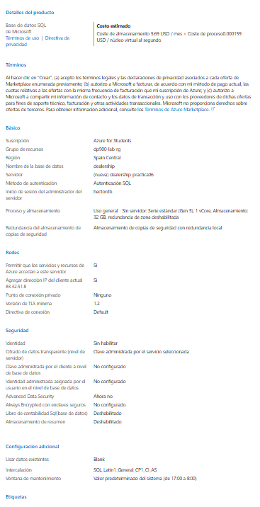

**Notas / incidencias:**
No he tenido incidentes

---

## 2. Crear las tablas y cargar datos de ejemplo

### 2.1 Conexión al Query editor

Dentro del recurso de la base de datos (dealership-practica06), en el menú lateral izquierdo he clickado en Query editor. He iniciado sesión con el login creado antes.

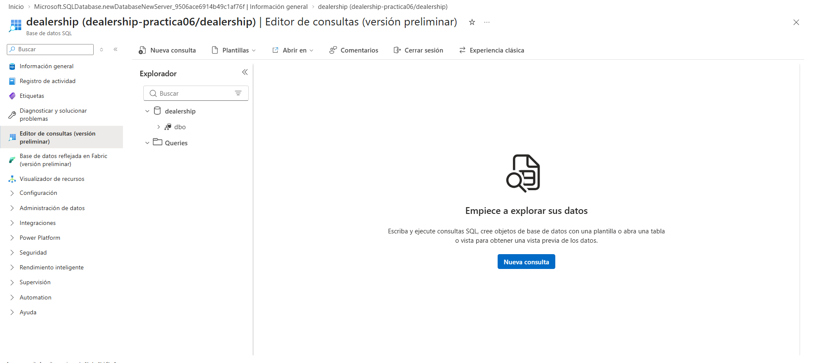

Tras esto he ejecutado la sigiuiente consulta :

### 2.2 Creación de tablas

```sql
CREATE TABLE Manufacturer
 (
     ManufacturerID   INT          PRIMARY KEY,
     ManufacturerName NVARCHAR(50) NOT NULL,
     Country          NVARCHAR(50)
 );

CREATE TABLE Vehicle
 (
     VehicleID      INT            PRIMARY KEY,
     ModelName      NVARCHAR(50)   NOT NULL,
     ManufacturerID INT            NOT NULL,
     ModelYear      INT,
     BodyType       NVARCHAR(30),
     ListPrice      DECIMAL(10, 2),
     FOREIGN KEY (ManufacturerID) REFERENCES Manufacturer(ManufacturerID)
 );
```

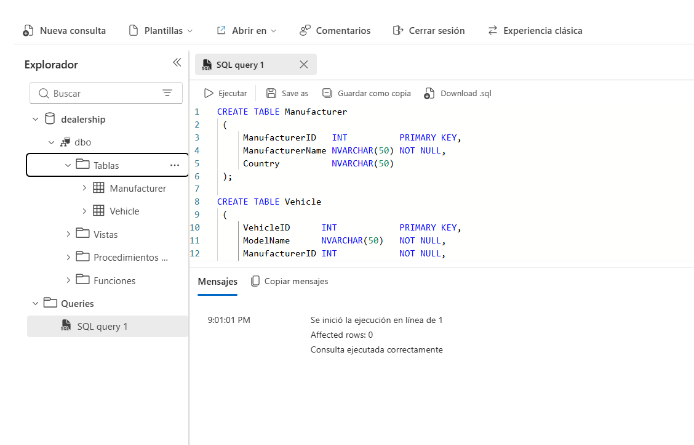

### 2.3 Inserción de datos de ejemplo

```sql
INSERT INTO Manufacturer (ManufacturerID, ManufacturerName, Country) VALUES
 (1, 'Toyota',        'Japan'),
 (2, 'Ford',          'United States'),
 (3, 'Volkswagen',    'Germany'),
 (4, 'Hyundai',       'South Korea');

INSERT INTO Vehicle (VehicleID, ModelName, ManufacturerID, ModelYear, BodyType, ListPrice) VALUES
 (101, 'Corolla',     1, 2024, 'Sedan',      24500.00),
 (102, 'RAV4',        1, 2024, 'SUV',        31200.00),
 (103, 'F-150',       2, 2023, 'Pickup',     38900.00),
 (104, 'Mustang',     2, 2024, 'Coupe',      42500.00),
 (105, 'Golf',        3, 2023, 'Hatchback',  27800.00),
 (106, 'Tiguan',      3, 2024, 'SUV',        33400.00),
 (107, 'Elantra',     4, 2024, 'Sedan',      22300.00),
 (108, 'Tucson',      4, 2023, 'SUV',        29600.00);
```

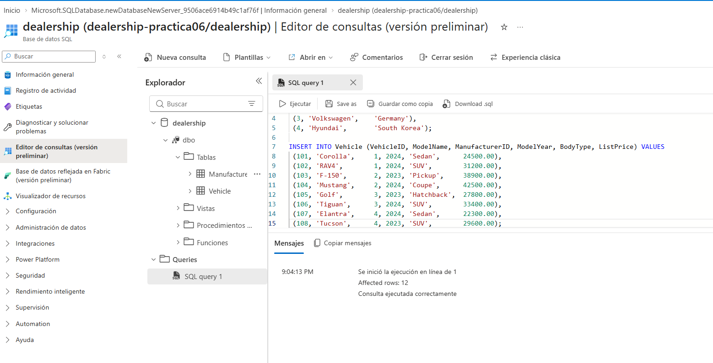

---

## 3. Consultar los datos

### 3.1 Seleccionar todas las columnas y filas

```sql
SELECT * FROM Vehicle;
```

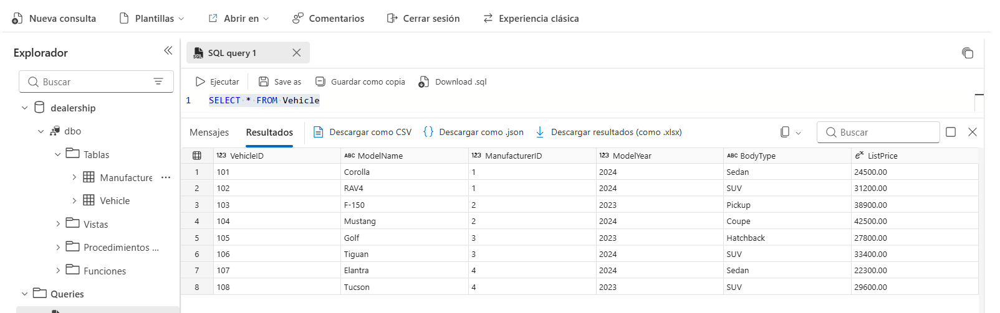

### 3.2 Seleccionar columnas específicas

```sql
SELECT ModelName, BodyType, ListPrice
FROM Vehicle;
```

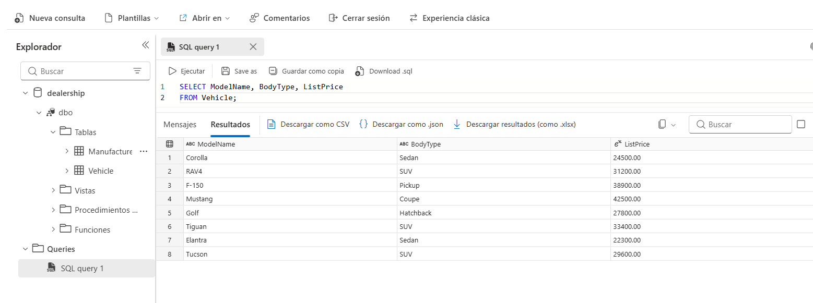

### 3.3 Filtrar y ordenar (WHERE / ORDER BY)

```sql
SELECT ModelName, BodyType, ListPrice
FROM Vehicle
WHERE ListPrice < 30000
ORDER BY ListPrice;
```

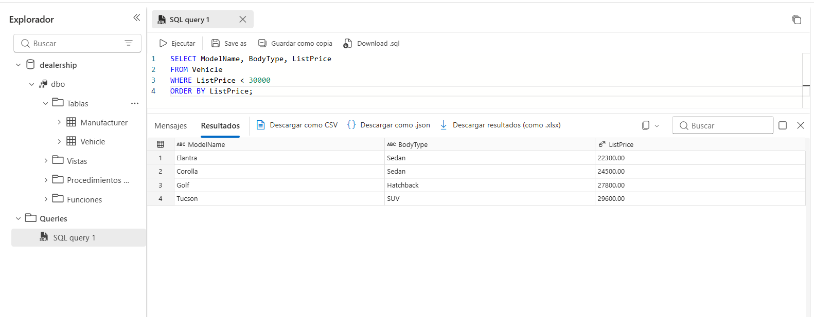

### 3.4 Combinar tablas (INNER JOIN)

```sql
SELECT
    v.ModelName,
    m.ManufacturerName,
    m.Country,
    v.ListPrice
FROM Vehicle AS v
INNER JOIN Manufacturer AS m
    ON v.ManufacturerID = m.ManufacturerID
ORDER BY m.ManufacturerName;
```

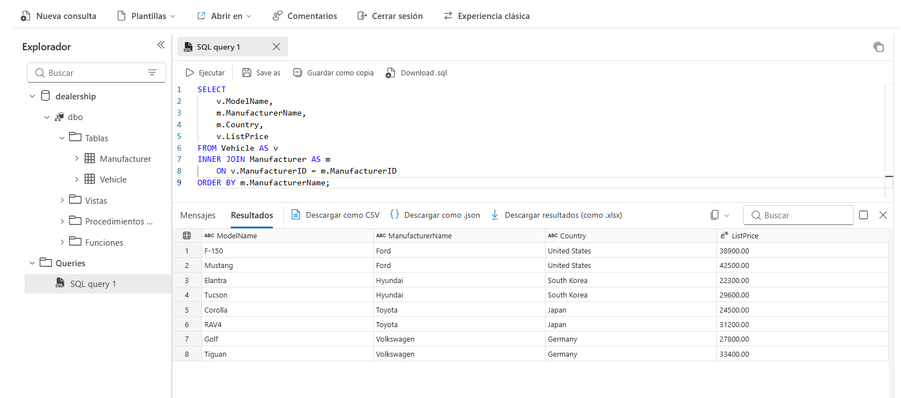

### 3.5 Experimentación libre
Consulta con ``TOP``

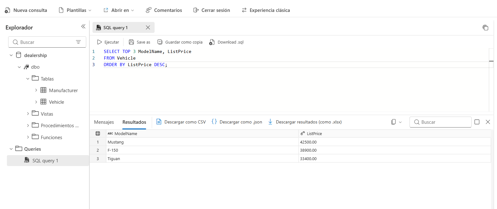

---

## 4. Limpieza de recursos

1. Ir al grupo de recursos creado al inicio.
2. **Delete resource group** → confirmar escribiendo el nombre → **Delete**.

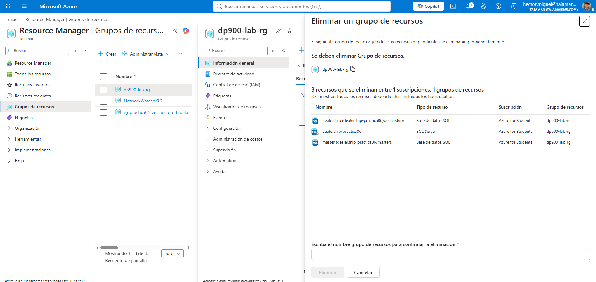

---

## Conclusiones

He aprendido a:
- Crear una instancia de Azure SQL Database.
- Configurar completamente la bbdd.
- Modelado de datos en Azure SQL.
- Gestión de costes y seguridad.