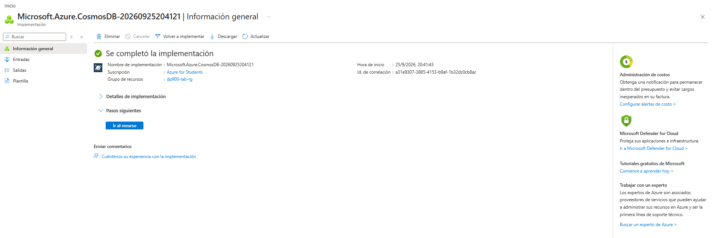
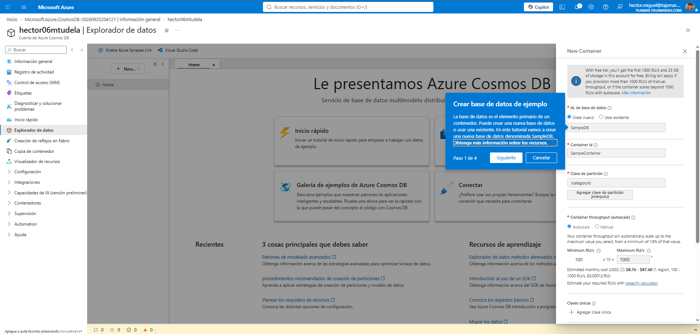
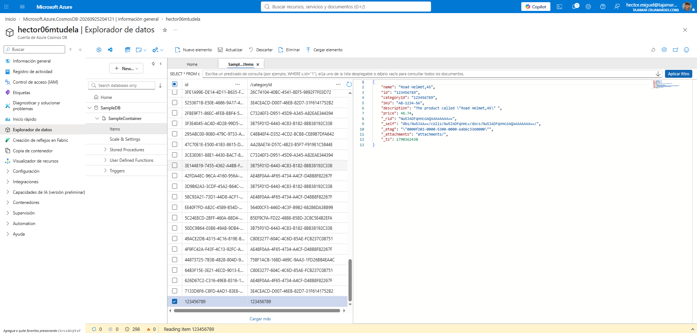
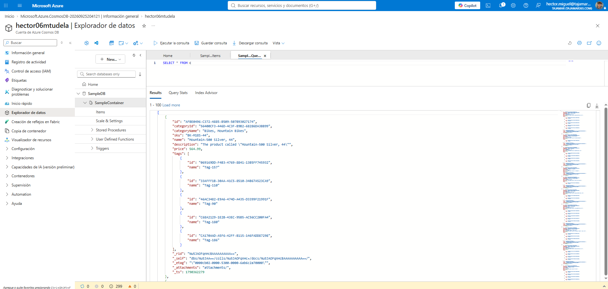
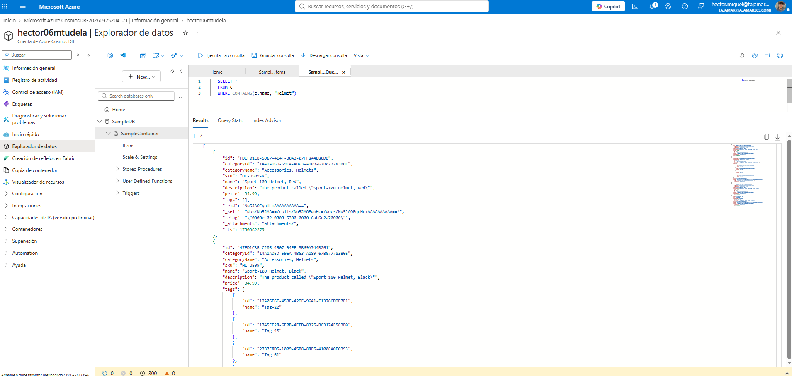
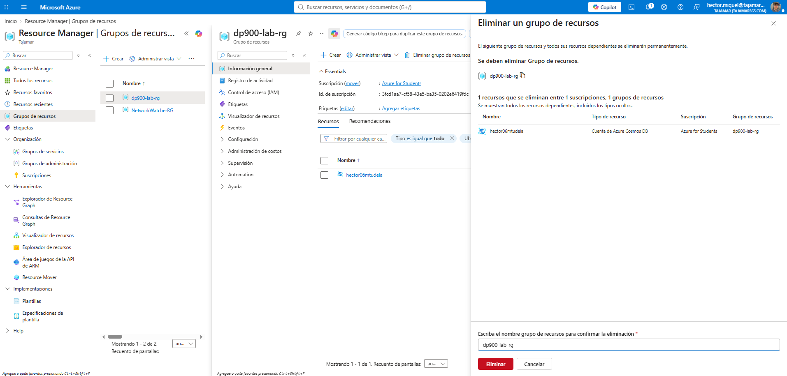
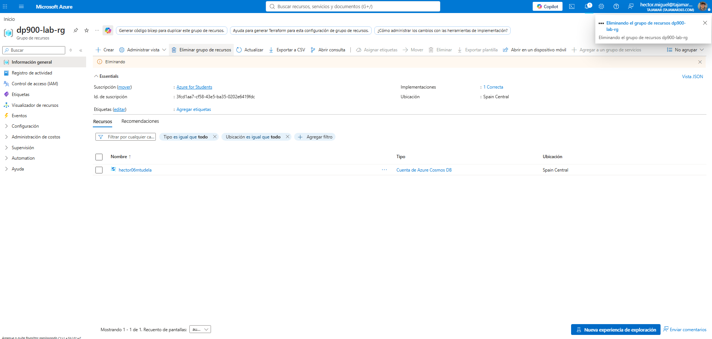

# Práctica 06 - Servicios de Azure para DB SQL y NoSQL

## Ejercicio 3: Exploración de Azure Cosmos DB (NoSQL)

**Referencia:** [DP-900 Lab - Explore Azure Cosmos DB](https://microsoftlearning.github.io/DP-900T00A-Azure-Data-Fundamentals/Instructions/Labs/dp900-03-cosmos-lab.html)

**Objetivo:** Crear una base de datos NoSQL con Azure Cosmos DB (API para NoSQL), donde cada dato se almacena como un item JSON en lugar de filas y columnas de una tabla relacional. Añadir y consultar datos de ejemplo con un lenguaje de consulta similar a SQL.

---

## 1. Crear la cuenta de Cosmos DB

Pasos:
1. En el portal de Azure, **+ Crear un recurso** → buscar `Azure Cosmos DB` → **Create**.
2. Seleccionar la API **Azure Cosmos DB for NoSQL** → **Create**.
3. Configurar en la pestaña Basics:
   - **Workload Type**: Learning
   - **Subscription**: mi suscripción
   - **Resource group**: reutilizar/crear
   - **Account Name**: nombre único
   - **Availability Zones**: Disable
   - **Location**: la recomendada más cercana
   - **Capacity mode**: Provisioned throughput
   - **Apply Free-Tier Discount**: Apply (si está disponible)
   - **Limit total account throughput**: sin marcar
4. **Review + create** → esperar validación → **Create**.
5. Esperar al despliegue → **Go to resource**.

**Capturas:**


---

## 2. Crear la base de datos de ejemplo

Pasos:
1. En el recurso de Cosmos DB → menú lateral → **Data Explorer**.
2. **Launch quick start**.
3. Revisar la configuración pre-rellenada: base de datos **SampleDB**, contenedor **SampleContainer**, clave de partición **/categoryId** → **OK**.
4. Esperar a que se creen la base de datos y el contenedor.




---

## 3. Ver y crear items

Se ha explorado la lista de items existentes en `SampleContainer` (productos tipo bicicleta, con campos como `sku`, `categoryName`, `tags`, `price`) y se ha creado un nuevo item manualmente con el siguiente JSON:

```json
{
    "name": "Road Helmet,45",
    "id": "123456789",
    "categoryId": "123456789",
    "SKU": "AB-1234-56",
    "description": "The product called \"Road Helmet,45\" ",
    "price": 48.74
}
```

Tras pulsar **Save**, Cosmos DB añadió automáticamente los siguientes metadatos al documento:

```json
"_rid": "Nu5JAOFqnHcAAAAAAAAA==",
"_self": "dbs/Nu5JAA==/colls/Nu5JAOFqnHc=/docs/Nu5JAOFqnHcAAAAAAAAA==/",
"_etag": "\"0000f203-0000-5300-0000-6ab6c33e0000\"",
"_attachments": "attachments/",
"_ts": 1790362430
```

**Capturas:**



**Notas / incidencias:**

> **Significado de los metadatos añadidos:**
> - `_rid`: identificador interno de recursos usado por Cosmos DB.
> - `_self`: enlace de recurso completo hacia el item.
> - `_etag`: etiqueta de entidad usada para control de concurrencia optimista (evitar sobrescrituras conflictivas).
> - `_ts`: timestamp Unix (segundos) de la última modificación.
> - `_attachments`: enlace a los adjuntos del documento (si los tuviera).
>
> Esto ilustra que Cosmos DB no exige un esquema fijo: se pueden añadir campos personalizados libremente, y el propio sistema gestiona sus metadatos internos de forma transparente.

---

## 4. Consultar la base de datos

**Consulta 1 - listar todos los items:**

```sql
SELECT * FROM c
```

Resultado: se devuelven todos los items del contenedor (100 primeros, con opción "Load more" para el resto), en formato JSON completo.

**Consulta 2 - filtrar por texto en el nombre:**

```sql
SELECT *
FROM c
WHERE CONTAINS(c.name, "Helmet")
```

Resultado: **4 items** devueltos, todos aquellos cuyo campo `name` contiene el texto "Helmet" (por ejemplo, "Sport-100 Helmet, Red", "Sport-100 Helmet, Black" y el item "Road Helmet,45" creado manualmente).

**Capturas:**





**Notas / incidencias:**

> La API de Cosmos DB for NoSQL permite usar un lenguaje de consulta muy similar a SQL estándar sobre documentos JSON, lo que facilita mucho la curva de aprendizaje si ya se conoce SQL relacional, aunque por debajo los datos no están organizados en tablas fijas sino en documentos flexibles.

---

## 5. Limpieza de recursos

Una vez finalizadas las consultas, se ha eliminado el grupo de recursos completo para evitar cargos innecesarios y dejar todo limpio.

**Pasos realizados:**
1. Acceso a **Grupos de recursos** → `dp900-lab-rg`.
2. **Eliminar grupo de recursos** → confirmación escribiendo el nombre exacto.
3. Eliminación iniciada correctamente (incluye la cuenta de Cosmos DB `hector06mtudela`).

**Capturas:**





---

## Conclusiones

En este ejercicio se ha dado el primer paso con bases de datos **NoSQL** en la nube usando **Azure Cosmos DB**:

- **Aprovisionamiento**: se ha creado una cuenta de Cosmos DB con la API **for NoSQL**, orientada a almacenar y consultar datos JSON, usando el nivel gratuito para no generar coste durante el aprendizaje.
- **Modelo de datos flexible**: a diferencia de una base de datos relacional (Ejercicio 1), aquí cada registro es un **documento JSON independiente**, sin necesidad de definir un esquema de tablas fijo de antemano. Se ha comprobado esto añadiendo un nuevo item con campos personalizados sin ninguna restricción de estructura previa.
- **Clave de partición**: se ha entendido su papel como mecanismo de distribución y escalado de los datos, eligiendo `/categoryId` (proporcionada automáticamente por el asistente Quick Start).
- **Metadatos del sistema**: se ha visto cómo Cosmos DB añade automáticamente campos de control (`_rid`, `_self`, `_etag`, `_ts`, `_attachments`) a cada documento guardado, útiles para concurrencia, control de versiones y gestión interna.
- **Consultas tipo SQL sobre JSON**: se ha usado un lenguaje de consulta similar a SQL (`SELECT * FROM c`, `WHERE CONTAINS(...)`) para filtrar documentos por el contenido de sus propiedades, mostrando que no hace falta aprender un lenguaje completamente nuevo para trabajar con NoSQL.
- **Buenas prácticas de coste y seguridad**: se ha eliminado el grupo de recursos completo al terminar, evitando dejar recursos activos innecesarios en la suscripción.

Comparado con el Ejercicio 1 (Azure SQL Database), este ejercicio pone de manifiesto la diferencia fundamental entre bases de datos **relacionales** (esquema fijo, tablas relacionadas por claves foráneas) y **NoSQL orientadas a documentos** (esquema flexible, escalado horizontal mediante particiones), cada una adecuada para distintos tipos de carga de trabajo.