# Resolución de Ejercicios T-SQL: SonoraDB

Este repositorio contiene las soluciones a los ejercicios prácticos de T-SQL sobre la base de datos `SonoraDB`. Cada ejercicio incluye el código SQL utilizado y una captura de pantalla evidenciando el resultado.

---

## 1. Exploración de la base de datos

### Ejercicio 1
**Enunciado:** Comprueba que trabajas con SQL Server 2025 y que SonoraDB tiene el nivel de compatibilidad correcto. En una sola consulta, muestra la versión principal del motor (`SERVERPROPERTY`) y el nivel de compatibilidad de SonoraDB (`sys.databases`).

**Código SQL:**
```sql
SELECT
    SERVERPROPERTY('ProductMajorVersion') AS VersionPrincipal,
    d.compatibility_level AS NivelCompatibilidad
FROM sys.databases AS d
WHERE d.name = 'SonoraDB';

```

**Resultado:**
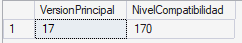

---

### Ejercicio 2
**Enunciado:** Lista los nombres de las tablas de usuario de SonoraDB usando la vista de catálogo `sys.tables`, ordenados alfabéticamente.

**Código SQL:**
```sql
SELECT name
FROM sys.tables
ORDER BY name desc

```

**Resultado:**
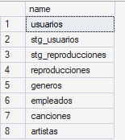

---

### Ejercicio 3
**Enunciado:** Usando `INFORMATION_SCHEMA.COLUMNS`, muestra las columnas de la tabla `reproducciones` con su tipo de dato, su longitud máxima y si admiten nulos, en el orden en que están definidas.

**Código SQL:**
```sql
SELECT COLUMN_NAME, DATA_TYPE, CHARACTER_MAXIMUM_LENGTH, IS_NULLABLE
FROM INFORMATION_SCHEMA.COLUMNS as columns
WHERE columns.TABLE_NAME = 'reproducciones'
ORDER BY ORDINAL_POSITION
```

**Resultado:**
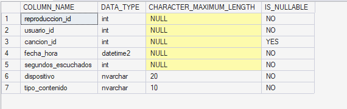

---

## 2. Consultas básicas: SELECT, WHERE y ORDER BY

### Ejercicio 4
**Enunciado:** Muestra el nombre de usuario, el plan y la fecha de alta de los usuarios de España (ES), del más antiguo al más reciente.

**Código SQL:**
```sql
SELECT nombre_usuario, plan_suscripcion, fecha_alta
FROM stg_usuarios
WHERE pais = 'ES'
```

**Resultado:**
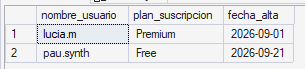

---

### Ejercicio 5
**Enunciado:** El equipo editorial busca canciones lanzadas en 2026 que duren entre 170 y 200 segundos (ambos incluidos) para una playlist de radio. Muestra título, duración y fecha de lanzamiento, ordenadas por fecha. Filtra el año con un rango de fechas, sin aplicar funciones sobre la columna.

**Código SQL:**
```sql
SELECT titulo, duracion_seg, fecha_lanzamiento
FROM canciones
WHERE duracion_seg >= 170 AND duracion_seg <= 200 AND fecha_lanzamiento >= '2026-01-01'
AND fecha_lanzamiento < '2027-01-01'
ORDER BY fecha_lanzamiento 
```

**Resultado:**
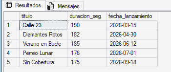

---

### Ejercicio 6
**Enunciado:** Obtén los usuarios cuyo nombre de usuario contiene un guion bajo (`_`), ordenados alfabéticamente. Antes de escribir la solución correcta, prueba `LIKE '%_%'` y explica por qué devuelve los 8 usuarios.

**Explicación:**
> No funciona Like '%_%' porque eso trae una carácter cualquiera como un . o algo así.

**Código SQL:**
```sql
SELECT nombre_usuario
FROM stg_usuarios
WHERE nombre_usuario LIKE '%[_]%'
```

**Resultado:**
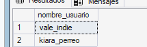

---

### Ejercicio 7
**Enunciado:** ¿Desde qué dispositivos se han hecho reproducciones? Muestra cada dispositivo una sola vez, ordenado alfabéticamente.

**Código SQL:**
```sql
SELECT DISTINCT dispositivo 
FROM stg_reproducciones
ORDER BY dispositivo ASC
```

**Resultado:**
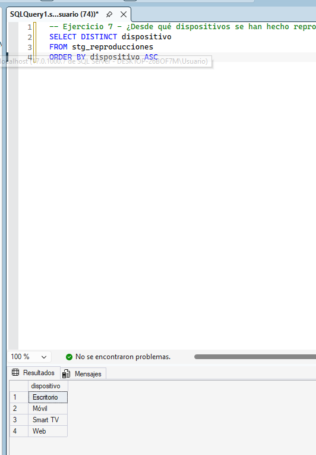

---

### Ejercicio 8
**Enunciado:** Lista las reproducciones que corresponden a anuncios filtrando por la columna `cancion_id`. Muestra el id de reproducción, el usuario y la fecha y hora. Comprueba también qué devuelve la condición `cancion_id = NULL` y explica el resultado.

**Explicación:**
> La condición = NULL no devuelve nada porque en SQL, NULL no representa un valor normal. Tienes que usar IS NULL


**Código SQL:**
```sql
SELECT reproduccion_id, usuario_id, fecha_hora, cancion_id
FROM reproducciones
WHERE cancion_id IS NULL

```

**Resultado:**
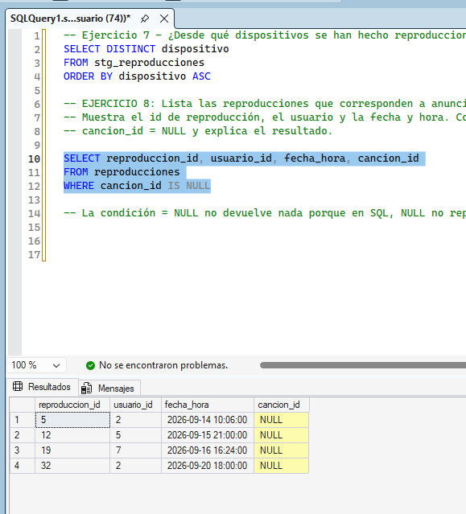

---

### Ejercicio 9
**Enunciado:** Obtén las 2 reproducciones con más segundos escuchados, pero incluyendo cualquier otra que empate con la última. Muestra id de reproducción, usuario, canción y segundos escuchados.

**Código SQL:**
```sql
SELECT TOP 2 WITH TIES reproduccion_id, usuario_id, cancion_id, segundos_escuchados
FROM reproducciones
ORDER BY segundos_escuchados DESC

```

**Resultado:**
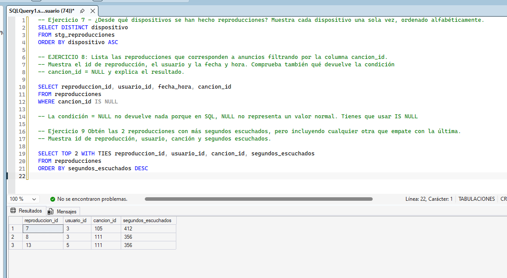

---

### Ejercicio 10
**Enunciado:** La app muestra el catálogo en páginas de 5 canciones ordenadas por título. Obtén los títulos de la página 2 con `OFFSET ... FETCH`.

**Código SQL:**
```sql
SELECT titulo
FROM canciones
ORDER BY titulo ASC
OFFSET 5 ROWS
FETCH NEXT 5 ROWS ONLY

```

**Resultado:**
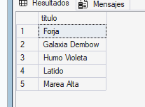

---

## 3. Expresiones y funciones

### Ejercicio 11
**Enunciado:** Clasifica las canciones de Nébula (artista 5) por duración: Corta si dura menos de 180 segundos, Media si dura entre 180 y 240 (ambos incluidos) y Larga si dura más de 240. Ordena por título.

**Código SQL:**
```sql
SELECT titulo,
  CASE
    WHEN duracion_seg<180 THEN 'Corta'
    WHEN duracion_seg>=180 AND duracion_seg<=240 THEN 'Media'
    ELSE 'Larga'
  END
  AS duracion
  FROM canciones
  WHERE artista_id='5';

```

**Resultado:**
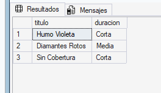

---

### Ejercicio 12
**Enunciado:** Para la ficha de artista de la app, genera una etiqueta con el formato `Nombre (PAÍS)` y la longitud del nombre en caracteres. Resuélvelo con `CONCAT` y después con el operador `||`, novedad de SQL Server 2025. Ordena por nombre.

**Código SQL:**
```sql
SELECT CONCAT(nombre,' (',pais,')') as nombre_pais, LEN(nombre) as longitud_nombre
FROM artistas
ORDER BY nombre ASC

SELECT nombre || ' (' || pais || ')' as nombre_pais
FROM artistas
ORDER BY nombre ASC

```

**Resultado:**
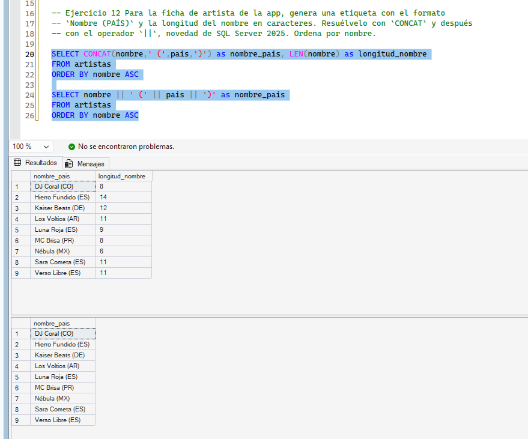

---

### Ejercicio 13
**Enunciado:** Calcula la antigüedad en días de cada usuario a fecha de 24/09/2026, ordenados de más a menos antiguo.

**Código SQL:**
```sql
SELECT nombre_usuario, DATEDIFF(dd,fecha_alta,'24/09/2026') as antiguedad
FROM stg_usuarios
ORDER BY antiguedad desc

```

**Resultado:**
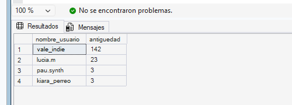

---

### Ejercicio 14
**Enunciado:** Para las reproducciones del usuario 3, separa `fecha_hora` en dos columnas: la fecha (`date`) y la hora sin fracciones de segundo (`time(0)`). Muestra también los segundos escuchados. Ordena por fecha y hora.

**Código SQL:**
```sql
SELECT
    CAST(fecha_hora as date) as fecha,
    CAST(fecha_hora as time(0)) as hora,
    segundos_escuchados
FROM reproducciones
WHERE usuario_id = 3
ORDER BY fecha, hora

```

**Resultado:**
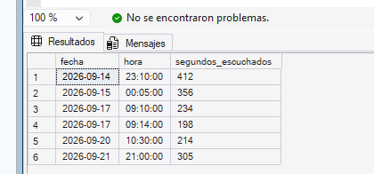

---

## 4. Funciones de agregación, GROUP BY y HAVING

### Ejercicio 15
**Enunciado:** Obtén un resumen del catálogo: número de canciones, duración mínima, duración máxima y duración media. Calcula la media dos veces, sobre la columna tal cual y forzando decimales, y explica la diferencia.

**Explicación:**
> La diferencia es que la que tiene decimales saca el .20000000 y la otra no

**Código SQL:**
```sql
SELECT 
COUNT(*) as canciones, 
MIN(duracion_seg) as duracion_minima, 
MAX(duracion_seg) as duracion_maxima, 
AVG(duracion_seg) as duracion_media_sin_decimales,
AVG(CAST(duracion_seg as decimal(10,2))) as duracion_media_con_decimales
FROM canciones

```

**Resultado:**
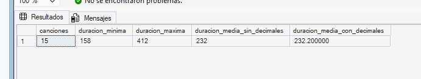

---

### Ejercicio 16
**Enunciado:** Sobre la tabla `reproducciones`, calcula en una sola consulta: `COUNT(*)`, `COUNT(cancion_id)`, el número de canciones distintas reproducidas y el número de usuarios distintos. Explica por qué las dos primeras cifras no coinciden.

**Explicación:**
> Porque en Sonora los anuncios tienen cancion_id = NULL Y COUNT(cancion_id) no los cuenta

**Código SQL:**
```sql
SELECT COUNT(DISTINCT cancion_id) as num_canciones, COUNT(DISTINCT usuario_id) as num_usuarios
FROM reproducciones

```

**Resultado:**
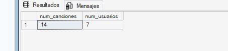

---

### Ejercicio 17
**Enunciado:** Para cada dispositivo, obtén el número de reproducciones (de cualquier tipo), el total de segundos y el total de minutos con un decimal. Ordena por número de reproducciones de mayor a menor.

**Código SQL:**
```sql
SELECT dispositivo, COUNT(*) as num_reproducciones, SUM(segundos_escuchados) as segundos_escuchados, SUM(segundos_escuchados) / 60.0 as minutos_Escuchados
 FROM reproducciones
GROUP BY dispositivo

```

**Resultado:**
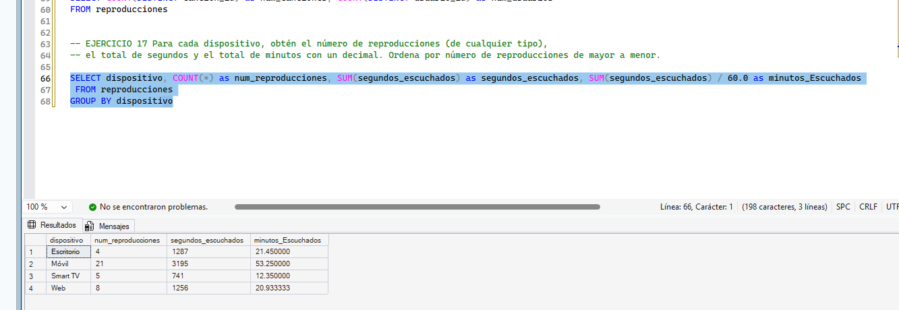

---

### Ejercicio 18
**Enunciado:** Usando la clasificación del Ejercicio 11 (Corta, Media, Larga) sobre todo el catálogo, obtén cuántas canciones hay en cada categoría y su duración media. Ordena por número de canciones descendente y por categoría.

**Código SQL:**
```sql
SELECT AVG(duracion_seg) as duracion_media, COUNT(*) as num_canciones,
  CASE
    WHEN duracion_seg<180 THEN 'Corta'
    WHEN duracion_seg>=180 AND duracion_seg<=240 THEN 'Media'
    ELSE 'Larga'
  END
  AS duracion
  FROM canciones
  GROUP BY 
   CASE
    WHEN duracion_seg<180 THEN 'Corta'
    WHEN duracion_seg>=180 AND duracion_seg<=240 THEN 'Media'
    ELSE 'Larga'
  END
  ORDER BY num_canciones DESC;

```

**Resultado:**
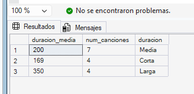

---

### Ejercicio 19
**Enunciado:** Marketing busca "superoyentes": usuarios con más de 3 reproducciones de tipo Canción y más de 800 segundos escuchados en total. Muestra el nombre de usuario, el número de reproducciones y los segundos. Ordena por segundos de mayor a menor.

**Código SQL:**
```sql
SELECT usuarios.nombre_usuario, COUNT(*) as numero_reproducciones, SUM(reproducciones.segundos_escuchados)
FROM reproducciones
INNER JOIN usuarios ON reproducciones.usuario_id = usuarios.usuario_id
WHERE reproducciones.tipo_contenido = 'Canción'
GROUP BY usuarios.nombre_usuario
HAVING COUNT(*) > 3 AND SUM(segundos_escuchados) > 800
ORDER BY SUM(reproducciones.segundos_escuchados) DESC

```

**Resultado:**
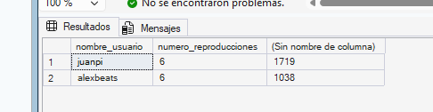

---

### Ejercicio 20
**Enunciado:** Obtén el número de reproducciones por plan de suscripción y tipo de contenido. Ordena por plan y tipo.

**Código SQL:**
```sql
SELECT usuarios.plan_suscripcion, reproducciones.tipo_contenido, COUNT(reproducciones.reproduccion_id) num_reproducciones
FROM reproducciones
INNER JOIN usuarios ON reproducciones.usuario_id = usuarios.usuario_id
GROUP BY usuarios.plan_suscripcion, reproducciones.tipo_contenido
ORDER BY usuarios.plan_suscripcion, reproducciones.tipo_contenido;

```

**Resultado:**
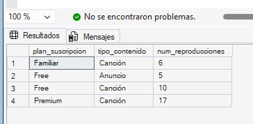

---

## 5. JOIN y UNION

### Ejercicio 21
**Enunciado:** Lista las canciones de artistas españoles con el nombre del artista y el nombre del género de la canción. Ordena por artista y título.

**Código SQL:**
```sql
SELECT canciones.titulo, artistas.nombre, generos.nombre
FROM canciones
INNER JOIN artistas ON artistas.artista_id = canciones.artista_id
INNER JOIN generos ON generos.genero_id = canciones.genero_id
WHERE artistas.pais = 'ES'
ORDER BY artistas.nombre, canciones.titulo

```

**Resultado:**
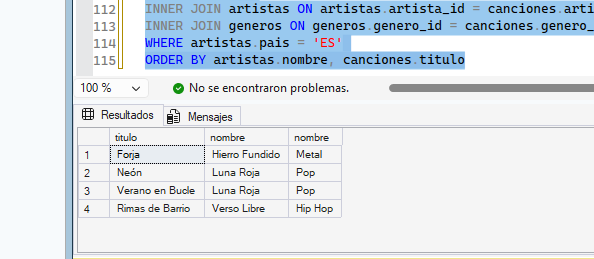

---

### Ejercicio 22
**Enunciado:** Muestra la actividad del 16/09/2026 con `INNER JOIN`: hora, usuario, título y artista, ordenada por fecha y hora. Filtra el día con un rango de fechas.

**Código SQL:**
```sql
SELECT
    reproducciones.fecha_hora,
    usuarios.nombre_usuario,
    canciones.titulo,
    artistas.nombre AS artista
FROM reproducciones
INNER JOIN usuarios
    ON usuarios.usuario_id = reproducciones.usuario_id
INNER JOIN canciones
    ON canciones.cancion_id = reproducciones.cancion_id
INNER JOIN artistas
    ON artistas.artista_id = canciones.artista_id
WHERE reproducciones.fecha_hora >= '2026-09-16'
  AND reproducciones.fecha_hora < '2026-09-17'
ORDER BY reproducciones.fecha_hora;

```

**Resultado:**
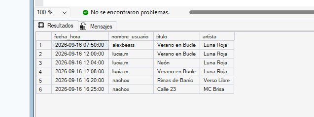

---

### Ejercicio 23
**Enunciado:** Ese día hubo 7 reproducciones, pero el Ejercicio 22 solo devuelve 6. Explica qué fila falta y por qué. Reescribe la consulta para que aparezcan todas, mostrando `(Anuncio)` en el título y `-` en el artista cuando no haya canción.

**Explicación:**
> *Escribe aquí qué fila falta y el motivo.*

**Código SQL:**
```sql
SELECT reproducciones.fecha_hora, usuarios.nombre_usuario, canciones.titulo, artistas.nombre AS artista
FROM reproducciones
INNER JOIN usuarios ON usuarios.usuario_id = reproducciones.usuario_id
LEFT JOIN canciones ON canciones.cancion_id = reproducciones.cancion_id
LEFT JOIN artistas ON artistas.artista_id = canciones.artista_id
WHERE reproducciones.fecha_hora >= '2026-09-16'
  AND reproducciones.fecha_hora < '2026-09-17'
ORDER BY reproducciones.fecha_hora; 

```

**Resultado:**
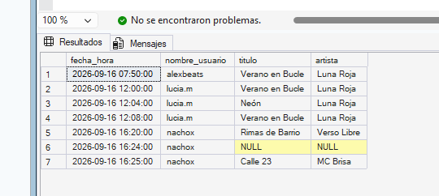

---

### Ejercicio 24
**Enunciado:** Con `LEFT JOIN` e `IS NULL`, obtén los usuarios que no tienen ninguna reproducción. Muestra el nombre de usuario, el plan y la fecha de alta.

**Código SQL:**
```sql
SELECT usuarios.nombre_usuario, usuarios.plan_suscripcion, usuarios.fecha_alta
FROM usuarios
LEFT JOIN reproducciones ON reproducciones.usuario_id = usuarios.usuario_id
WHERE reproduccion_id IS NULL
```

**Resultado:**
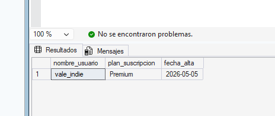

---

### Ejercicio 25
**Enunciado:** Obtén el número de reproducciones de cada artista, incluidos los que no tienen ninguna. Ordena por reproducciones descendente y por nombre. Después cambia el conteo a `COUNT(*)` y explica por qué Sara Cometa pasa a tener 1.

**Explicación:**
> El uso de `COUNT(*)` altera el resultado de Sara Cometa porque también cuenta los valores NULL

**Código SQL:**
```sql
SELECT artistas.nombre, COUNT(reproducciones.reproduccion_id) as num_reproducciones
FROM artistas
LEFT JOIN canciones ON canciones.artista_id = artistas.artista_id
LEFT JOIN reproducciones ON reproducciones.cancion_id = canciones.cancion_id
GROUP BY artistas.nombre
ORDER BY num_reproducciones DESC, artistas.nombre


```

**Resultado:**
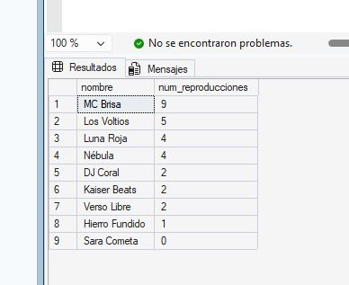

---

### Ejercicio 26
**Enunciado:** Con un self join sobre empleados, muestra cada empleado con su puesto y el nombre de su jefe directo. Para quien no tiene jefe, muestra `(sin jefe)`. Ordena por id de empleado.

**Código SQL:**
```sql
SELECT empleado.nombre, empleado.puesto,
    CASE
        WHEN empleado.jefe_id IS NULL THEN '(sin jefe)'
        ELSE jefe.nombre
    END
FROM empleados AS empleado
LEFT JOIN empleados AS jefe
    ON empleado.jefe_id = jefe.empleado_id
ORDER BY empleado.empleado_id

```

**Resultado:**
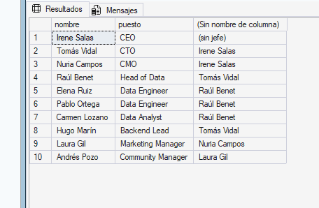

---

### Ejercicio 27
**Enunciado:** Obtén los géneros (de la canción) con más de 3 reproducciones válidas, con el número de reproducciones y los minutos escuchados con un decimal. Ordena por reproducciones descendente.

**Código SQL:**
```sql
SELECT
    generos.nombre AS genero,
    COUNT(reproducciones.reproduccion_id) AS num_reproducciones,
    CAST(SUM(reproducciones.segundos_escuchados) / 60.0 AS DECIMAL(10,1)) AS minutos_escuchados
FROM reproducciones
INNER JOIN canciones
    ON canciones.cancion_id = reproducciones.cancion_id
INNER JOIN generos
    ON generos.genero_id = canciones.genero_id
WHERE reproducciones.tipo_contenido = 'Canción'
  AND reproducciones.segundos_escuchados >= 30
GROUP BY generos.nombre
HAVING COUNT(reproducciones.reproduccion_id) > 3
ORDER BY num_reproducciones DESC;

```

**Resultado:**
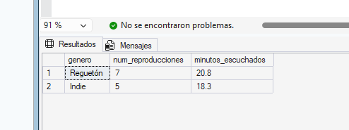

---

### Ejercicio 28
**Enunciado:** Sonora quiere saber en qué países tiene presencia, ya sea por artistas o por usuarios. Obtén la lista de países sin repetir, ordenada. Después cambia a `UNION ALL`, cuenta las filas y explica la diferencia.

**Explicación:**
> UNION elimina los países duplicados y cuenta países distintos mientras que UNION ALL se queda los duplicados y cuenta todas las filas procedentes de artistas y usuarios.

**Código SQL:**
```sql
SELECT pais
FROM artistas
UNION
SELECT pais
FROM usuarios
ORDER BY pais;

SELECT pais
FROM artistas
UNION ALL
SELECT pais
FROM usuarios
ORDER BY pais;

SELECT COUNT(*) AS total_paises
FROM (
    SELECT pais
    FROM artistas
    UNION
    SELECT pais
    FROM usuarios
) AS paises;

SELECT COUNT(*) AS total_filas
FROM (
    SELECT pais
    FROM artistas
    UNION ALL
    SELECT pais
    FROM usuarios
) AS paises;

```

**Resultado:**
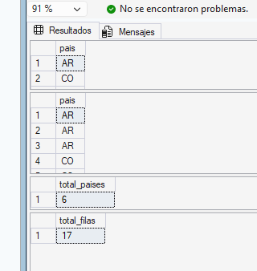

---

## 6. DDL: crear y modificar tablas

### Ejercicio 29
**Enunciado:** Crea la tabla `dbo.playlists` con estas columnas y restricciones (da nombre explícito a cada restricción): `playlist_id` (PK autonumérica), `usuario_id` (FK a usuarios), `nombre`, `es_publica` (por defecto 0), `fecha_creacion` (por defecto actual). Un usuario no puede tener dos playlists con el mismo nombre.

**Código SQL:**
```sql
-- Escribe tu código aquí

```

**Resultado:**
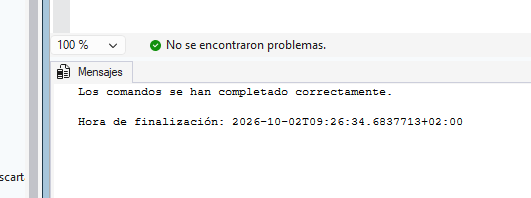

---

### Ejercicio 30
**Enunciado:** Crea la tabla `dbo.playlist_canciones`, que relaciona cada playlist con sus canciones: `playlist_id` (FK a playlists), `cancion_id` (FK a canciones), `fecha_agregada` (por defecto actual). La PK es compuesta (`playlist_id`, `cancion_id`).

**Código SQL:**
```sql
-- Escribe tu código aquí

```

**Resultado:**
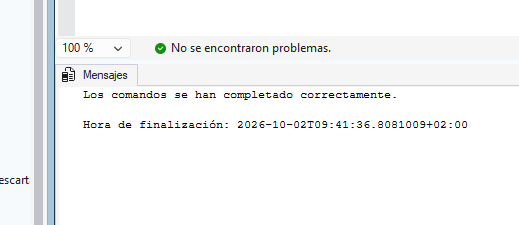

---

### Ejercicio 31
**Enunciado:** Tras una reunión con Producto, hay dos cambios en `playlists`. Aplícalos con `ALTER TABLE`: Añadir columna opcional `descripcion` de tipo `nvarchar(200)` y añadir una restricción que obligue a que el nombre tenga al menos 3 caracteres. Comprueba con `INFORMATION_SCHEMA.COLUMNS`.

**Código SQL:**
```sql
-- Escribe tu código aquí

```

**Resultado:**
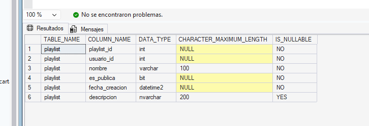

---

## 7. DML: insertar, actualizar y borrar

### Ejercicio 32
**Enunciado:** Inserta en una sola instrucción estas tres playlists, sin indicar `playlist_id`, `es_publica` ni `fecha_creacion`: alexbeats (1) "Perreo Mañanero", marta_rock (2) "Rock para currar", juanpi (3) "Code & Techno". Después consulta la tabla.

**Código SQL:**
```sql
-- Escribe tu código aquí

```

**Resultado:**
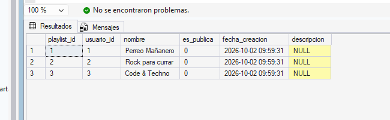

---

### Ejercicio 33
**Enunciado:** Añade canciones a las playlists: A la 1 las canciones 103, 104 y 113. A la 2 las canciones 106, 107 y 110. A la 3, todas las canciones de géneros House y Techno con un `INSERT ... SELECT` usando un `JOIN` con géneros.

**Código SQL:**
```sql
-- Escribe tu código aquí

```

**Resultado:**
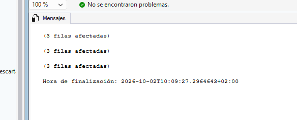

---

### Ejercicio 34
**Enunciado:** Comprueba que las restricciones protegen los datos. Ejecuta cada intento por separado, anota el número de error y qué restricción lo provoca.

**Tabla de Errores Encontrados:**

| Intento | Acción | Error | Motivo |
|---------|--------|-------|--------|
| 1 | Añadir otra vez la canción 103 a la playlist 1. | *Rellenar* | *Rellenar* |
| 2 | Añadir la canción 999 a la playlist 1. | *Rellenar* | *Rellenar* |
| 3 | Crear una playlist para alexbeats llamada AB. | *Rellenar* | *Rellenar* |
| 4 | Crear otra playlist para alexbeats llamada Perreo Mañanero. | *Rellenar* | *Rellenar* |

**Código SQL (Intentos):**
```sql
-- Escribe tu código aquí (o comenta los intentos fallidos)

```

**Resultado:**


---

### Ejercicio 35
**Enunciado:** Aplica dos actualizaciones: Añade a la playlist 2 la descripción "Guitarras para la oficina". Con un `UPDATE` que haga `JOIN` con usuarios, haz públicas todas las playlists cuyo dueño tenga plan Premium.

**Código SQL:**
```sql
-- Escribe tu código aquí

```

**Resultado:**
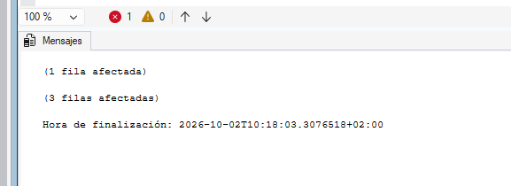

---

### Ejercicio 36
**Enunciado:** Obtén un resumen de las playlists: id, dueño, nombre, si es pública y número de canciones. Ordena por id.

**Código SQL:**
```sql
-- Escribe tu código aquí

```

**Resultado:**
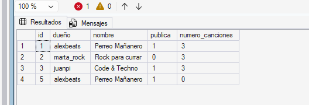

---

### Ejercicio 37
**Enunciado:** Aplica estos borrados: Quita la canción Forja (110) de la playlist 2. Intenta borrar la playlist 3 directamente (anota el error). Borra la playlist 3 correctamente, en el orden necesario.

**Anotación del Error:**
> *Escribe aquí el error al intentar borrar la playlist 3 directamente y el porqué.*

**Código SQL:**
```sql
-- Escribe tu código aquí

```

**Resultado:**


---

### Ejercicio 38
**Enunciado:** Soporte quiere probar qué pasaría si marta_rock (usuario 2) pasara a Premium, sin que el cambio quede guardado. Dentro de una transacción explícita, actualiza su plan, consulta el valor, deshaz el cambio y vuelve a consultarlo.

**Código SQL:**
```sql
-- Escribe tu código aquí

```

**Resultado:**
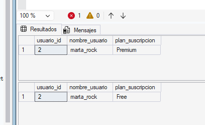

---

### Ejercicio 39
**Enunciado:** Deja SonoraDB como estaba: elimina las tablas `playlist_canciones` y `playlists` en el orden correcto y de forma que el script no falle si ya no existen. Comprueba con `sys.tables` que vuelven a quedar las 8 tablas originales.

**Código SQL:**
```sql
-- Escribe tu código aquí

```

**Resultado:**
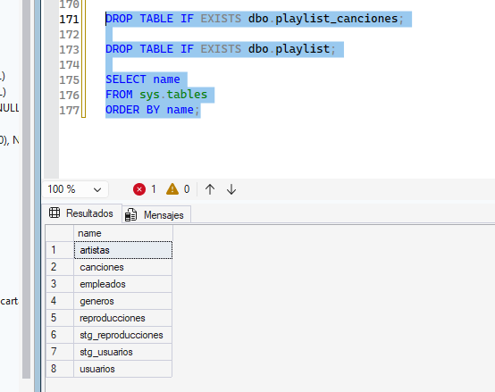