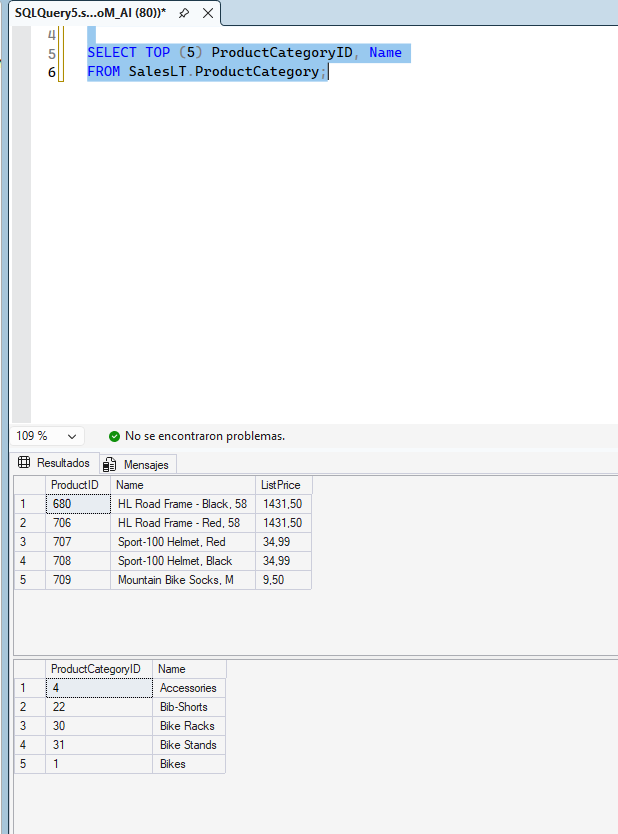
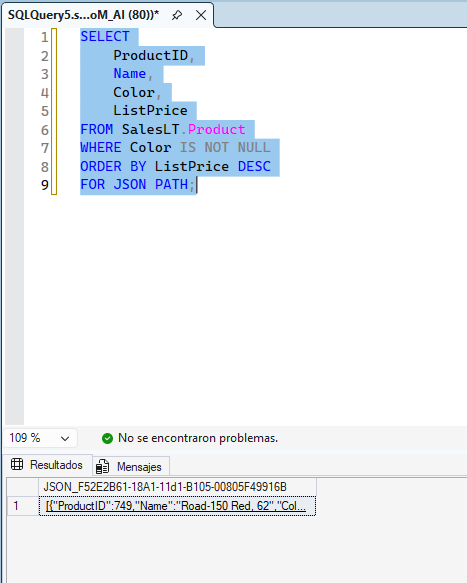
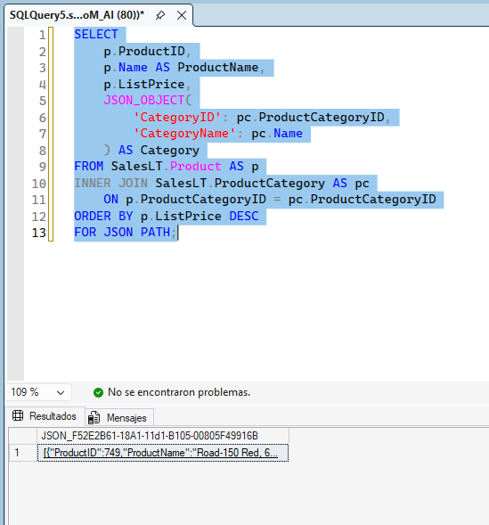
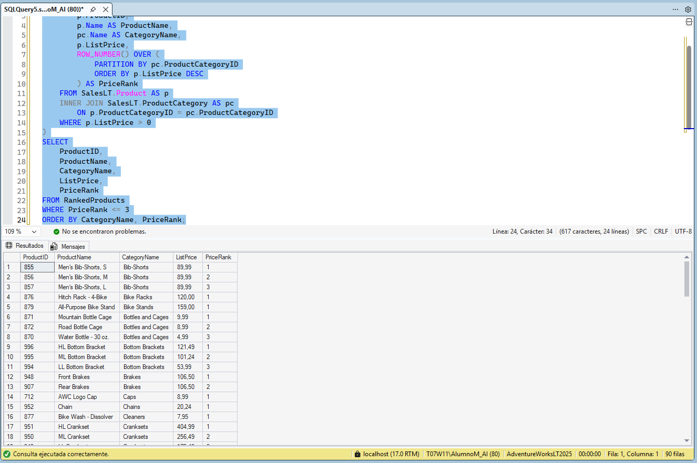
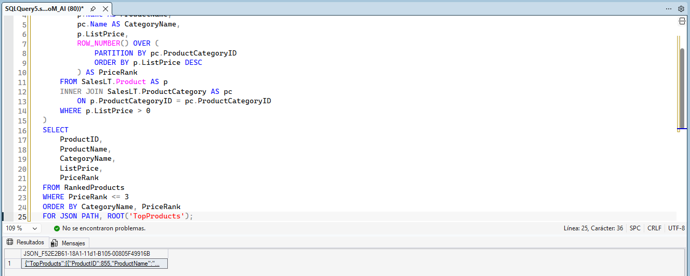
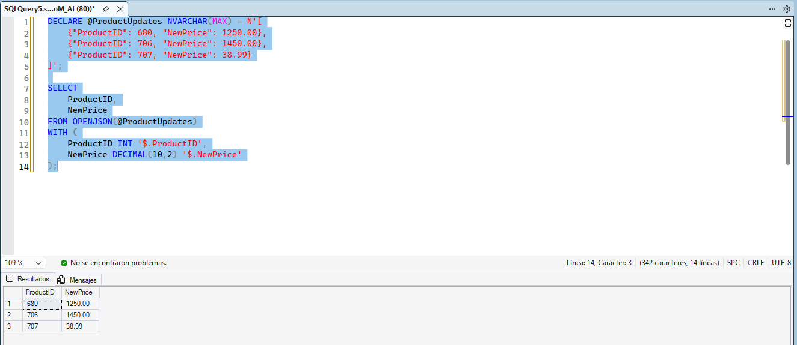
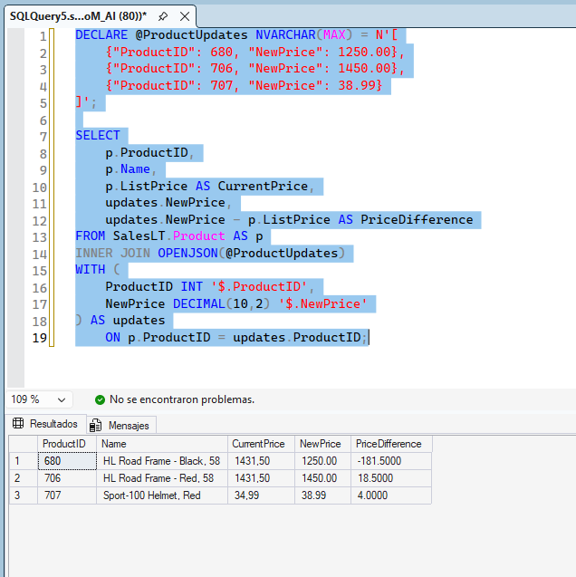

# Lab 03 – Advanced T-SQL: JSON functions, CTEs & Window Functions

## Objetivo

En este laboratorio practicas el uso de funciones JSON en T-SQL para construir y consultar datos JSON a partir de la base de datos `AdventureWorksLT`. Tambien combinas la salida JSON con una CTE y una funcion de ventana para crear un reporte practico.

**Escenario:** eres desarrollador/a de base de datos para una empresa de e-commerce. El equipo de marketing necesita los datos de productos en formato JSON para un catalogo web, y ademas necesitas crear reportes que clasifiquen productos dentro de cada categoria.

> Verifica siempre que el codigo se haya copiado correctamente antes de ejecutarlo.

## Prerrequisitos

- SQL Server 2022+ o Azure SQL Database
- Una herramienta de consultas (SQL Server Management Studio)
- Una conexion con permisos de lectura
- Base de datos de ejemplo AdventureWorksLT restaurada (SQL Server o Azure SQL)

---

## 1. Conectar a AdventureWorksLT

Asegurate de que la base de datos de ejemplo este restaurada y disponible en tu instancia de SQL. Verifica la conectividad:

```sql
-- Verify key tables in AdventureWorksLT
SELECT TOP (5) ProductID, Name, ListPrice
FROM SalesLT.Product;

SELECT TOP (5) ProductCategoryID, Name
FROM SalesLT.ProductCategory;
```

Cada consulta debe devolver hasta cinco filas de datos de ejemplo. Si alguna consulta no devuelve filas o falla, confirma que la base de datos AdventureWorksLT este correctamente restaurada y que tengas acceso de lectura.

---

## 2. Construir salida JSON a partir de datos de producto

El equipo de marketing necesita la informacion de productos en formato JSON para un catalogo web. Empieza creando un objeto JSON simple a partir de la tabla `Product`.

### 2.1 Crear un objeto JSON por cada producto

Usa `FOR JSON PATH` para convertir filas de productos en JSON.

```sql
SELECT
    ProductID,
    Name,
    Color,
    ListPrice
FROM SalesLT.Product
WHERE Color IS NOT NULL
ORDER BY ListPrice DESC
FOR JSON PATH;
```


Esta consulta selecciona productos con un valor de color y da formato al resultado como un arreglo JSON. Cada fila se convierte en un objeto JSON con propiedades que coinciden con los nombres de columna. La clausula `FOR JSON PATH` gestiona la conversion automaticamente.

### 2.2 Crear JSON anidado con categorias de producto

Agrega informacion de categoria como un objeto anidado.

```sql
SELECT
    p.ProductID,
    p.Name AS ProductName,
    p.ListPrice,
    JSON_OBJECT(
        'CategoryID': pc.ProductCategoryID,
        'CategoryName': pc.Name
    ) AS Category
FROM SalesLT.Product AS p
INNER JOIN SalesLT.ProductCategory AS pc
    ON p.ProductCategoryID = pc.ProductCategoryID
ORDER BY p.ListPrice DESC
FOR JSON PATH;
```


Esta consulta usa `JSON_OBJECT` para construir una estructura anidada. La propiedad `Category` contiene su propio objeto JSON con `CategoryID` y `CategoryName`. Este enfoque mantiene agrupados los datos relacionados en la salida.

---

## 3. Combinar JSON con una CTE y una funcion de ventana

Ahora crea un reporte mas util que clasifique productos por precio dentro de cada categoria y exporte el resultado como JSON.

### 3.1 CTE con ranking mediante ROW_NUMBER()

Primero, construye la logica de la consulta usando una CTE y `ROW_NUMBER()`.

```sql
WITH RankedProducts AS (
    SELECT
        p.ProductID,
        p.Name AS ProductName,
        pc.Name AS CategoryName,
        p.ListPrice,
        ROW_NUMBER() OVER (
            PARTITION BY pc.ProductCategoryID
            ORDER BY p.ListPrice DESC
        ) AS PriceRank
    FROM SalesLT.Product AS p
    INNER JOIN SalesLT.ProductCategory AS pc
        ON p.ProductCategoryID = pc.ProductCategoryID
    WHERE p.ListPrice > 0
)
SELECT
    ProductID,
    ProductName,
    CategoryName,
    ListPrice,
    PriceRank
FROM RankedProducts
WHERE PriceRank <= 3
ORDER BY CategoryName, PriceRank;
```

La CTE calcula un rango de precio para cada producto dentro de su categoria. `PARTITION BY` reinicia la numeracion en cada categoria, y `ORDER BY ListPrice DESC` asigna el rango 1 al producto mas caro. La consulta externa filtra para mostrar solo los 3 productos principales por categoria.

### 3.2 Exportar los productos clasificados como JSON

Agrega `FOR JSON PATH` para dar formato a los resultados para una API.

```sql
WITH RankedProducts AS (
    SELECT
        p.ProductID,
        p.Name AS ProductName,
        pc.Name AS CategoryName,
        p.ListPrice,
        ROW_NUMBER() OVER (
            PARTITION BY pc.ProductCategoryID
            ORDER BY p.ListPrice DESC
        ) AS PriceRank
    FROM SalesLT.Product AS p
    INNER JOIN SalesLT.ProductCategory AS pc
        ON p.ProductCategoryID = pc.ProductCategoryID
    WHERE p.ListPrice > 0
)
SELECT
    ProductID,
    ProductName,
    CategoryName,
    ListPrice,
    PriceRank
FROM RankedProducts
WHERE PriceRank <= 3
ORDER BY CategoryName, PriceRank
FOR JSON PATH, ROOT('TopProducts');
```


Agregar `ROOT('TopProducts')` envuelve todo el arreglo JSON en un objeto con una propiedad nombrada. Esto facilita el trabajo en aplicaciones que esperan un elemento raiz.

---

## 4. Parsear datos JSON con OPENJSON

Ahora practica leer datos JSON de vuelta en filas usando `OPENJSON`.

### 4.1 Parsear un arreglo JSON en filas

Supon que recibes actualizaciones de producto como JSON. Usa `OPENJSON` para convertirlo en una tabla.

```sql
DECLARE @ProductUpdates NVARCHAR(MAX) = N'[
    {"ProductID": 680, "NewPrice": 1250.00},
    {"ProductID": 706, "NewPrice": 1450.00},
    {"ProductID": 707, "NewPrice": 38.99}
]';

SELECT
    ProductID,
    NewPrice
FROM OPENJSON(@ProductUpdates)
WITH (
    ProductID INT '$.ProductID',
    NewPrice DECIMAL(10,2) '$.NewPrice'
);
```


La clausula `WITH` define el esquema de la salida. Cada propiedad JSON se mapea a una columna con un tipo de dato especifico. La sintaxis `$.PropertyName` indica a SQL Server que ruta JSON leer para cada columna.

### 4.2 Unir JSON parseado con datos existentes

Combina los datos JSON con la tabla `Product` para ver los precios actuales y los nuevos.

```sql
DECLARE @ProductUpdates NVARCHAR(MAX) = N'[
    {"ProductID": 680, "NewPrice": 1250.00},
    {"ProductID": 706, "NewPrice": 1450.00},
    {"ProductID": 707, "NewPrice": 38.99}
]';

SELECT
    p.ProductID,
    p.Name,
    p.ListPrice AS CurrentPrice,
    updates.NewPrice,
    updates.NewPrice - p.ListPrice AS PriceDifference
FROM SalesLT.Product AS p
INNER JOIN OPENJSON(@ProductUpdates)
WITH (
    ProductID INT '$.ProductID',
    NewPrice DECIMAL(10,2) '$.NewPrice'
) AS updates
    ON p.ProductID = updates.ProductID;
```


Esta consulta une el JSON parseado directamente con la tabla `Product`. La funcion `OPENJSON` con una clausula `WITH` actua como una tabla, por lo que puedes unirla (`JOIN`) igual que cualquier otra fuente de datos. El resultado muestra el precio actual de cada producto junto al precio nuevo propuesto.

---

## Resumen

En este laboratorio he aprendido a:

- Generar salida JSON desde resultados de consultas con `FOR JSON PATH`
- Crear estructuras JSON anidadas con `JSON_OBJECT`
- Combinar salida JSON con CTEs y funciones de ventana
- Parsear arreglos JSON en filas usando `OPENJSON` con un esquema