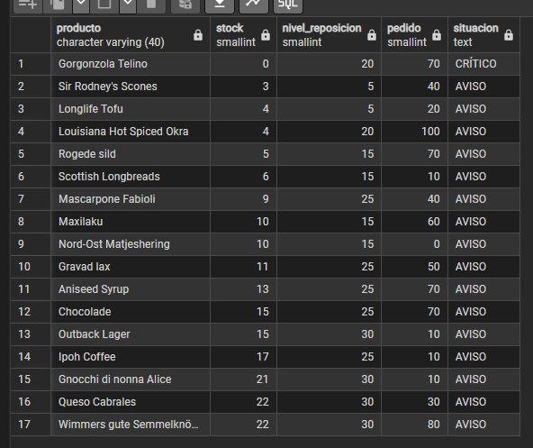
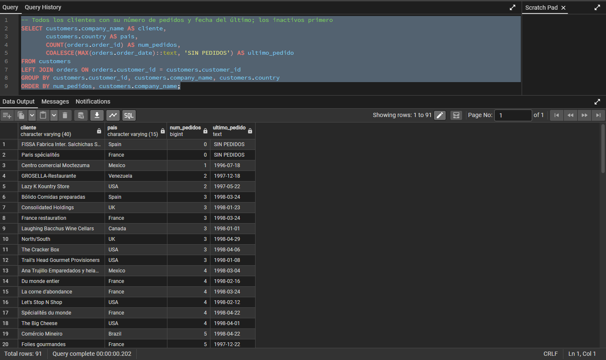
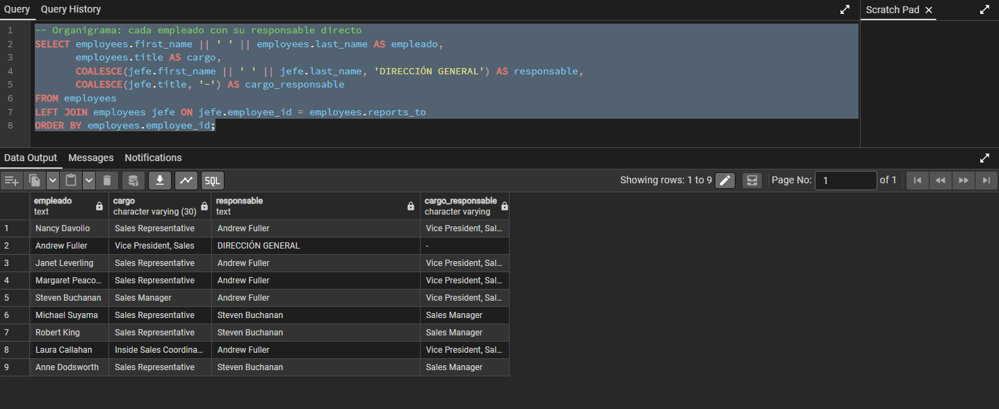
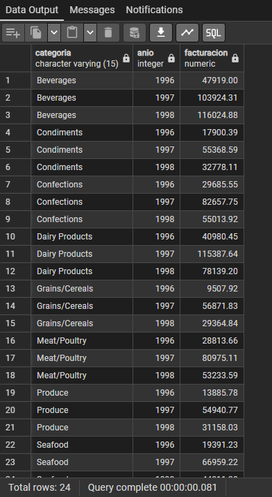
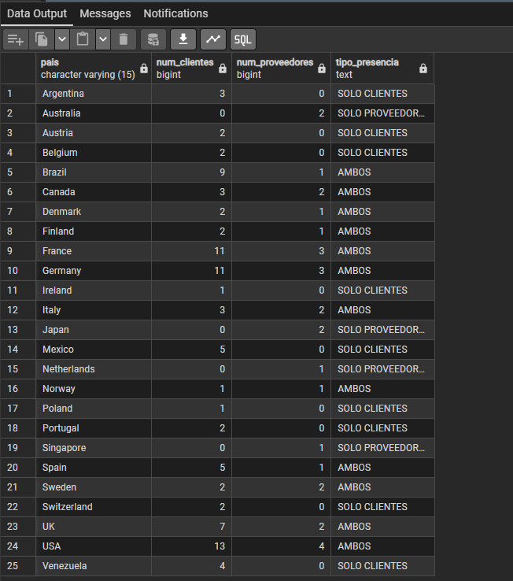

## Pregunta  — 

**Enunciado:** 

```sql

```
**Resultado:**


**Comentario:**  


---

## Pregunta 1 — Catálogo comercial activo

**Enunciado:** Obtén los productos que no están descatalogados y cuyo precio unitario esté entre 10 y 50 euros, ambos incluidos. Muestra el nombre del producto y su precio redondeado a dos decimales, ordenado de mayor a menor precio.

```sql
-- Productos activos con precio entre 10 y 50, de mayor a menor precio
SELECT product_name AS producto, ROUND(unit_price::numeric, 2) AS precio
FROM products
WHERE discontinued = 0 AND unit_price BETWEEN 10 AND 50
ORDER BY precio DESC;
```
**Resultado:**


**Comentario:** He usado ``::numeric`` porque unit_price no es un tipo de valor que pueda usarse en ROUND() y porque se pide en las especificaciones del proyecto. 


---

## Pregunta 2 — Concentración geográfica de la cartera


**Enunciado:** Dirección quiere saber en qué mercados está realmente concentrada la base de clientes antes de decidir dónde abrir delegación. Cuenta cuántos clientes hay en cada país y muestra únicamente aquellos países con **5 o más clientes**, ordenados de mayor a menor. Indica también cuántas ciudades distintas hay en cada uno de esos países.

```sql
-- Países con 5 o más clientes, con su número de ciudades distintas
SELECT country AS pais, COUNT(*) AS num_clientes, COUNT(DISTINCT city) AS num_ciudades
FROM customers
GROUP BY country
HAVING COUNT(*) >= 5
ORDER BY num_clientes DESC, pais;
```

**Resultado:**


**Comentario:** Uso ``Having`` porque estoy filtrando filas después de haber agrupado los datos con ``GROUP BY``.

---

## Pregunta 3 — Alerta de reposición

**Enunciado:** Productos activos con stock inferior o igual a su nivel de reposición, con una columna que diga 'CRÍTICO' si el stock es 0 y 'AVISO' en el resto.

```sql
-- Productos activos con stock igual o inferior al nivel de reposición
SELECT product_name AS producto, units_in_stock AS stock, reorder_level AS nivel_reposicion,
       units_on_order AS pedido,
       CASE
           WHEN units_in_stock = 0 THEN 'CRÍTICO'
           ELSE 'AVISO'
       END AS situacion
FROM products
WHERE discontinued = 0
  AND units_in_stock <= reorder_level
ORDER BY units_in_stock, product_name;
```

**Resultado:**


**Comentario:** Usé CASE WHEN para decidir el texto entre "Crítico" y "Aviso" 


---

## Pregunta 4  — Ficha completa de producto


**Enunciado:** Para los productos suministrados por empresas de Italia, Francia o España, muestra producto, categoría, proveedor, país y ciudad, ordenados por país y producto.


```sql
-- Productos de proveedores de Italia, Francia o España con categoría y proveedor
SELECT products.product_name AS producto,
       categories.category_name AS categoria,
       suppliers.company_name AS proveedor,
       suppliers.country AS pais,
       suppliers.city AS ciudad
FROM products 
INNER JOIN categories ON categories.category_id = products.category_id
INNER JOIN suppliers ON suppliers.supplier_id = products.supplier_id
WHERE suppliers.country IN ('Italy', 'France', 'Spain')
ORDER BY suppliers.country, products.product_name;
```
**Resultado:**


**Comentario:** Unión de tablas mediante ``INNER JOIN`` para poder hacer ``IN`` sobre los países necesarios en la tabla ``suppliers``

---

## Pregunta 5 — Detalle valorizado de un pedido

**Enunciado:** Reconstruye la factura del pedido 10248 línea a línea: producto, precio, cantidad, descuento e importe, con el nombre del cliente y la fecha.

```sql
-- Detalles del pedido 10248
SELECT customers.company_name AS cliente, orders.order_date AS fecha_pedido,products.product_name AS producto,
       ROUND(order_details.unit_price::numeric, 2) AS precio_unitario, order_details.quantity AS cantidad,
       ROUND(order_details.discount::numeric, 2) AS descuento, ROUND((order_details.unit_price::numeric) * order_details.quantity * (1 - order_details.discount::numeric), 2) AS importe_linea
FROM orders
INNER JOIN order_details USING (order_id)
INNER JOIN products USING (product_id)
INNER JOIN customers USING (customer_id)
WHERE orders.order_id = 10248
ORDER BY products.product_name;
```
**Resultado:**


**Comentario:** Uso de ``USING`` porque las tablas comparten el nombre de columna de sus ids y si no se usase aparecerían duplicadas.

---

## Pregunta 6 — Ranking de categorías por facturación

**Enunciado:** Facturacion totl por categoría, con número de líneas y de productos distintos vendidos. Solo las categorías con más de 100000 euros.


```sql
-- Facturación por categoría, solo las que superan 100.000 euros
SELECT categories.category_name AS categoria,
       COUNT(*) AS num_lineas,
       COUNT(DISTINCT products.product_id) AS num_productos,
       ROUND(SUM((order_details.unit_price::numeric) * order_details.quantity * (1 - order_details.discount::numeric)), 2) AS facturacion
FROM order_details
INNER JOIN products ON products.product_id = order_details.product_id
INNER JOIN categories ON categories.category_id = products.category_id
GROUP BY categories.category_name
HAVING SUM((order_details.unit_price::numeric) * order_details.quantity * (1 - order_details.discount::numeric)) > 100000
ORDER BY facturacion DESC;
```
**Resultado:**


**Comentario:** En el ``HAVING`` repito la expresión completa del ``SUM()`` porque no le puedo hacer llamada por su nombre


---

## Pregunta 7 — Clientes sin actividad comercial

**Enunciado:** Todos los clientes con su número de pedidos y la fecha del último. Los que no han pedido salen con 0 y ``'SIN PEDIDOS'``, y los inactivos van primero.

```sql
-- Todos los clientes con su número de pedidos y fecha del último; los inactivos primero
SELECT customers.company_name AS cliente,
       customers.country AS pais,
       COUNT(orders.order_id) AS num_pedidos,
       COALESCE(MAX(orders.order_date)::text, 'SIN PEDIDOS') AS ultimo_pedido
FROM customers
LEFT JOIN orders ON orders.customer_id = customers.customer_id
GROUP BY customers.customer_id, customers.company_name, customers.country
ORDER BY num_pedidos, customers.company_name;
```
**Resultado:**


**Comentario:** Usé ``LEFT JOIN`` para que los clientes sin pedidos no desaparezcan. También, como ``MAX(order_date)`` es una fecha y ``'SIN PEDIDOS'`` es texto, convierto la fecha a texto para poder usar ``COALESCE``.


---

## Pregunta 8 — Organigrama de la fuerza de ventas

**Enunciado:** Cada empleado con su cargo, el nombre completo de su responsable y el cargo de este. Quien no reporta a nadie aparece con ``'DIRECCIÓN GENERAL'``.

```sql
-- Organigrama: cada empleado con su responsable directo
SELECT employees.first_name || ' ' || employees.last_name AS empleado,
       employees.title AS cargo,
       COALESCE(jefe.first_name || ' ' || jefe.last_name, 'DIRECCIÓN GENERAL') AS responsable,
       COALESCE(jefe.title, '-') AS cargo_responsable
FROM employees
LEFT JOIN employees jefe ON jefe.employee_id = employees.reports_to
ORDER BY employees.employee_id;
```
**Resultado:** 


**Comentario:** Uso de ``SELF JOIN``. La tabla employees aparece dos veces, como empleado y su jefe. En este caso, el alias de uno de ellos es imprescindible, en mi caso uso el del jefe porque lo veo muy necesario.

---

## Pregunta 9 — Rejilla de cobertura categoría × año 

**Enunciado:** Todas las combinaciones de las 8 categorías con los 3 años (24 filas) con su facturación, con 0 cuando no haya ventas.

```sql
-- Rejilla completa categoría x año con la facturación (0 si no hubo ventas)
WITH ventas AS (
    SELECT products.category_id,
           EXTRACT(YEAR FROM orders.order_date)::int AS anio,
           (order_details.unit_price::numeric) * order_details.quantity * (1 - order_details.discount::numeric) AS importe
    FROM orders
    INNER JOIN order_details ON order_details.order_id = orders.order_id
    INNER JOIN products ON products.product_id = order_details.product_id
),
anios AS (
    SELECT DISTINCT EXTRACT(YEAR FROM order_date)::int AS anio
    FROM orders
)
SELECT categories.category_name AS categoria,
       anios.anio AS anio,
       COALESCE(ROUND(SUM(ventas.importe), 2), 0) AS facturacion
FROM categories
CROSS JOIN anios
LEFT JOIN ventas ON ventas.category_id = categories.category_id AND ventas.anio = anios.anio
GROUP BY categories.category_name, anios.anio
ORDER BY categories.category_name, anios.anio;
```
**Resultado:**


**Comentario:** He tenido que usar un ``CROSS JOIN`` por que necesitaba 8 categorías x 3 años y después un ``LEFT JOIN``.


---

## Pregunta 10 — Mapa de países: clientes frente a proveedores

**Enunciado:** Para cada país, cuántos clientes y cuántos proveedores hay, y si tiene solo clientes, solo proveedores o ambos.

```sql
-- Clientes y proveedores por país, con el tipo de presencia
SELECT COALESCE(client.pais, provider.pais) AS pais,
       COALESCE(client.num, 0) AS num_clientes,
       COALESCE(provider.num, 0) AS num_proveedores,
       CASE
           WHEN provider.pais IS NULL THEN 'SOLO CLIENTES'
           WHEN client.pais IS NULL THEN 'SOLO PROVEEDORES'
           ELSE 'AMBOS'
       END AS tipo_presencia
FROM (SELECT country AS pais, COUNT(*) AS num FROM customers GROUP BY country) client
FULL JOIN (SELECT country AS pais, COUNT(*) AS num FROM suppliers GROUP BY country) provider
       ON client.pais = provider.pais
ORDER BY pais;
```
**Resultado:**


**Comentario:** He agregado por separsdo clientes y proveedores en dos subconsultas y las he unido con ``FULL JOIN`` para que así aparezcan los países que están solo en un lado

---

## Pregunta 11 — Directorio unificado de contactos

**Enunciado:** Una sola tabla con los contactos de clientes, proveedores y empleados, con origen, nombre en mayúsculas, organización, ciudad y país.

```sql
-- Directorio unificado de contactos de clientes, proveedores y empleados
SELECT 'CLIENTE' AS origen,
       UPPER(customers.contact_name) AS contacto,
       customers.company_name AS organizacion,
       customers.city AS ciudad,
       customers.country AS pais
FROM customers
UNION ALL
SELECT 'PROVEEDOR',
       UPPER(suppliers.contact_name),
       suppliers.company_name,
       suppliers.city,
       suppliers.country
FROM suppliers
UNION ALL
SELECT 'EMPLEADO',
       UPPER(employees.first_name || ' ' || employees.last_name),
       'NORTHWIND TRADERS',
       employees.city,
       employees.country
FROM employees
ORDER BY origen, pais, contacto;
```
**Resultado:**


**Comentario:** Uso ``UNION ALL`` porque quiero todas las filas tal cual: con ``UNION`` se eliminarían los duplicados y se borrarían los que coincidiesen en en nombre y ciudad. 


---

## Pregunta  — 

**Enunciado:** 

```sql

```
**Resultado:**


**Comentario:**  


---

## Pregunta  — 

**Enunciado:** 

```sql

```
**Resultado:**


**Comentario:**  


---

## Pregunta  — 

**Enunciado:** 

```sql

```
**Resultado:**


**Comentario:**  


---

## Pregunta  — 

**Enunciado:** 

```sql

```
**Resultado:**


**Comentario:**  


---

## Pregunta  — 

**Enunciado:** 

```sql

```
**Resultado:**


**Comentario:**  


---

## Pregunta  — 

**Enunciado:** 

```sql

```
**Resultado:**


**Comentario:**  


---

## Pregunta  — 

**Enunciado:** 

```sql

```
**Resultado:**


**Comentario:**  


---

## Pregunta  — 

**Enunciado:** 

```sql

```
**Resultado:**


**Comentario:**  


---

## Pregunta  — 

**Enunciado:** 

```sql

```
**Resultado:**


**Comentario:**  


---

